---
## Front matter
lang: ru-RU
title: Лабораторная работа № 2
subtitle: Основы администрирования операционных систем
author:
  - Иванов Сергей Владимирович, НПИбд-01-23
institute:
  - Российский университет дружбы народов, Москва, Россия
date: 14 сентября 2024

## i18n babel
babel-lang: russian
babel-otherlangs: english

## Formatting pdf
toc: false
slide_level: 2
aspectratio: 169
section-titles: true
theme: metropolis
header-includes:
 - \metroset{progressbar=frametitle,sectionpage=progressbar,numbering=fraction}
 - '\makeatletter'
 - '\beamer@ignorenonframefalse'
 - '\makeatother'

  ## Fonts
mainfont: PT Serif
romanfont: PT Serif
sansfont: PT Sans
monofont: PT Mono
mainfontoptions: Ligatures=TeX
romanfontoptions: Ligatures=TeX
sansfontoptions: Ligatures=TeX,Scale=MatchLowercase
monofontoptions: Scale=MatchLowercase,Scale=0.9
---

## Цель работы

Получить представление о работе с учётными записями пользователей и группами пользователей в операционной системе типа Linux.

## Задание

1. Прочитать справочное описание man по командам ls, whoami, id, groups, su, sudo, passwd, vi, visudo, useradd, usermod, userdel, groupadd, groupdel.
2. Выполнить действия по переключению между учётными записями пользователей, по управлению учётными записями пользователей (раздел 2.4 1).
3. Выполнить действия по созданию пользователей и управлению их учётными записями (раздел 2.4.2).
4. Выполнить действия по работе с группами пользователей (раздел 2.4.3).

# Выполнение работы

## Команда whoami

Войдём в систему, определим какую учётную запись мы используем

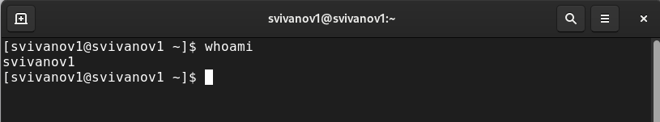{#fig:001 width=70%}

## Команда id

Вывожу более подробную информацию, используя команду id

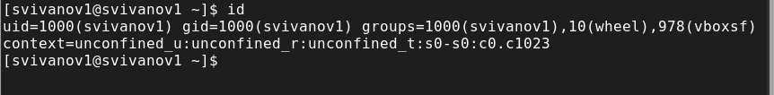{#fig:002 width=70%}

## Учетная запись root

Использую su для переключения к учётной записи root. Наберём id

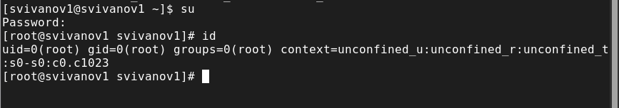{#fig:003 width=70%}

## Возвращение

Возвращаюсь к учётной записи своего пользователя

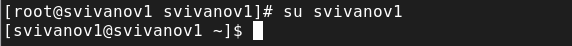{#fig:004 width=70%}

## Проверка строки в файле

Просматриваю файл /etc/sudoers. Убеждаюсь, что в открытом файле
присутствует строка %wheel ALL=(ALL) ALL.

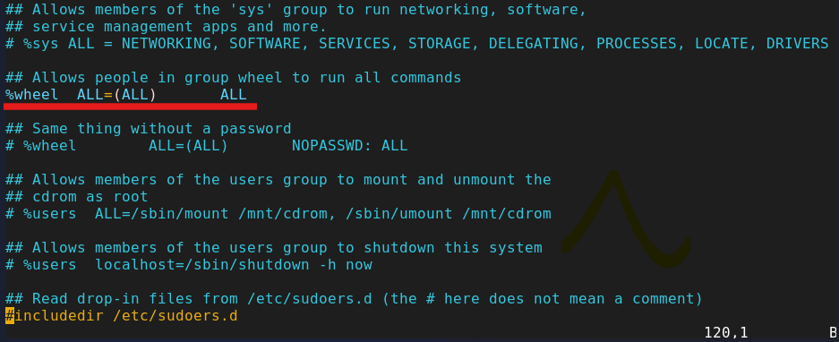{#fig:005 width=70%}

## Создание alice

Создадим пользователя alice, входящего в группу wheel. Убедимся, что пользователь добавлен в группу wheel

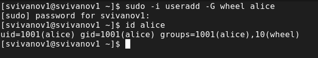{#fig:006 width=70%}

## Задаем пароль

Зададим пароль для пользователя alice

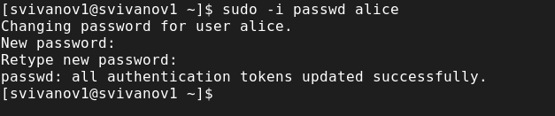{#fig:007 width=70%}

## Пользователь alice

Переключимся на учётную запись пользователя alice

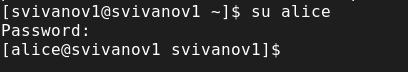{#fig:008 width=70%}

## Создание пользователя bob

Создадим пользователя bob.

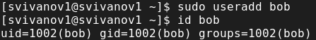{#fig:009 width=70%}

## Пароль для bob

Установим пароль для bob. Просмотрим, в какие группы входит пользователь bob

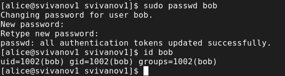{#fig:010 width=70%}

## Редактируем файл

Меняю параметры CREATE_HOME и USERGROUPS_ENAB в файле конфигурации /etc/login.defs

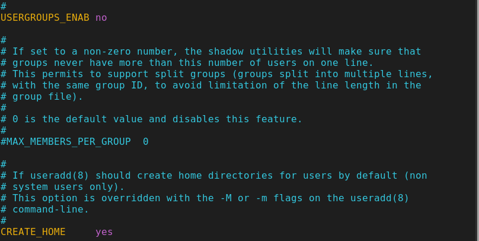{#fig:011 width=70%}

## Создание каталогов

Перейдем в каталог /etc/skel. Создаем каталоги Pictures и Documents

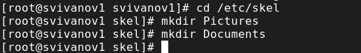{#fig:012 width=70%}

## Добавление строки в файл

Изменим содержимое файла .bashrc, добавив строку export EDITOR=/usr/bin vim.

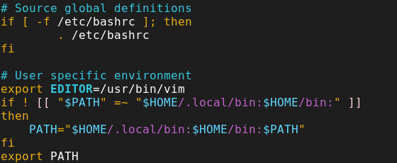{#fig:013 width=70%}

## Создание carol

Используя утилиту useradd, создаём пользователя carol, установим пароль для него.

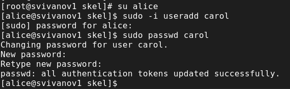{#fig:014 width=70%}

## Просмотр информации о carol

Посмотрим информацию о пользователе carol: id carol

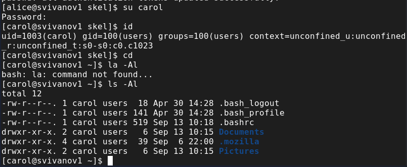{#fig:015 width=70%}

## Строка о записи пароля

Переключимся на учётную запись alice. Выводим строку записи о пароле пользователя carol в файле /etc/shadow.

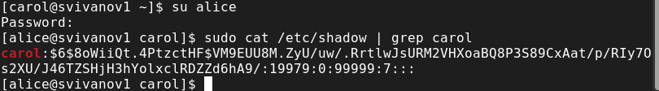{#fig:016 width=70%}

## Меняем свойства пароля

Изменим свойства пароля пользователя carol: sudo passwd -n 30 -w 3 -x 90 carol. Убедимся в изменении в строке с данными о пароле пользователя carol 

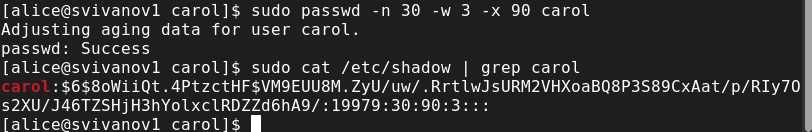{#fig:017 width=70%}

## Проверка идентификатора в файлах

Убедимся, что идентификатор alice существует во всех трёх файлах: grep alice /etc/passwd /etc/shadow /etc/group 

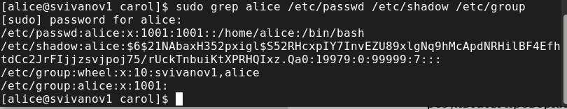{#fig:018 width=70%}

## Проверка идентификатора в файлах

Убедимся, что идентификатор carol существует не во всех трёх файлах:
sudo grep carol /etc/passwd /etc/shadow /etc/group 

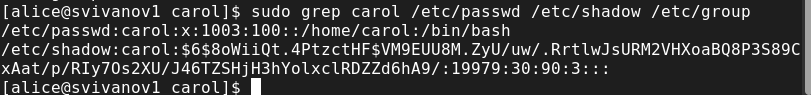{#fig:019 width=70%}

## Добавление в группы

Cоздаем группы main и third, используем usermod добавляем разных пользователей в разные группы 

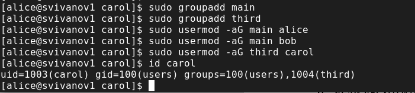{#fig:020 width=70%}

## Определяем группы

Определим, участниками каких групп являются другие созданные нами пользователи

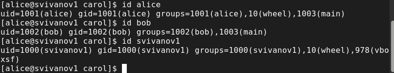{#fig:021 width=70%}

# Вывод

## Вывод 

В ходе выполнения лабораторной работы были получены представление о работе с учётными записями пользователей и группами пользователей в операционной системе типа Linux.

## Список литературы

:::{#refs}

https://esystem.rudn.ru/mod/page/view.php?id=1098933

:::

