---
## Front matter
title: "Отчет по лабораторной работе №2"
subtitle: "Дисциплина: Основы администрирования операционных систем"
author: "Иванов Сергей Владимирович"

## Generic otions
lang: ru-RU
toc-title: "Содержание"

## Bibliography
bibliography: bib/cite.bib
csl: pandoc/csl/gost-r-7-0-5-2008-numeric.csl

## Pdf output format
toc: true # Table of contents
toc-depth: 2
lof: true # List of figures
fontsize: 12pt
linestretch: 1.5
papersize: a4
documentclass: scrreprt
## I18n polyglossia
polyglossia-lang:
  name: russian
  options:
	- spelling=modern
	- babelshorthands=true
polyglossia-otherlangs:
  name: english
## I18n babel
babel-lang: russian
babel-otherlangs: english
## Fonts
mainfont: PT Serif
romanfont: PT Serif
sansfont: PT Sans
monofont: PT Mono
mainfontoptions: Ligatures=TeX
romanfontoptions: Ligatures=TeX
sansfontoptions: Ligatures=TeX,Scale=MatchLowercase
monofontoptions: Scale=MatchLowercase,Scale=0.9
## Biblatex
biblatex: true
biblio-style: "gost-numeric"
biblatexoptions:
  - parentracker=true
  - backend=biber
  - hyperref=auto
  - language=auto
  - autolang=other*
  - citestyle=gost-numeric
## Pandoc-crossref LaTeX customization
figureTitle: "Рис."
listingTitle: "Листинг"
lofTitle: "Список иллюстраций"
lolTitle: "Листинги"
## Misc options
indent: true
header-includes:
  - \usepackage{indentfirst}
  - \usepackage{float} # keep figures where there are in the text
  - \floatplacement{figure}{H} # keep figures where there are in the text
---

# Цель работы

Получить представление о работе с учётными записями пользователей и группами пользователей в операционной системе типа Linux.

# Задание

1. Прочитать справочное описание man по командам ls, whoami, id, groups, su, sudo, passwd, vi, visudo, useradd, usermod, userdel, groupadd, groupdel.
2. Выполнить действия по переключению между учётными записями пользователей, по управлению учётными записями пользователей (раздел 2.4 1).
3. Выполнить действия по созданию пользователей и управлению их учётными записями (раздел 2.4.2).
4. Выполнить действия по работе с группами пользователей (раздел 2.4.3).

# Выполнение лабораторной работы

Войдём в систему как обычный пользователь и откроем терминал. Определим, какую учётную запись пользователя мы используем, введя команду whoami (используем учётную запись svivanov1). (рис. 1).

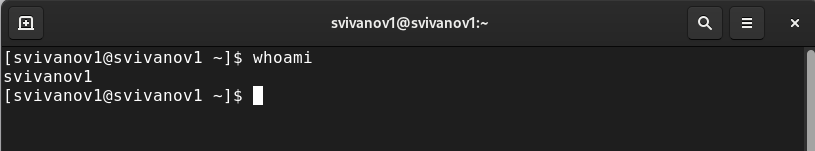{#fig:001 width=70%}

Вывожу на экран более подробную информацию, используя команду id (UID – id пользователя равный 1000 GID – id группы равный 1000) (рис. 2).

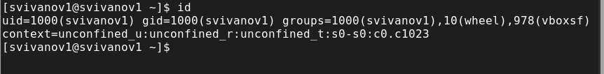{#fig:002 width=70%}

Использую команду su для переключения к учётной записи root. При запросе
пароля ввожу пароль пользователя root. Наберём id (UID – id пользователя равный 0 GID – id группы равный 0). (рис. 3).

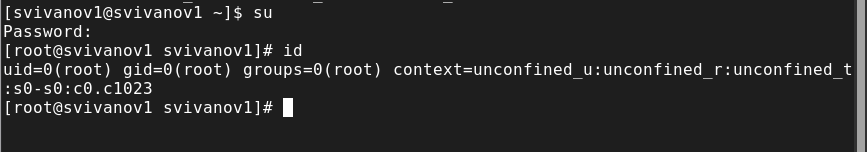{#fig:003 width=70%}

Возвращаюсь к учётной записи своего пользователя (рис. 4).

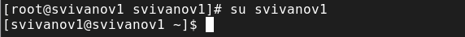{#fig:004 width=70%}

Просматриваю в безопасном режиме файл /etc/sudoers, используя sudo -i visudo. Мы должны убедиться, что в открытом с помощью visudo файле
присутствует строка %wheel ALL=(ALL) ALL (данная строка присутствует) (рис. 5). 

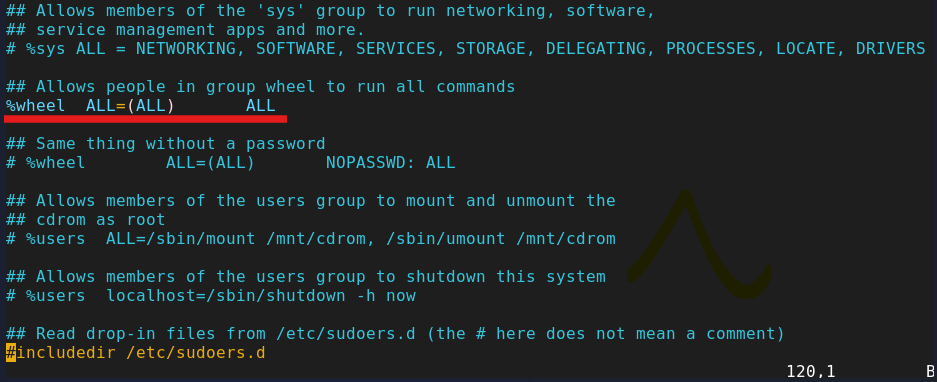{#fig:005 width=70%}

Создадим пользователя alice, входящего в группу wheel. Убедимся, что пользователь alice добавлен в группу wheel, введя id alice (рис. 6). 

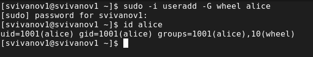{#fig:006 width=70%}

Зададим пароль для пользователя alice (рис. 7). 

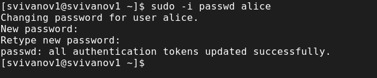{#fig:007 width=70%}

Переключимся на учётную запись пользователя alice (рис. 8).

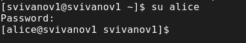{#fig:008 width=70%}

Создадим пользователя bob.  (рис. 9).

{#fig:009 width=70%}

Установим пароль для bob. Просмотрим, в какие группы входит пользователь bob (рис. 10).

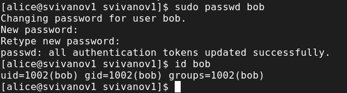{#fig:010 width=70%}

Теперь применим общие решения для создания учётных записей пользователей. Для этого переключимся в терминале на учётную запись пользователя root: su. Далее открываем файл конфигурации /etc/login.defs для редактирования, используя: vim /etc/login.defs. Изменим несколько параметров. Например, параметр CREATE_HOME и убедимся, что он установлен в значение yes. Также установим параметр USERGROUPS_ENAB no. Это позволит не добавлять нового пользователя в группу с тем же именем, что и пользователь, а использовать группу users. (рис. 11). 

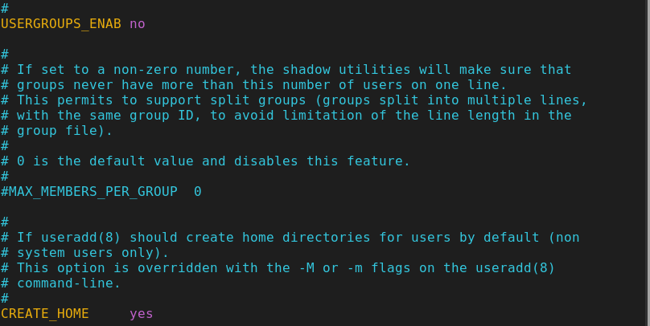{#fig:011 width=70%}

Перейдем в каталог /etc/skel. Создаем каталоги Pictures и Documents. Это позволит добавить эти каталоги по умолчанию во все домашние каталоги пользователей. (рис. 12). 

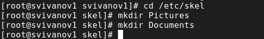{#fig:012 width=70%}

Изменим содержимое файла .bashrc, добавив строку export EDITOR=/usr/bin vim.  (рис. 13). Эта запись означает, что текстовый редактор vim или редактор mceditor будет установлен по умолчанию для инструментов, которые нуждаются в изменении текстовых файлов.

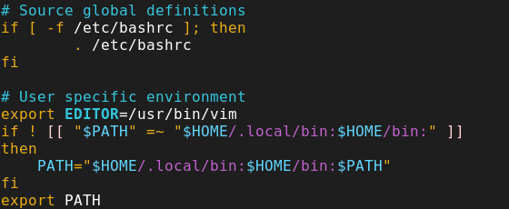{#fig:013 width=70%}

Переключимся в терминале на учётную запись пользователя alice, используя утилиту useradd, создаём пользователя carol, установим пароль для него (рис. 14). 

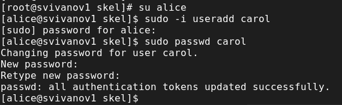{#fig:014 width=70%}

Посмотрим информацию о пользователе carol: id carol (carol находится в группе users). Теперь нам нужно убедиться, что каталоги Pictures и Documents были созданы в домашнем каталоге пользователя carol: su carol и ls (рис. 15). 

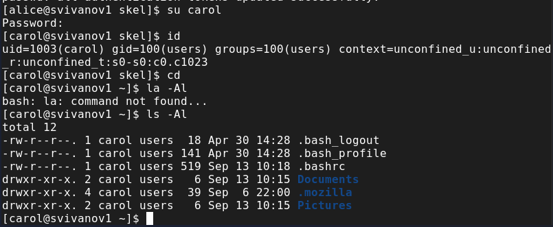{#fig:015 width=70%}

Переключимся в терминале на учётную запись пользователя alice. Поясним строку записи о пароле пользователя carol в файле /etc/shadow. Тут нам выводится зашифрованный пароль. (рис. 16).

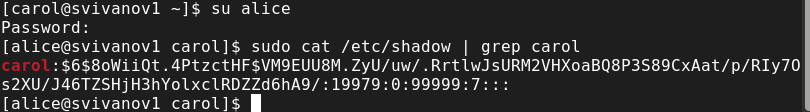{#fig:016 width=70%}

Изменим свойства пароля пользователя carol следующим образом: sudo passwd -n 30 -w 3 -x 90 carol. Убедимся в изменении в строке с данными о пароле пользователя carol в файле /etc/shadow: sudo cat /etc/shadow | grep carol (рис. 17)

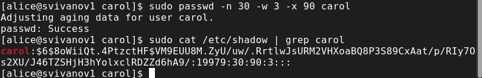{#fig:017 width=70%}

Убедимся, что идентификатор alice существует во всех трёх файлах: grep alice /etc/passwd /etc/shadow /etc/group (рис. 18)

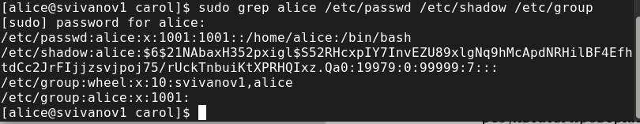{#fig:018 width=70%}

Убедимся, что идентификатор carol существует не во всех трёх файлах:
sudo grep carol /etc/passwd /etc/shadow /etc/group (рис. 19)

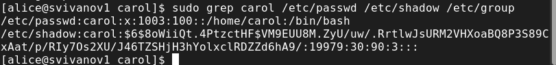{#fig:019 width=70%}

Находясь под учётной записью пользователя alice, создаем группы main и third, используем usermod для добавления пользователей alice и bob в группу main, а carol, dan, dave и david — в группу third, убедимся, что пользователь carol правильно добавлен в группу third. Carol входит в группы users и third (рис. 20)

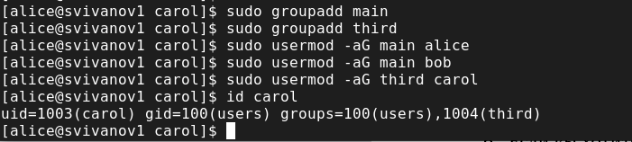{#fig:020 width=70%}

Определим, участниками каких групп являются другие созданные нами пользователи. alice входит в группы alice, main, wheel. bob - bob, main. svivanov1 - vboxsf, wheel, svivanov1 (рис. 21)

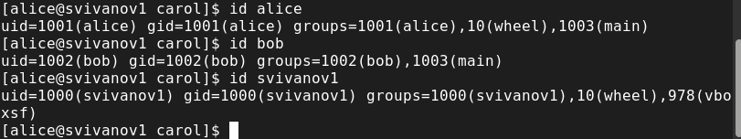{#fig:021 width=70%}

# Контрольные вопросы

**1. При помощи каких команд можно получить информацию о номере (идентификаторе), назначенном пользователю Linux, о группах, в которые включён пользователь?**

Команда id.

**2. Какой UID имеет пользователь root? При помощи какой команды можно узнать UID пользователя?**

UID=0. Его можно узнать при поомощи команды id "имя пользователя". Например id carol, id alice, id svivanov1. (рис. 21)

**3. В чём состоит различие между командами su и sudo?**

Различие между ними заключается в пароле, который им требуется. "sudo" требует пароля текущего пользователя, "su" требует ввода пароля пользователя root. Очевидно, что "sudo" является лучшей альтернативой между ними с точки зрения безопасности.

**4. В каком конфигурационном файле определяются параметры sudo?**

В файле /etc/sudoers.

**5. Какую команду следует использовать для безопасного изменения конфигурации sudo?**

Команда visudo.

**6. Если вы хотите предоставить пользователю доступ ко всем командам администрирования системы через sudo, членом какой группы он должен быть**

Admin.

**7. Какие файлы/каталоги можно использовать для определения параметров, которые будут использоваться при создании учётных записей пользователей? Приведите примеры настроек.**

Каталоги /etc/login.defs и /etc/default/useradd.

**8. Где хранится информация о первичной и дополнительных группах пользователей ОС типа Linux?.**

В файле /etc/passwd хранится информация о пользователях, включая их основную (первичную) группу. Дополнительные группы указываются в файле /etc/group. Также можно использовать команду id username, чтобы получить информацию о всех группах, в которых состоит пользователь. Пример команды 'id alice': uid=1001(alice) gid=1001(alice) group: 001(alice) ,10(wheel) ,1003(main) (рис. 21)

**9. Какие команды вы можете использовать для изменения информации о пароле пользователя (например о сроке действия пароля)?**

Команда sudo passwd -n 'Пароль должен использоваться как минимум за сколько-то дней' -w ' За сколько дней до истечения срока действия пользователь получит предупреждение' -x 'срок действия пароля' 'имя пользователя' (рис. 17)

**10. Какую команду следует использовать для прямого изменения информации в файле /etc/group и почему?**

Следуем использовать команду visudo, т.к этот файл очень важен, visudo не позволяет созранить изменения если имеется синтаксическая ошибка.

# Выводы

В ходе выполнения лабораторной работы были получены представление о работе с учётными записями пользователей и группами пользователей в операционной системе типа Linux.

