---
## Front matter
lang: ru-RU
title: Лабораторная работа № 3
subtitle: Основы администрирования операционных систем
author:
  - Иванов Сергей Владимирович, НПИбд-01-23
institute:
  - Российский университет дружбы народов, Москва, Россия
date: 20 сентября 2024

## i18n babel
babel-lang: russian
babel-otherlangs: english

## Formatting pdf
toc: false
slide_level: 2
aspectratio: 169
section-titles: true
theme: metropolis
header-includes:
 - \metroset{progressbar=frametitle,sectionpage=progressbar,numbering=fraction}
 - '\makeatletter'
 - '\beamer@ignorenonframefalse'
 - '\makeatother'

  ## Fonts
mainfont: PT Serif
romanfont: PT Serif
sansfont: PT Sans
monofont: PT Mono
mainfontoptions: Ligatures=TeX
romanfontoptions: Ligatures=TeX
sansfontoptions: Ligatures=TeX,Scale=MatchLowercase
monofontoptions: Scale=MatchLowercase,Scale=0.9
---

## Цель работы

Получение навыков настройки базовых и специальных прав доступа для групп пользователей в операционной системе типа Linux.

## Задание

1. Прочитать справочное описание man по командам chgrp, chmod, getfacl, setfacl.
2. Выполнить действия по управлению базовыми разрешениями для групп пользователей 
3. Выполнить действия по управлению специальными разрешениями для групп пользователей 
4. Выполнить действия по управлению расширенными разрешениями с использованием списков ACL для групп пользователей 

# Выполнение работы

## Создаём каталоги

В корневом каталоге создаем каталоги /data/main и /data/third. Посмотрим, кто является их владельцем.

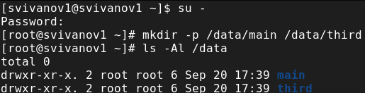{#fig:001 width=70%}

## Меняем владельцев

Изменим владельцев этих каталогов с root на main и third соответственно

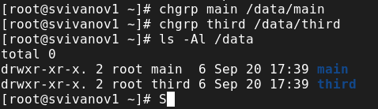{#fig:002 width=70%}

## Установка разрешений

Установим разрешения, позволяющие владельцам каталогов записывать файлы в них и запрещающие доступ к содержимому другим пользователям.

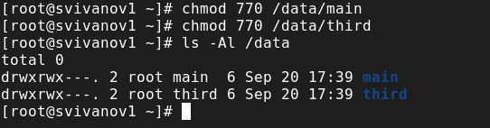{#fig:003 width=70%}

## Учетная запись bob и создание emptyfile

Под пользователем bob перейдем в каталог /data/main и создадим файл emptyfile. Т.к пользователь bob владелец каталога main, нам удалось перейти в него и создать новый файл

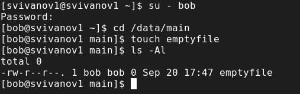{#fig:004 width=70%}

## Создание файла в /data/third

Передем в каталог /data/third и создадим emptyfile. Т.к пользователь bob не является владельцем каталога, нам не удалось перейти в него и создать новый файл

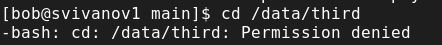{#fig:005 width=70%}

## Создание файлов alice

Откроем терминал под пользователем alice. Перейдем в каталог /data/main. Создадим 2 файла: alice1, alice2

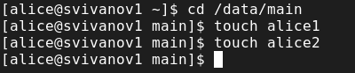{#fig:006 width=70%}

## Удаление файлов alice

Переходим на пользователя bob. Перейдём в каталог /data/main. Мы увидим два файла, созданные пользователем alice. Попробуем удалить файлы, принадлежащие ему. Убедимся, что файлы удалены

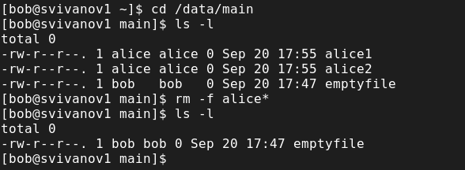{#fig:007 width=70%}

## Создание файлов bob

Создадим 2 файла, которые принадлежат пользователю bob: bob1 и bob2

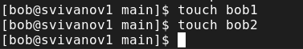{#fig:008 width=70%}

## Бит идентификатора группы

Под пользователем root установим для каталога /data/main бит идентификатора группы, а также stiky-бит для разделяемого каталога группы

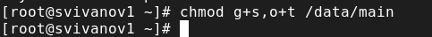{#fig:009 width=70%}

## Файлы alice3 и alice4

Под пользователем alice создадим в каталоге /data/main файлы alice3 и alice4. Мы видим, что 2 этих файла принадлежат группе main, которая является владельцем каталога /data/main.

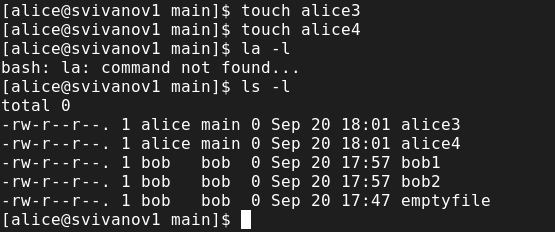{#fig:010 width=70%}

## Пробуем удалить файлы

Под пользователем alice попробуем удалить файлы, принадлежащие пользователю bob. Убеждаемся, что sticky-bit предотвратит удаление этих файлов.

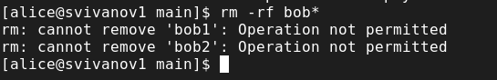{#fig:011 width=70%}

## Установка прав

Под пользователем root установим права на чтение и выполнение в каталоге /data/main для группы third и права на чтение и выполнение для группы main в каталоге /data/third

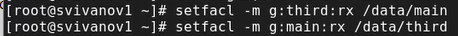{#fig:012 width=70%}

## Правильность установки разрешений

Используем команду getfacl, чтобы убедиться в правильности установки разрешений

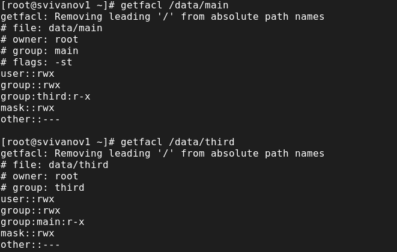{#fig:013 width=70%}

## Проверка полномочий

Создадим newfile1 в каталоге /data/main. Используем getfacl для проверки текущих назначений полномочий. У пользователя только чтение и запись, у группы и других только чтение.

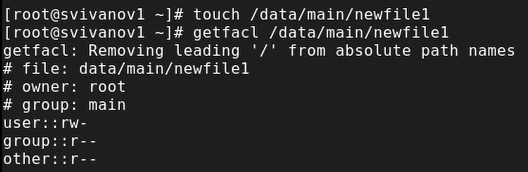{#fig:014 width=70%}

## Проверка полномочий

Выполним аналогичные действия для каталога /data/third.

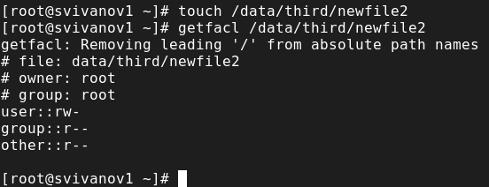{#fig:015 width=70%}

## Установка ACL по умолчанию

Установим ACL по умолчанию для каталогов /data/main и /data/third. Убедимся, что настройки ACL работают, добавив новый файл в каталог.

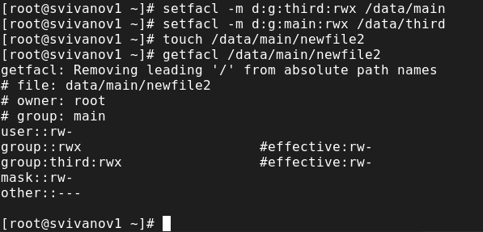{#fig:016 width=70%}

## Установка ACL по умолчанию

Выполним аналогичные действия для каталога /data/third

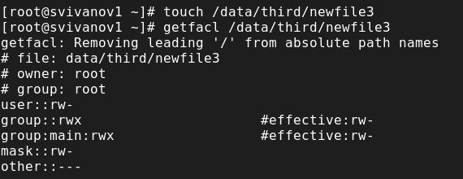{#fig:017 width=70%}

## Проверка операций с файлами

Проверим операции с файлами: rm /data/main/newfile1 и rm /data/main/newfile2. Система не даёт удалить данные файлы.

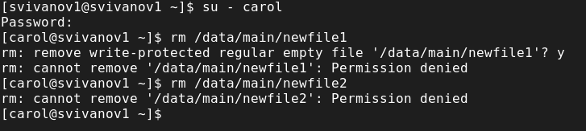{#fig:018 width=70%}

## Проверка операций с файлами

Проверим, возможно ли осуществить запись в файл. В файл newfile1 запись осуществить не получилось, а вот в newfile2 всё выполнилось 

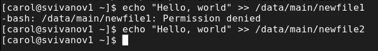{#fig:019 width=70%}

# Вывод

## Вывод 

В ходе выполнения лабораторной работы были получены навыки настройки
базовых и специальных прав доступа для групп пользователей в операционной
системе типа Linux.

## Список литературы

:::{#refs}

https://esystem.rudn.ru/mod/page/view.php?id=1098933

:::

