---
## Front matter
title: "Отчет по лабораторной работе №3"
subtitle: "Дисциплина: Основы администрирования операционных систем"
author: "Иванов Сергей Владимирович"

## Generic otions
lang: ru-RU
toc-title: "Содержание"

## Bibliography
bibliography: bib/cite.bib
csl: pandoc/csl/gost-r-7-0-5-2008-numeric.csl

## Pdf output format
toc: true # Table of contents
toc-depth: 2
lof: true # List of figures
fontsize: 12pt
linestretch: 1.5
papersize: a4
documentclass: scrreprt
## I18n polyglossia
polyglossia-lang:
  name: russian
  options:
	- spelling=modern
	- babelshorthands=true
polyglossia-otherlangs:
  name: english
## I18n babel
babel-lang: russian
babel-otherlangs: english
## Fonts
mainfont: PT Serif
romanfont: PT Serif
sansfont: PT Sans
monofont: PT Mono
mainfontoptions: Ligatures=TeX
romanfontoptions: Ligatures=TeX
sansfontoptions: Ligatures=TeX,Scale=MatchLowercase
monofontoptions: Scale=MatchLowercase,Scale=0.9
## Biblatex
biblatex: true
biblio-style: "gost-numeric"
biblatexoptions:
  - parentracker=true
  - backend=biber
  - hyperref=auto
  - language=auto
  - autolang=other*
  - citestyle=gost-numeric
## Pandoc-crossref LaTeX customization
figureTitle: "Рис."
listingTitle: "Листинг"
lofTitle: "Список иллюстраций"
lolTitle: "Листинги"
## Misc options
indent: true
header-includes:
  - \usepackage{indentfirst}
  - \usepackage{float} # keep figures where there are in the text
  - \floatplacement{figure}{H} # keep figures where there are in the text
---

# Цель работы

Получение навыков настройки базовых и специальных прав доступа для групп пользователей в операционной системе типа Linux.

# Задание

1. Прочитать справочное описание man по командам chgrp, chmod, getfacl, setfacl.
2. Выполнить действия по управлению базовыми разрешениями для групп пользователей 
3. Выполнить действия по управлению специальными разрешениями для групп пользователей 
4. Выполнить действия по управлению расширенными разрешениями с использованием списков ACL для групп пользователей 

# Выполнение лабораторной работы

Откроем терминал с учётной записью root. В корневом каталоге создаем каталоги /data/main и /data/third. Посмотрим, кто является владельцем этих каталогов ls -Al /data. (рис. 1).

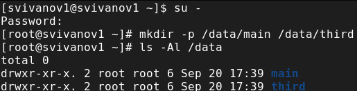{#fig:001 width=70%}

Прежде чем устанавливать разрешения, изменим владельцев этих каталогов с root на main и third соответственно: chgrp main /data/main, chgrp third /data/third. Посмотрим, кто теперь является владельцем этих каталогов (рис. 2).

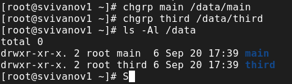{#fig:002 width=70%}

Установим разрешения, позволяющие владельцам каталогов записывать файлы в эти каталоги и запрещающие доступ к содержимому каталогов всем другим пользователям и группам. Проверим установленные права доступа. (рис. 3).

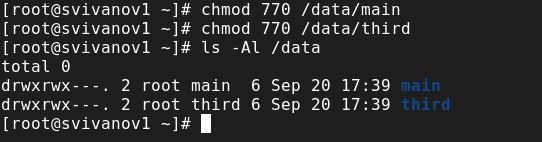{#fig:003 width=70%}

В другом терминале перейдём под учётную запись пользователя bob: su –
bob. Под пользователем bob попробуем перейти в каталог /data/main и создать файл emptyfile в этом каталоге: cd /data/main и touch emptyfile. Так как пользователь bob является владельцем каталога main, нам удалось перейти в этот каталог и создать в нём новый файл. (рис. 4).

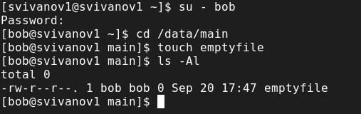{#fig:004 width=70%}

Теперь под пользователем bob попробуем перейти в каталог /data/third и создать файл emptyfile в этом каталоге. Так как пользователь bob не является владельцем каталога third, нам не удалось перейти в этот каталог и создать в нём новый файл (рис. 5). 

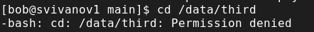{#fig:005 width=70%}

Откроем новый терминал под пользователем alice. Перейдем в каталог /data/main. Создадим два файла, владельцем которых является alice: touch alice1, touch alice2 (рис. 6). 

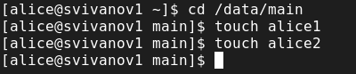{#fig:006 width=70%}

В другом терминале переходим под учётную запись пользователя bob su - bob. Перейдём в каталог cd /data/main и в этом каталоге вводим: ls -l. Мы увидим два файла, созданные пользователем alice. Попробуем удалить файлы, принадлежащие пользователю alice: rm -f alice*. Убедимся, что файлы будут удалены пользователем bob (рис. 7). 

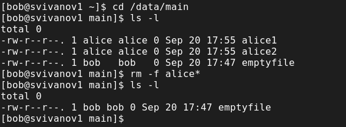{#fig:007 width=70%}

Создадим два файла, которые принадлежат пользователю bob: touch bob1 и touch bob2 (рис. 8).

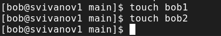{#fig:008 width=70%}

В терминале под пользователем root установим для каталога /data/main бит идентификатора группы, а также stiky-бит для разделяемого каталога группы: chmod g+s,o+t /data/main (рис. 9).

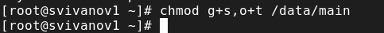{#fig:009 width=70%}

В терминале под пользователем alice создадим в каталоге /data/main файлы touch alice3 touch alice4. Теперь мы должны увидеть, что два созданных нами файла принадлежат группе main, которая является группой-владельцем каталога /data/main. (рис. 10).

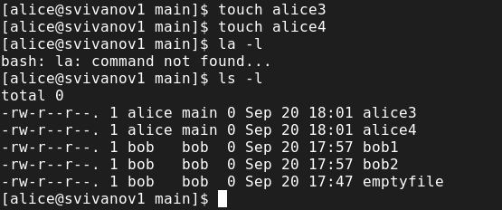{#fig:010 width=70%}

В терминале под пользователем alice попробуем удалить файлы, принадлежащие пользователю bob: rm -rf bob*. Убеждаемся, что sticky-bit предотвратит удаление этих файлов пользователем alice, поскольку этот пользователь не является владельцем этих файлов (рис. 11). 

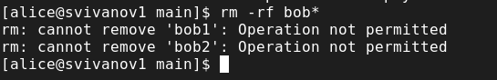{#fig:011 width=70%}

Откроем терминал с учётной записью root. Установим права на чтение и выполнение в каталоге /data/main для группы third и права на чтение и выполнение для группы main в каталоге /data/third: setfacl -m g:third:rx /data/main и setfacl -m g:main:rx /data/third (рис. 12). 

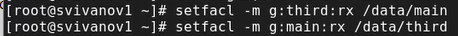{#fig:012 width=70%}

Используем команду getfacl, чтобы убедиться в правильности установки разрешений: getfacl /data/main и getfacl /data/third (рис. 13)

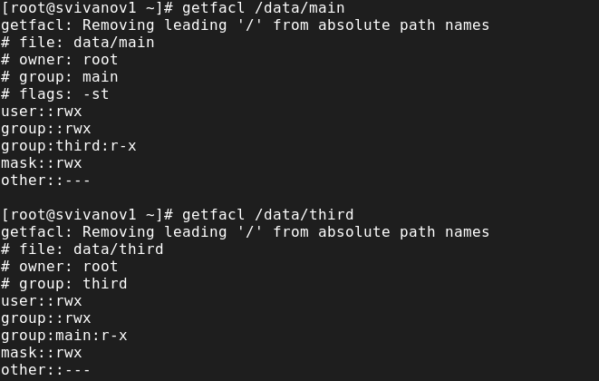{#fig:013 width=70%}

Создадим новый файл с именем newfile1 в каталоге /data/main: touch /data/ и main/newfile1. Используем getfacl /data/main/newfile1 для проверки текущих назначений полномочий. У пользователя только чтение и запись, у группы и других только чтение. (рис. 14). 

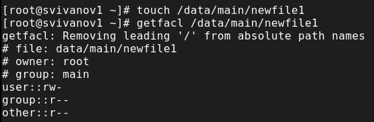{#fig:014 width=70%}

Выполним аналогичные действия для каталога /data/third. (рис. 15). 

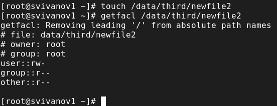{#fig:015 width=70%}

Установим ACL по умолчанию для каталогов /data/main и /data/third. setfacl -m d:g:third:rwx /data/main и setfacl -m d:g:main:rwx /data/third. Убедимся, что настройки ACL работают, добавив новый файл в каталог touch /data/main/newfile2. Используем getfacl /data/main/newfile2 для проверки текущих назначений полномочий (рис. 16).

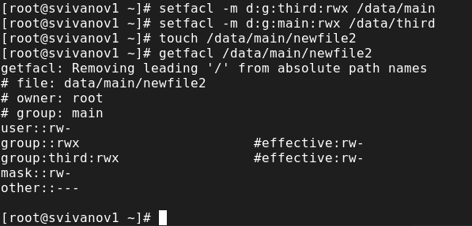{#fig:016 width=70%}

Выполним аналогичные действия для каталога /data/third (рис. 17)

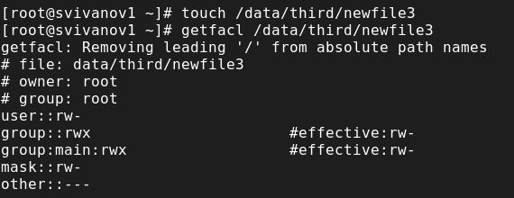{#fig:017 width=70%}

Для проверки полномочий группы third в каталоге /data/third войдем в другом терминале под учётной записью члена группы third: su - carol. Проверим операции с файлами: rm /data/main/newfile1 и rm /data/main/newfile2. Система не даёт удалить данные файлы. (рис. 18)

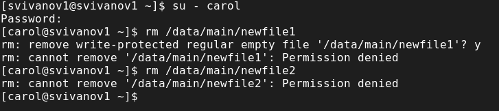{#fig:018 width=70%}

Проверим, возможно ли осуществить запись в файл: echo "Hello, world" >> /data/main/newfile1 и echo "Hello, world" >> /data/main/newfile2. В файл newfile1 запись осуществить не получилось, а вот в newfile2 всё выполнилось (рис. 19)

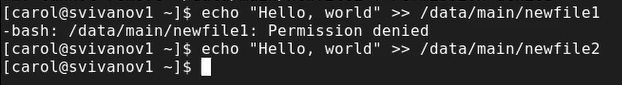{#fig:019 width=70%}

# Контрольные вопросы

**1. Как следует использовать команду chown, чтобы установить владельца группы для файла? Приведите пример.**

chown bob:main /data/third/newfile.

**2. С помощью какой команды можно найти все файлы, принадлежащие конкретному пользователю? Приведите пример.**

find ~ -user bob -print.

**3. Как применить разрешения на чтение, запись и выполнение для всех файлов в каталоге /data для пользователей и владельцев групп, не устанавливая никаких прав для других? Приведите пример.**

chmod 770 /data/main

**4. Какая команда позволяет добавить разрешение на выполнение для файла, который необходимо сделать исполняемым?**

chmod +x file

**5. Какая команда позволяет убедиться, что групповые разрешения для всех новых файлов, создаваемых в каталоге, будут присвоены владельцу группы этого каталога? Приведите пример.**

getfacl “имя каталога”. getfacl /data/main

**6. Необходимо, чтобы пользователи могли удалять только те файлы, владельцами которых они являются, или которые находятся в каталоге, владельцами которого они являются. С помощью какой команды можно это сделать? Приведите пример.**

chmod g+s,o+t /data/main

**7. Какая команда добавляет ACL, который предоставляет членам группы права доступа на чтение для всех существующих файлов в текущем каталоге?**

setfacl -m g:group:r <file/dir>. setfacl -m g:third:rx /data/main

**8. Что нужно сделать для гарантии того, что члены группы получат разрешения на чтение для всех файлов в текущем каталоге и во всех его подкаталогах, а также для всех файлов, которые будут созданы в этом каталоге в будущем? Приведите пример.**

setfacl -dm g:group:r /dir.

**9. Какое значение umask нужно установить, чтобы «другие» пользователи не получали какие-либо разрешения на новые файлы? Приведите пример.**

007.

**10. Какая команда гарантирует, что никто не сможет удалить файл myfile случайно?**

sudo chattr +i myfile.

# Выводы

В ходе выполнения лабораторной работы были получены навыки настройки
базовых и специальных прав доступа для групп пользователей в операционной
системе типа Linux.

