---
## Front matter
lang: ru-RU
title: Лабораторная работа № 4
subtitle: Основы администрирования операционных систем
author:
  - Иванов Сергей Владимирович, НПИбд-01-23
institute:
  - Российский университет дружбы народов, Москва, Россия
date: 27 сентября 2024

## i18n babel
babel-lang: russian
babel-otherlangs: english

## Formatting pdf
toc: false
slide_level: 2
aspectratio: 169
section-titles: true
theme: metropolis
header-includes:
 - \metroset{progressbar=frametitle,sectionpage=progressbar,numbering=fraction}
 - '\makeatletter'
 - '\beamer@ignorenonframefalse'
 - '\makeatother'

  ## Fonts
mainfont: PT Serif
romanfont: PT Serif
sansfont: PT Sans
monofont: PT Mono
mainfontoptions: Ligatures=TeX
romanfontoptions: Ligatures=TeX
sansfontoptions: Ligatures=TeX,Scale=MatchLowercase
monofontoptions: Scale=MatchLowercase,Scale=0.9
---

## Цель работы

Получить навыки работы с репозиториями и менеджерами пакетов.

## Задание

1. Изучить, как и в каких файлах подключаются репозитории для установки программного обеспечения; 
2. Изучить и повторить процесс установки/удаления определённого пакета с использованием возможностей dnf
3. Изучить и повторить процесс установки/удаления определённого пакета с использованием возможностей rpm 

# Выполнение работы

## Содержимое репозиториев

Перейдем в режим суперпользователя, в каталог /etc/yum.repos.d и изучим его содержание:

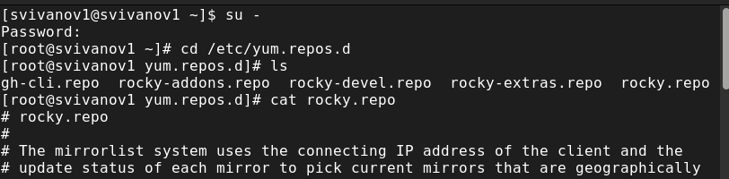{#fig:001 width=70%}

## Список репозиториев

Выводим на экран список репозиториев: dnf repolist

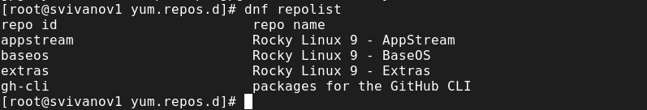{#fig:002 width=70%}

## Список пакетов user

Выводим на экран список пакетов, в названии которых есть слово user

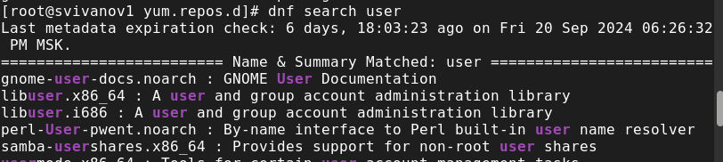{#fig:003 width=70%}

## Установка nmap

Установим nmap, предварительно изучив информацию по имеющимся пакетам: dnf search nmap; dnf info nmap

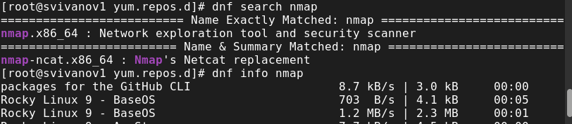{#fig:004 width=70%}

## Установка nmap

dnf install nmap

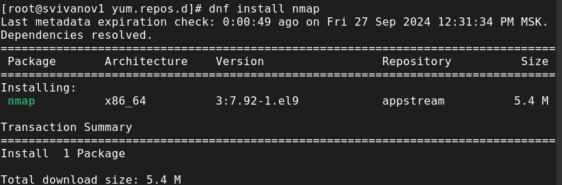{#fig:005 width=70%}

## Удаление nmap

Удалим nmap: dnf remove nmap

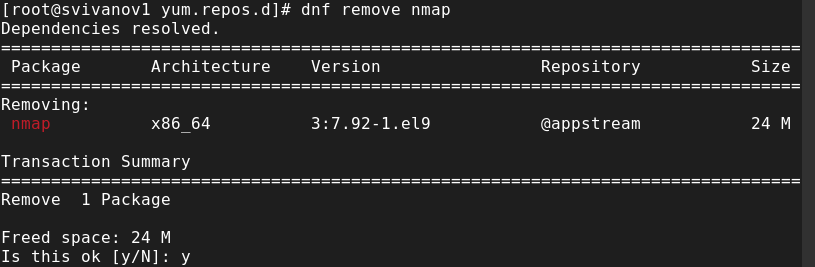{#fig:006 width=70%}

## Установка RPM Development Tools

Получим список имеющихся групп пакетов

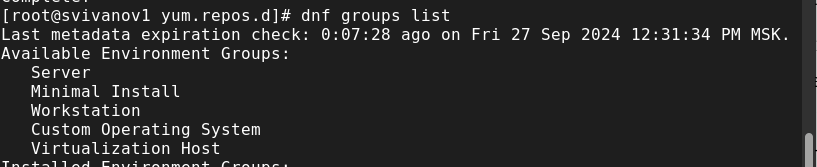{#fig:007 width=70%}

## Установка RPM Development Tools

Затем установим группу пакетов RPM Development Tools:

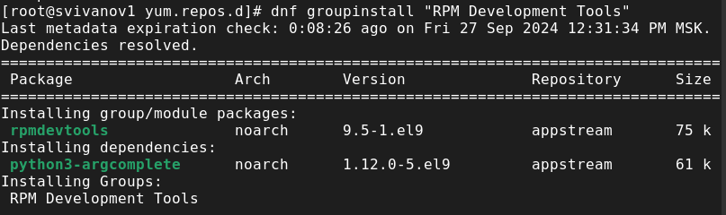{#fig:008 width=70%}

## Удаление RPM Development Tools

Для удаления пакетов RPM Development Tools воспользуемся командой dnf groupremove "RPM Development Tools"

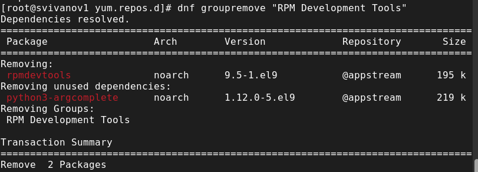{#fig:009 width=70%}

## История dnf

Посмотрим историю использования команды dnf: dnf history

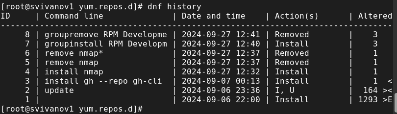{#fig:010 width=70%}

## Отмена действия

Отменим последнее действие

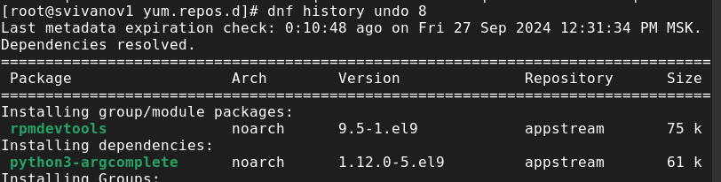{#fig:011 width=70%}

## Скачивание rpm

Скачаем rpm-пакет lynx:

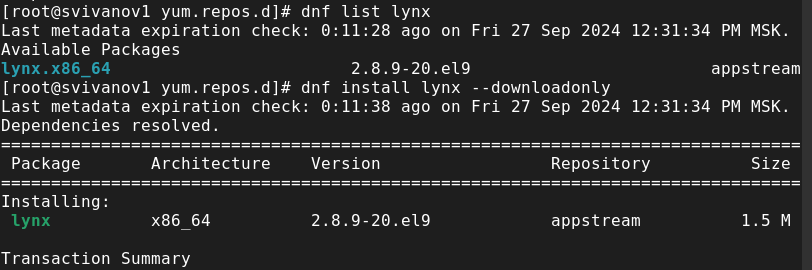{#fig:012 width=70%}

## rpm пакет

Найдем каталог, в который был помещён пакет после загрузки, перейдем в него и установим пакет. Определим расположение исполняемого файла

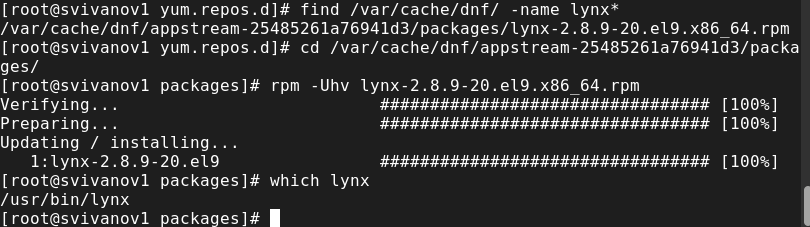{#fig:013 width=70%}

## Дополнительная информация

Используя rpm, определим по имени файла, к какому пакету принадлежит lynx и получим дополнительную информацию о содержимом пакета

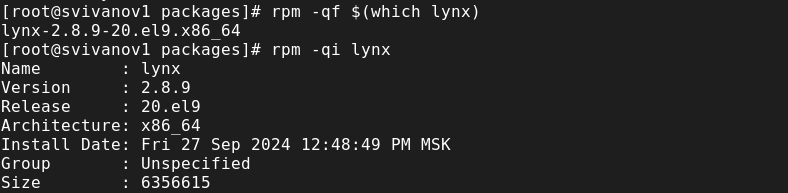{#fig:014 width=70%}

## Все файлы в пакете

Получим список всех файлов в пакете

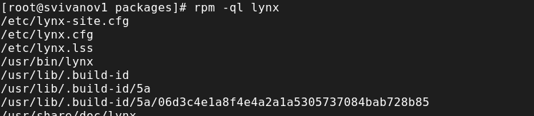{#fig:015 width=70%}

## Документация пакета

Также выведем перечень файлов с документацией пакета

{#fig:016 width=70%}

## Конф. файлы и скрипты

Выведем на экран перечень и месторасположение конфигурационных файлов пакета и расположение и содержание скриптов, выполняемых при установке пакета.

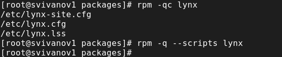{#fig:017 width=70%}

## Проверка lynx

Запускаем текстовый браузер lynx, чтобы проверить корректность установки пакета.

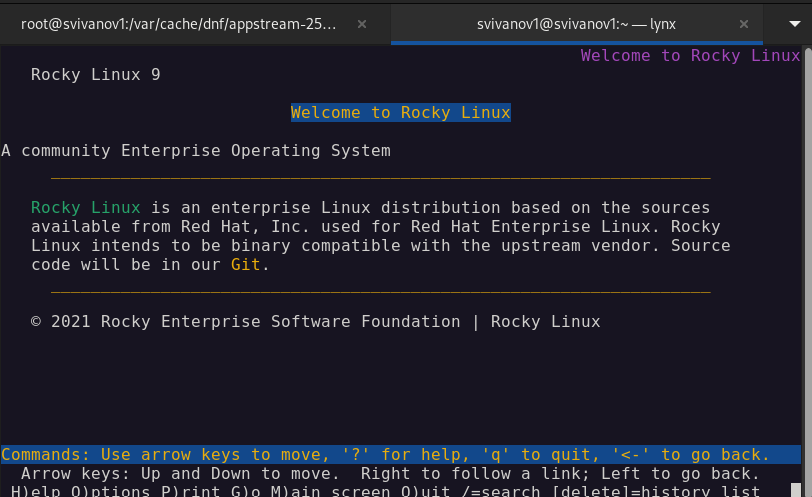{#fig:018 width=70%}

## Удаление пакета

Вернемся в терминал с учётной записью root и удалим пакет

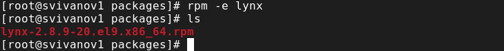{#fig:019 width=70%}

## Установка dnsmasq

Установим пакет dnsmasq и определим расположение исполняемого файла

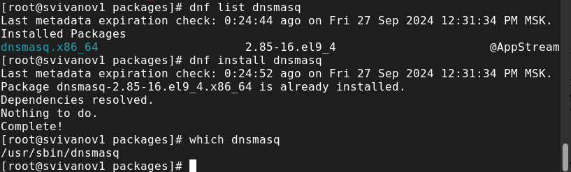{#fig:020 width=70%}

## Доп. информация

Определим по имени файла, к какому пакету принадлежит dnsmasq и получим дополнительную информацию о содержимом пакета

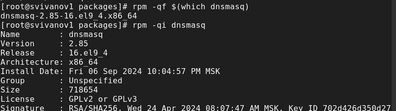{#fig:021 width=70%}

## Список файлов в пакете

Получим список всех файлов в пакете

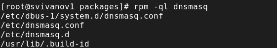{#fig:022 width=70%}

## Перечень файлов

Также выведем перечень файлов с документацией пакета

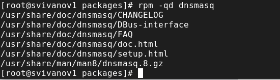{#fig:023 width=70%}

## Файл документации

Посмотрим файлы документации, применив команду man dnsmasq. 

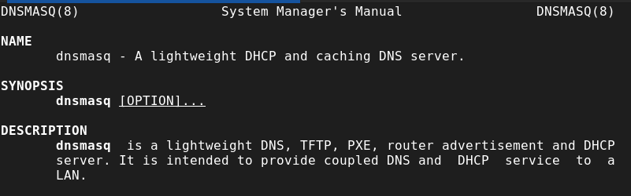{#fig:024 width=70%}

## Конф. файлы и скрипты

Выведем на экран перечень конфигурационных файлов пакета. Выведем на экран расположение и содержание скриптов, выполняемых при установке пакета

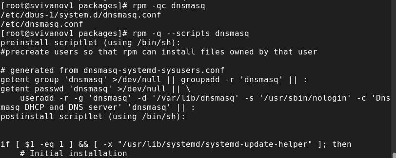{#fig:025 width=70%}

## Удаляем пакет

Вернемся в терминал с учётной записью root и удалим пакет

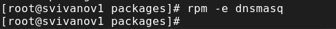{#fig:026 width=70%}

# Вывод

## Вывод 

В ходе выполнения лабораторной работы были получены навыки работы с репозиториями и менеджерами пакетов.

## Список литературы

:::{#refs}

https://esystem.rudn.ru/mod/page/view.php?id=1098933

:::

