---
## Front matter
title: "Отчет по лабораторной работе №4"
subtitle: "Дисциплина: Основы администрирования операционных систем"
author: "Иванов Сергей Владимирович"

## Generic otions
lang: ru-RU
toc-title: "Содержание"

## Bibliography
bibliography: bib/cite.bib
csl: pandoc/csl/gost-r-7-0-5-2008-numeric.csl

## Pdf output format
toc: true # Table of contents
toc-depth: 2
lof: true # List of figures
fontsize: 12pt
linestretch: 1.5
papersize: a4
documentclass: scrreprt
## I18n polyglossia
polyglossia-lang:
  name: russian
  options:
	- spelling=modern
	- babelshorthands=true
polyglossia-otherlangs:
  name: english
## I18n babel
babel-lang: russian
babel-otherlangs: english
## Fonts
mainfont: PT Serif
romanfont: PT Serif
sansfont: PT Sans
monofont: PT Mono
mainfontoptions: Ligatures=TeX
romanfontoptions: Ligatures=TeX
sansfontoptions: Ligatures=TeX,Scale=MatchLowercase
monofontoptions: Scale=MatchLowercase,Scale=0.9
## Biblatex
biblatex: true
biblio-style: "gost-numeric"
biblatexoptions:
  - parentracker=true
  - backend=biber
  - hyperref=auto
  - language=auto
  - autolang=other*
  - citestyle=gost-numeric
## Pandoc-crossref LaTeX customization
figureTitle: "Рис."
listingTitle: "Листинг"
lofTitle: "Список иллюстраций"
lolTitle: "Листинги"
## Misc options
indent: true
header-includes:
  - \usepackage{indentfirst}
  - \usepackage{float} # keep figures where there are in the text
  - \floatplacement{figure}{H} # keep figures where there are in the text
---

# Цель работы

Получить навыки работы с репозиториями и менеджерами пакетов.

# Задание

1. Изучить, как и в каких файлах подключаются репозитории для установки программного обеспечения; 
2. Изучить и повторить процесс установки/удаления определённого пакета с использованием возможностей dnf
3. Изучить и повторить процесс установки/удаления определённого пакета с использованием возможностей rpm 

# Выполнение лабораторной работы

В консоли перейдем в режим работы суперпользователя, перейдем в каталог /etc/yum.repos.d и изучим содержание каталога и файлов репозиториев: (рис. 1).

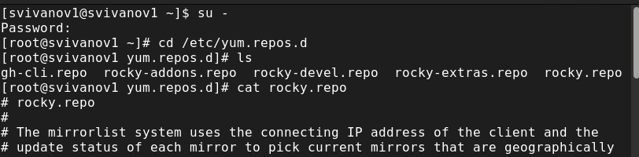{#fig:001 width=70%}

Выводим на экран список репозиториев: dnf repolist (рис. 2).

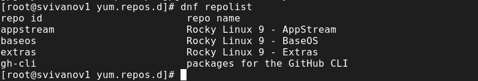{#fig:002 width=70%}

Выводим на экран список пакетов, в названии или описании которых есть слово user: dnf search user (рис. 3).

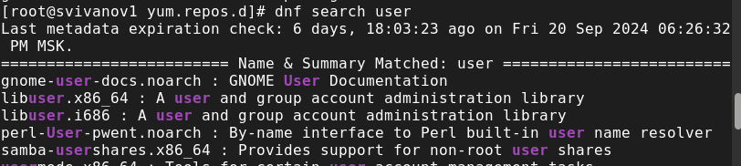{#fig:003 width=70%}

Установим nmap, предварительно изучив информацию по имеющимся пакетам:
dnf search nmap
dnf info nmap
dnf install nmap (рис. 4). (рис. 5). 

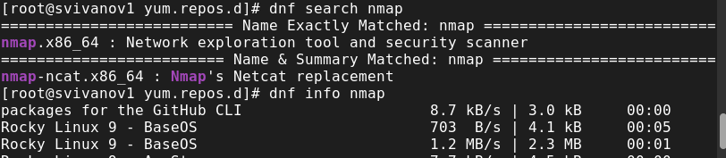{#fig:004 width=70%}

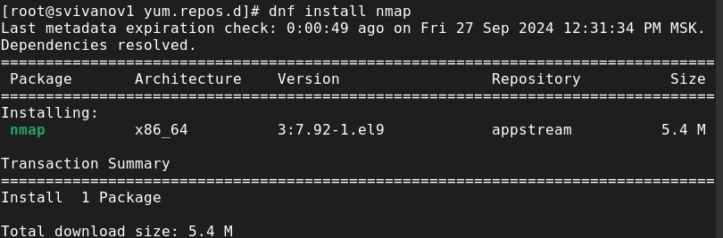{#fig:005 width=70%}

Удалим nmap: dnf remove nmap (рис. 6). 

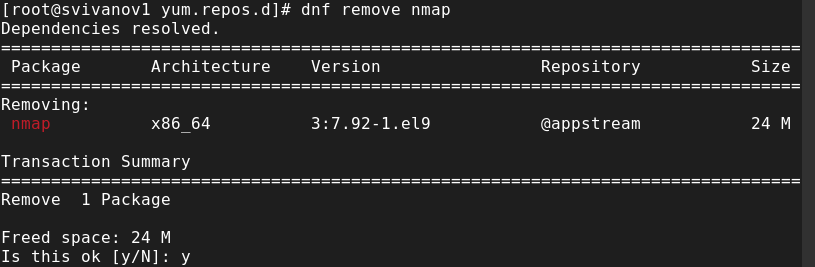{#fig:006 width=70%}

Получим список имеющихся групп пакетов, затем установим группу пакетов RPM Development Tools:
dnf groups list
LANG=C dnf groups list
dnf groups info "RPM Development Tools"
dnf groupinstall "RPM Development Tools" (рис. 7). (рис. 8).

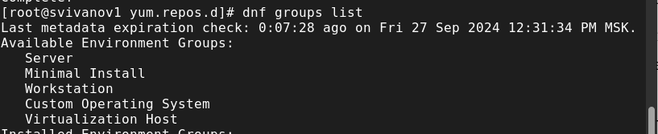{#fig:007 width=70%}

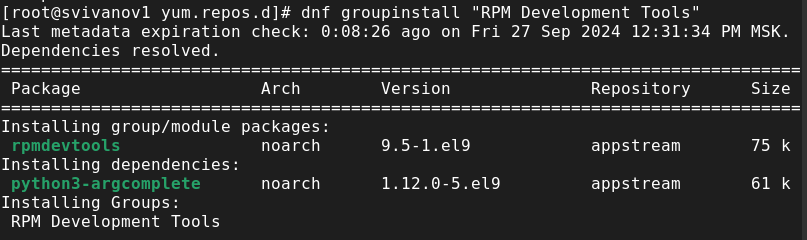{#fig:008 width=70%}

Для удаления группы пакетов RPM Development Tools воспользуемся командой dnf groupremove "RPM Development Tools" (рис. 9).

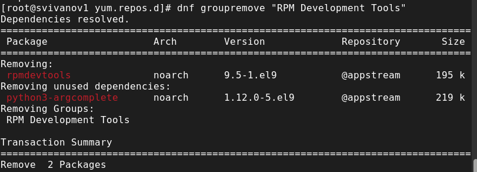{#fig:009 width=70%}

Посмотрим историю использования команды dnf: dnf history (рис. 10).

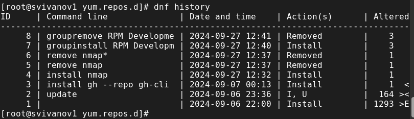{#fig:010 width=70%}

Отменим последнее действие (рис. 11). 

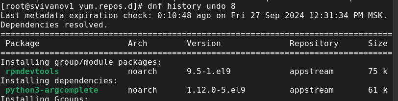{#fig:011 width=70%}

Скачаем rpm-пакет lynx:
dnf list lynx
dnf install lynx --downloadonly (рис. 12). 

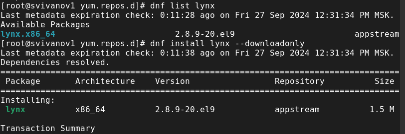{#fig:012 width=70%}

Найдем каталог, в который был помещён пакет после загрузки:
find /var/cache/dnf/ -name lynx*
Перейдем в этот каталог и затем установим rpm-пакет:
rpm -Uhv lynx-<версия>.rpm
Определим расположение исполняемого файла:
which lynx (рис. 13)

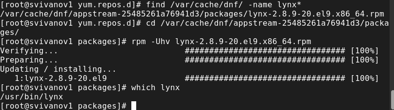{#fig:013 width=70%}

Используя rpm, определим по имени файла, к какому пакету принадлежит lynx: rpm -qf $(which lynx) и получим дополнительную информацию о содержимом пакета, введя: rpm -qi lynx (рис. 14). 

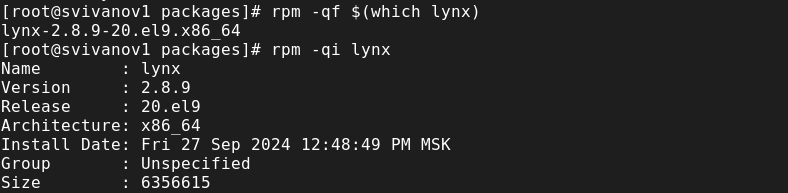{#fig:014 width=70%}

Получим список всех файлов в пакете, используя: rpm -ql lynx (рис. 15). 

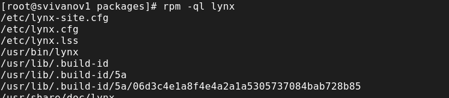{#fig:015 width=70%}

Также выведем перечень файлов с документацией пакета, введя: rpm -qd lynx (рис. 16).

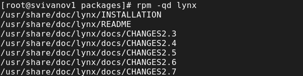{#fig:016 width=70%}

Выведем на экран перечень и месторасположение конфигурационных файлов пакета: rpm -qc lynx. Выведем на экран расположение и содержание скриптов, выполняемых при установке пакета: rpm -q --scripts lynx (рис. 17)

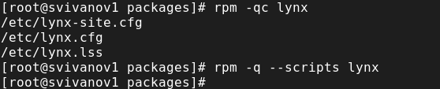{#fig:017 width=70%}

В отдельном терминале под своей учётной записью запускаем текстовый браузер lynx, чтобы проверить корректность установки пакета. Все установлено корректно (рис. 18)

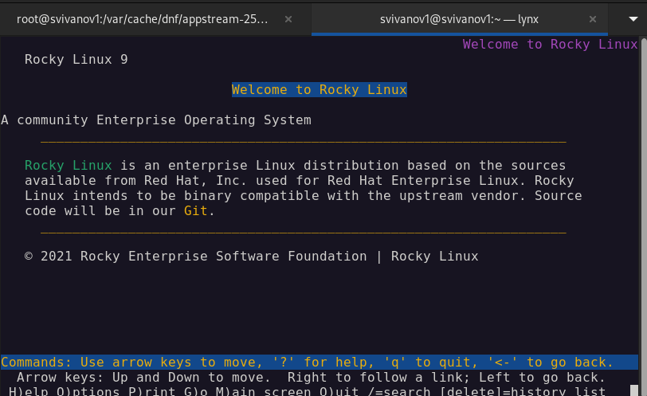{#fig:018 width=70%}

Вернемся в терминал с учётной записью root и удалим пакет:
rpm -e lynx
ls (рис. 19)

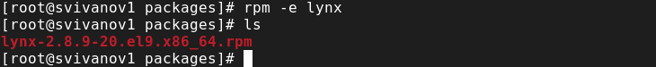{#fig:019 width=70%}

Установим пакет dnsmasq: dnf list dnsmasq; dnf install dnsmasq; и определим расположение исполняемого файла: which dnsmasq (рис. 20)

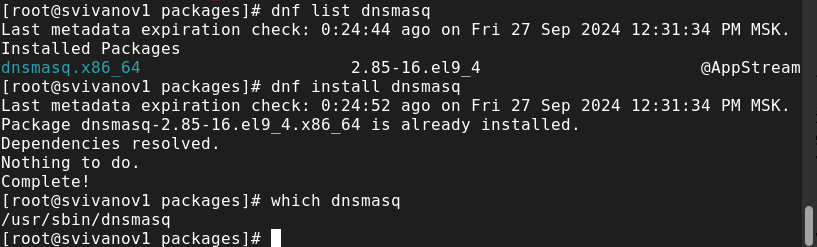{#fig:020 width=70%}

Определим по имени файла, к какому пакету принадлежит dnsmasq: rpm -qf $(which dnsmasq) и получим дополнительную информацию о содержимом пакета: rpm -qi dnsmasq (рис. 21)

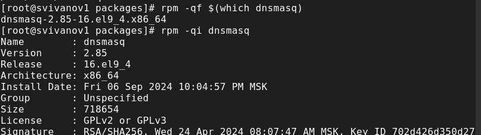{#fig:021 width=70%}

Получим список всех файлов в пакете: rpm -ql dnsmasq (рис. 22)

{#fig:022 width=70%}

Также выведем перечень файлов с документацией пакета: rpm -qd dnsmasq (рис. 23)

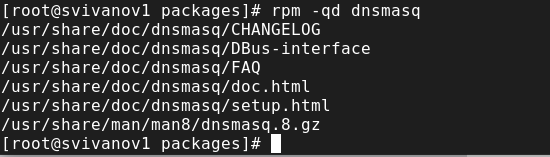{#fig:023 width=70%}

Посмотрим файлы документации, применив команду man dnsmasq. (рис. 24)

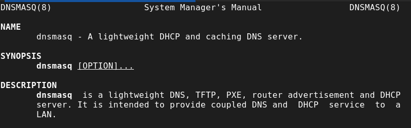{#fig:024 width=70%}

Выведем на экран перечень и месторасположение конфигурационных файлов пакета: rpm -qc dnsmasq. Выведем на экран расположение и содержание скриптов, выполняемых при установке пакета: rpm -q --scripts dnsmasq (рис. 25)

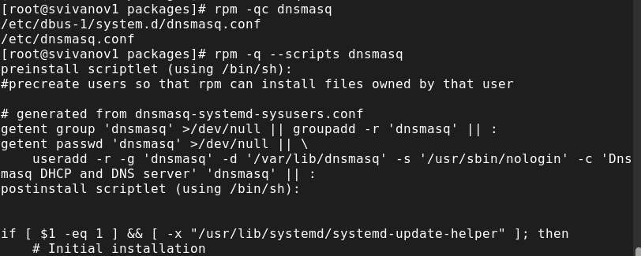{#fig:025 width=70%}

Вернемся в терминал с учётной записью root и удалим пакет: rpm -e dnsmask (рис. 26)

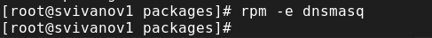{#fig:026 width=70%}

# Контрольные вопросы

**1. Какая команда позволяет вам искать пакет rpm, содержащий файл useradd?**

yum search useradd.

**2. Какие команды вам нужно использовать, чтобы показать имя группы dnf, которая содержит инструменты безопасности и показывает, что находится в этой группе?**

find ~ -user bob -print.

**Какая команда позволяет вам установить rpm, который вы загрузили из Интернета и который не находится в репозиториях?**

chmod 770 /data/main

**4. Вы хотите убедиться, что пакет rpm, который вы загрузили, не содержит никакого опасного кода сценария. Какая команда позволяет это сделать?**

chmod +x file

**5. Какая команда показывает всю документацию в rpm?**

getfacl “имя каталога”. getfacl /data/main

**6. Какая команда показывает, какому пакету rpm принадлежит файл?**

chmod g+s,o+t /data/main

# Выводы

В ходе выполнения лабораторной работы были получены навыки работы с репозиториями и менеджерами пакетов.

