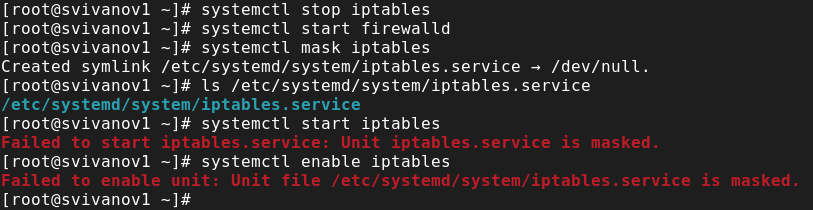

---
## Front matter
lang: ru-RU
title: Лабораторная работа № 5
subtitle: Основы администрирования операционных систем
author:
  - Иванов Сергей Владимирович, НПИбд-01-23
institute:
  - Российский университет дружбы народов, Москва, Россия
date: 5 октября 2024

## i18n babel
babel-lang: russian
babel-otherlangs: english

## Formatting pdf
toc: false
slide_level: 2
aspectratio: 169
section-titles: true
theme: metropolis
header-includes:
 - \metroset{progressbar=frametitle,sectionpage=progressbar,numbering=fraction}
 - '\makeatletter'
 - '\beamer@ignorenonframefalse'
 - '\makeatother'

  ## Fonts
mainfont: PT Serif
romanfont: PT Serif
sansfont: PT Sans
monofont: PT Mono
mainfontoptions: Ligatures=TeX
romanfontoptions: Ligatures=TeX
sansfontoptions: Ligatures=TeX,Scale=MatchLowercase
monofontoptions: Scale=MatchLowercase,Scale=0.9
---

## Цель работы

Получить навыки управления системными службами операционной системы посредством systemd.

## Задание

1. Выполнить основные операции по запуску, определению статуса, добавлению (удалению) в автозапуск службы Very Secure FTP 
2. Продемонстровать навыки по разрешению конфликтов юнитов для служб
firewalld и iptables 
3. Продемонстрировать навыки работы с изолированными целями 

# Выполнение работы

## Статус службы Very Secure FTP

Проверим статус службы Very Secure FTP

{#fig:001 width=70%}

## Установка и запуск Very Secure

Установим и запустим службу Very Secure FTP

{#fig:002 width=70%}

## Добавляем в автозапуск

Добавим службу Very Secure FTP в автозапуск при загрузке операционной системы и проверим ее статус.

{#fig:003 width=70%}

## Убираем из автозапуска

Удалим службу из автозапуска и проверим её статус.

{#fig:004 width=70%}

## Символические ссылки

Выведем на экран символические ссылки, ответственные за запуск различных сервисов

{#fig:005 width=70%}

## Выводим символические ссылки

Снова добавим службу в автозапуск и выведем на экран символические ссылки

{#fig:006 width=70%}

## Статус Very Secure

Снова проверим статус службы. Теперь мы видим, что для файла юнита состояние изменено на enabled.

{#fig:007 width=70%}

## Список зависимостей юнита

Выведем на экран список зависимостей юнита

{#fig:008 width=70%}

## Список юнитов которые зависят от данного

Выведем на экран список юнитов, которые зависят от данного юнита

{#fig:009 width=70%}

## Установка iptables

Получим полномочия администратора. Установим iptables

{#fig:010 width=70%}

## Проверка статусов

Проверим статус firewalld

{#fig:011 width=70%}

## Проверка статусов

Проверим статус iptables

{#fig:012 width=70%}

## Запуск служб

Попробуем запустить firewalld и iptables. Видим, что при запуске одной службы вторая дезактивируется или не запускается.

{#fig:013 width=70%}

## Настройки конфликтов

Введем cat /usr/lib/systemd/system/firewalld.service и опишем настройки конфликтов для этого юнита при наличии.

{#fig:014 width=70%}

## Настройки конфликтов

Введем cat /usr/lib/systemd/system/iptables.service и опишем настройки конфликтов для этого юнита.

{#fig:015 width=70%}

## Документация пакета

Выгрузим службу iptables и загрузим firewalld. Заблокируем запуск iptables, попробуем его запустить. Попробуем добавить iptables в автозапуск.

{#fig:016 width=70%}

## Загруженные цели

Получим список всех активных загруженных целей

{#fig:017 width=70%}

## Список всех целей

Получим список всех целей

{#fig:018 width=70%}

## Цели которые можно изолировать

Перейдем в каталог systemd и найдем список всех целей, которые можно изолировать

{#fig:019 width=70%}

## Перезапуск

Переключим операционную систему в режим восстановления и перезапустим операционную систему следующим образом

{#fig:020 width=70%}

## Текстовый и графический режим

Перегрузим систему командой reboot. Убедимся, что система загрузилась в текстовом режиме. Для запуска по умолчанию графического режима введем команду. Перегрузим систему командой reboot. Убедимся, что система загрузилась в графическом режиме.

{#fig:021 width=70%}

# Вывод

## Вывод 

В ходе выполнения лабораторной работы были получены навыки управления c системными службами операционной системы посредством systemd.

## Список литературы

:::{#refs}

https://esystem.rudn.ru/mod/page/view.php?id=1098933

:::

