---
## Front matter
title: "Отчет по лабораторной работе №5"
subtitle: "Дисциплина: Основы администрирования операционных систем"
author: "Иванов Сергей Владимирович"

## Generic otions
lang: ru-RU
toc-title: "Содержание"

## Bibliography
bibliography: bib/cite.bib
csl: pandoc/csl/gost-r-7-0-5-2008-numeric.csl

## Pdf output format
toc: true # Table of contents
toc-depth: 2
lof: true # List of figures
fontsize: 12pt
linestretch: 1.5
papersize: a4
documentclass: scrreprt
## I18n polyglossia
polyglossia-lang:
  name: russian
  options:
	- spelling=modern
	- babelshorthands=true
polyglossia-otherlangs:
  name: english
## I18n babel
babel-lang: russian
babel-otherlangs: english
## Fonts
mainfont: PT Serif
romanfont: PT Serif
sansfont: PT Sans
monofont: PT Mono
mainfontoptions: Ligatures=TeX
romanfontoptions: Ligatures=TeX
sansfontoptions: Ligatures=TeX,Scale=MatchLowercase
monofontoptions: Scale=MatchLowercase,Scale=0.9
## Biblatex
biblatex: true
biblio-style: "gost-numeric"
biblatexoptions:
  - parentracker=true
  - backend=biber
  - hyperref=auto
  - language=auto
  - autolang=other*
  - citestyle=gost-numeric
## Pandoc-crossref LaTeX customization
figureTitle: "Рис."
listingTitle: "Листинг"
lofTitle: "Список иллюстраций"
lolTitle: "Листинги"
## Misc options
indent: true
header-includes:
  - \usepackage{indentfirst}
  - \usepackage{float} # keep figures where there are in the text
  - \floatplacement{figure}{H} # keep figures where there are in the text
---

# Цель работы

Получить навыки управления системными службами операционной системы посредством systemd.

# Задание

1. Выполнить основные операции по запуску, определению статуса, добавлению (удалению) в автозапуск службы Very Secure FTP 
2. Продемонстровать навыки по разрешению конфликтов юнитов для служб
firewalld и iptables 
3. Продемонстрировать навыки работы с изолированными целями 

# Выполнение лабораторной работы

Получим полномочия администратора. Проверим статус службы Very Secure FTP: systemctl status vsftpd (рис. 1).

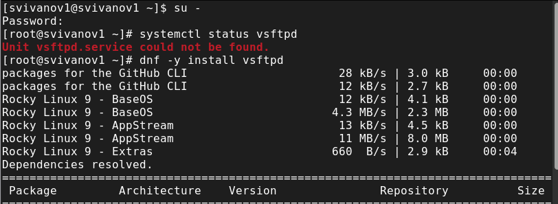{#fig:001 width=70%}

Установим службу Very Secure FTP: dnf -y install vsftpd. Запустим службу Very Secure FTP: systemctl start vsftpd. Проверим статус службы Very Secure FTP: systemctl status vsftpd (рис. 2).

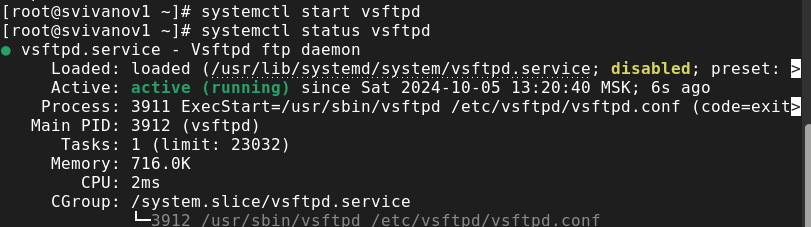{#fig:002 width=70%}

Добавим службу Very Secure FTP в автозапуск при загрузке операционной системы, используя команду systemctl enable. Затем проверим статус службы. (рис. 3).

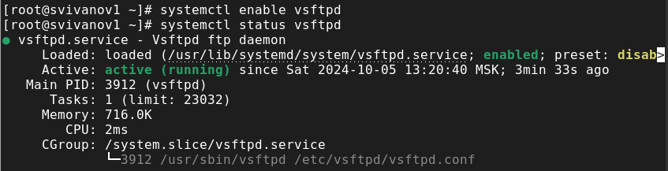{#fig:003 width=70%}

Удалим службу из автозапуска, используя команду systemctl disable, и снова проверим её статус. (рис. 4). 

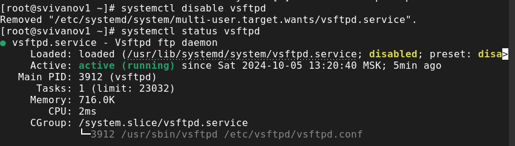{#fig:004 width=70%}

Выведем на экран символические ссылки, ответственные за запуск различных сервисов: ls /etc/systemd/system/multi-user.target.wants (рис. 5). 

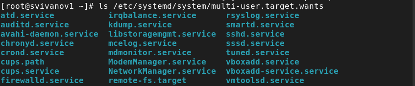{#fig:005 width=70%}

Снова добавим службу Very Secure FTP в автозапуск и выведем на экран символические ссылки, ответственные за запуск различных сервисов. (рис. 6). 

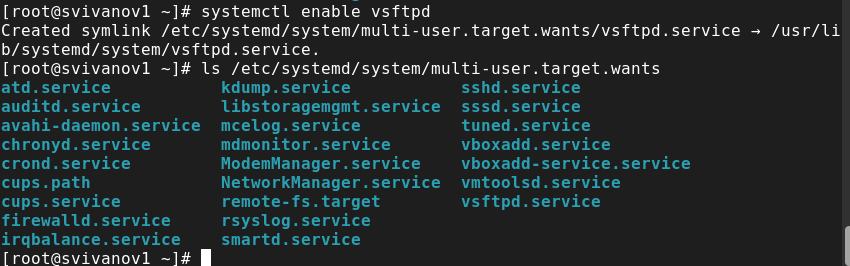{#fig:006 width=70%}

Снова проверим статус службы Very Secure FTP: systemctl status vsftpd. Теперь мы видим, что для файла юнита состояние изменено с disabled на enabled. (рис. 7).

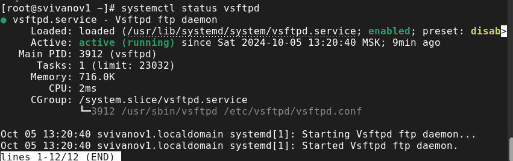{#fig:007 width=70%}

Выведем на экран список зависимостей юнита: systemctl list-dependencies vsftpd (рис. 8).

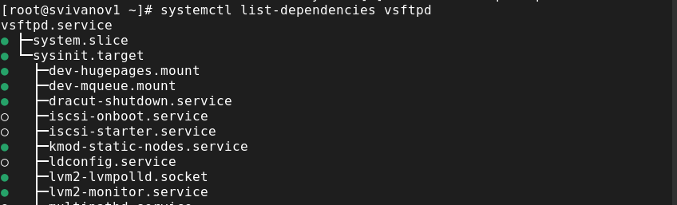{#fig:008 width=70%}

Выведем на экран список юнитов, которые зависят от данного юнита: systemctl list-dependencies vsftpd --reverse (рис. 9).

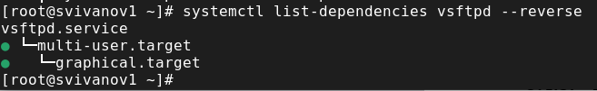{#fig:009 width=70%}

Получим полномочия администратора. Установим iptables: dnf -y install iptables\* (рис. 10).

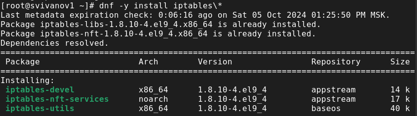{#fig:010 width=70%}

Проверим статус firewalld и iptables: systemctl status firewalld;
systemctl status iptables (рис. 11). (рис. 12).

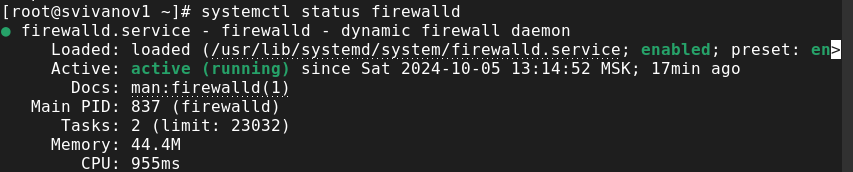{#fig:011 width=70%}

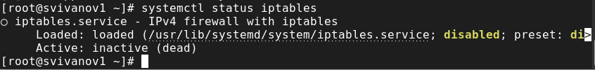{#fig:012 width=70%}

Попробуем запустить firewalld и iptables: systemctl start firewalld; systemctl start iptables. Видим, что при запуске одной службы вторая дезактивируется или не запускается. (рис. 13)

{#fig:013 width=70%}

Введем cat /usr/lib/systemd/system/firewalld.service и опишем настройки конфликтов для этого юнита при наличии. (рис. 14). 

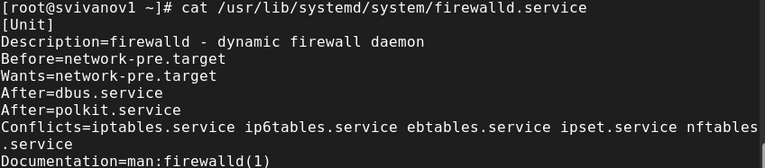{#fig:014 width=70%}

Введем cat /usr/lib/systemd/system/iptables.service и опишем настройки конфликтов для этого юнита. (рис. 15). 

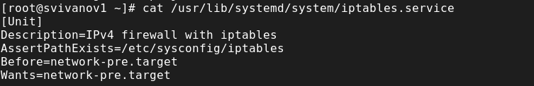{#fig:015 width=70%}

Выгрузим службу iptables: systemctl stop iptables и загрузим службу firewalld systemctl start firewalld. Заблокируем запуск iptables, введя:
systemctl mask iptables. Попробуем запустить iptables: systemctl start iptables. Появилось сообщение об ошибке, указывающее, что служба замаскирована и по этой причине не может быть запущена. Попробуем добавить iptables в автозапуск: systemctl enable iptables. Сервис будет неактивен, а статус загрузки отобразится как замаскированный. (рис. 16).

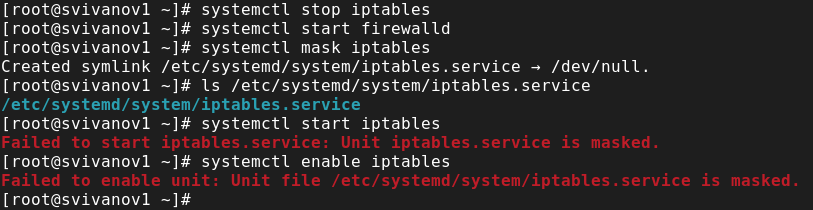{#fig:016 width=70%}

Чтобы получить список всех активных загруженных целей, вводим: systemctl --type=target (рис. 17)

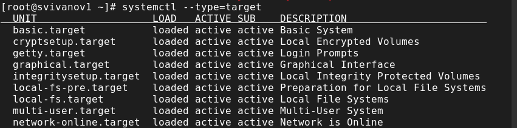{#fig:017 width=70%}

Чтобы получить список всех целей, введем: systemctl --type=target --all (рис. 18)

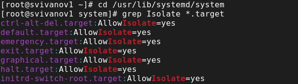{#fig:018 width=70%}

Перейдем в каталог systemd и найдем список всех целей, которые можно изолировать: cd /usr/lib/systemd/system; grep Isolate *.target (рис. 19)

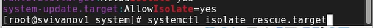{#fig:019 width=70%}

Переключим операционную систему в режим восстановления: systemctl isolate rescue.target и перезапустим операционную систему следующим образом: systemctl isolate reboot.target (рис. 20)

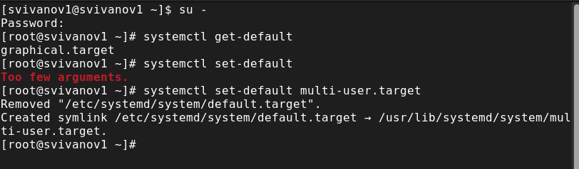{#fig:020 width=70%}

Перегрузим систему командой reboot. Убедимся, что система загрузилась в текстовом режиме. Для запуска по умолчанию графического режима введем systemctl set-default graphical.target. Вновь перегрузим систему командой reboot. Убедимся, что система загрузилась в графическом режиме. (рис. 21)

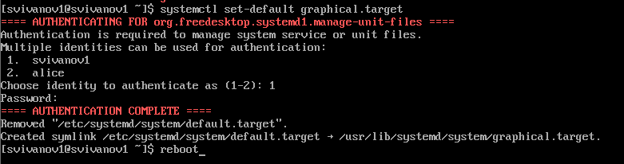{#fig:021 width=70%}

# Контрольные вопросы

**1. Что такое юнит (unit)? Приведите примеры.**

Unit – объект, которым может управлять система.

**2. Какая команда позволяет вам убедиться, что цель больше не входит в список автоматического запуска при загрузке системы?**

systemctl is-enable “имя_юнита” (пример: systemctl is-enable vsftpd.service).

**3. Какую команду вы должны использовать для отображения всех сервисных юнитов, которые в настоящее время загружены?**

system list-units.

**4. Как создать потребность (wants) в сервисе?**

Нужно внести всю необходимую информацию в переменную “Wants”, которая находится в файле имя_сервиса.service.

**5. Как переключить текущее состояние на цель восстановления (rescue target)?**

systemctl set-default rescue.target.

**6. Поясните причину получения сообщения о том, что цель не может быть изолирована**

Изолируя цель, мы запускаем эту цель со всеми её зависимостями. Не все цели могут быть изолированы (в случае, если цель является неотъемлемой частью system).

**7. Вы хотите отключить службу systemd, но, прежде чем сделать это, вы хотите узнать, какие другие юниты зависят от этой службы. Какую команду вы бы использовали?**

systemctl list-dependencies “имя_юнита” --reverse (пример: systemctl list-dependencies firewalld.service --reverse).

# Выводы

В ходе выполнения лабораторной работы были получены навыки управления c системными службами операционной системы посредством systemd.

