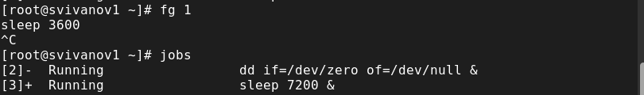
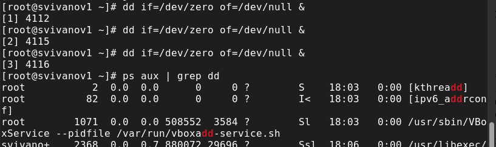
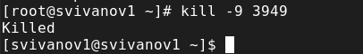
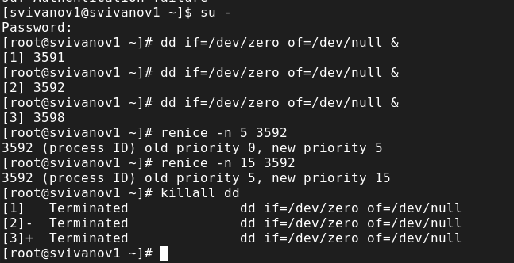
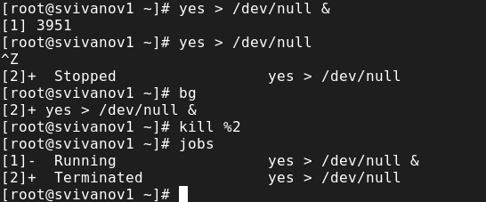
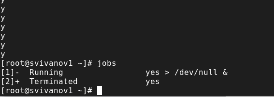
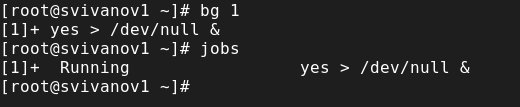
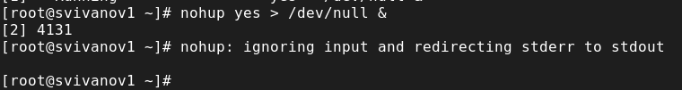
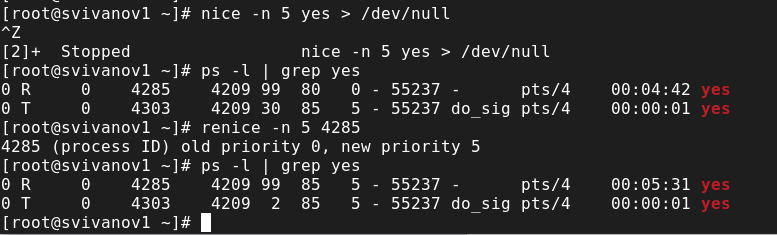

---
## Front matter
lang: ru-RU
title: Лабораторная работа № 6
subtitle: Основы администрирования операционных систем
author:
  - Иванов Сергей Владимирович, НПИбд-01-23
institute:
  - Российский университет дружбы народов, Москва, Россия
date: 12 октября 2024

## i18n babel
babel-lang: russian
babel-otherlangs: english

## Formatting pdf
toc: false
slide_level: 2
aspectratio: 169
section-titles: true
theme: metropolis
header-includes:
 - \metroset{progressbar=frametitle,sectionpage=progressbar,numbering=fraction}
 - '\makeatletter'
 - '\beamer@ignorenonframefalse'
 - '\makeatother'

  ## Fonts
mainfont: PT Serif
romanfont: PT Serif
sansfont: PT Sans
monofont: PT Mono
mainfontoptions: Ligatures=TeX
romanfontoptions: Ligatures=TeX
sansfontoptions: Ligatures=TeX,Scale=MatchLowercase
monofontoptions: Scale=MatchLowercase,Scale=0.9
---

## Цель работы

Получить навыки управления процессами операционной системы.

## Задание

1. Продемонстрировать навыки управления заданиями операционной системы.
2. Продемонстрировать навыки управления процессами операционной системы.
3. Выполнить задания для самостоятельной работы 

# Выполнение работы

## Режим суперпользователя, начальные команды 

{#fig:001 width=70%}

## Проверка состояний и выполнение в фоновом режиме

{#fig:002 width=70%}

## Перемещение на передний план и отмена задания

{#fig:003 width=70%}

## Перемещение на передний план и отмена задания

{#fig:004 width=70%}

## Ввод команды и закрытие терминала

{#fig:005 width=70%}

## Запуск top

{#fig:006 width=70%}

## Убийство задания dd в top

{#fig:007 width=70%}

## Запуск заданий и поиск строк с dd

{#fig:008 width=70%}

## Изменение приоритета, просмотр иерархии

{#fig:009 width=70%}

## Закрытие корневой оболочки

{#fig:010 width=70%}

# Самостоятельная работа (задание 1)

## Запуск задания, увеличение приоритетов, завершение процессов

{#fig:011 width=70%}

# Самостоятельная работа (задание 2)

## Запуск программ yes, приостановка, повторный запуск, завершение

{#fig:012 width=70%}

## Запуск программы yes, остановка, запуск, завершение, проверка состояния

{#fig:013 width=70%}

## Перевод на передний план 

{#fig:014 width=70%}

## Перевод в фоновый режим и проверка 

{#fig:015 width=70%}

## Запуск в фоне с условием

{#fig:016 width=70%}

## Убеждаемся, что процесс работает

{#fig:017 width=70%}

## Запущенные процессы

{#fig:018 width=70%}

## Запуск и убийство программ

{#fig:019 width=70%}

## Посылка сигнала SIGHUP

{#fig:020 width=70%}

## Запуск нескольких программ и одновременное их завершение

{#fig:021 width=70%}

## Запуск программ и изменение приоритетов

{#fig:022 width=70%}

# Вывод

## Вывод 

В ходе выполнения лабораторной работы были получены навыки управления процессами операционной системы.

## Список литературы

:::{#refs}

https://esystem.rudn.ru/mod/page/view.php?id=1098933

:::

