---
## Front matter
title: "Отчет по лабораторной работе №6"
subtitle: "Дисциплина: Основы администрирования операционных систем"
author: "Иванов Сергей Владимирович"

## Generic otions
lang: ru-RU
toc-title: "Содержание"

## Bibliography
bibliography: bib/cite.bib
csl: pandoc/csl/gost-r-7-0-5-2008-numeric.csl

## Pdf output format
toc: true # Table of contents
toc-depth: 2
lof: true # List of figures
fontsize: 12pt
linestretch: 1.5
papersize: a4
documentclass: scrreprt
## I18n polyglossia
polyglossia-lang:
  name: russian
  options:
	- spelling=modern
	- babelshorthands=true
polyglossia-otherlangs:
  name: english
## I18n babel
babel-lang: russian
babel-otherlangs: english
## Fonts
mainfont: PT Serif
romanfont: PT Serif
sansfont: PT Sans
monofont: PT Mono
mainfontoptions: Ligatures=TeX
romanfontoptions: Ligatures=TeX
sansfontoptions: Ligatures=TeX,Scale=MatchLowercase
monofontoptions: Scale=MatchLowercase,Scale=0.9
## Biblatex
biblatex: true
biblio-style: "gost-numeric"
biblatexoptions:
  - parentracker=true
  - backend=biber
  - hyperref=auto
  - language=auto
  - autolang=other*
  - citestyle=gost-numeric
## Pandoc-crossref LaTeX customization
figureTitle: "Рис."
listingTitle: "Листинг"
lofTitle: "Список иллюстраций"
lolTitle: "Листинги"
## Misc options
indent: true
header-includes:
  - \usepackage{indentfirst}
  - \usepackage{float} # keep figures where there are in the text
  - \floatplacement{figure}{H} # keep figures where there are in the text
---

# Цель работы

Получить навыки управления процессами операционной системы.

# Задание

1. Продемонстрировать навыки управления заданиями операционной системы.
2. Продемонстрировать навыки управления процессами операционной системы.
3. Выполнить задания для самостоятельной работы

# Выполнение лабораторной работы

Получим полномочия администратора. Введём следующие команды:
sleep 3600 &
dd if=/dev/zero of=/dev/null &
sleep 7200
Поскольку мы запустили последнюю команду без & после неё, у нас есть 2 часа, прежде чем мы снова получим контроль над оболочкой. Введём Ctrl + z , чтобы остановить процесс. (рис. 1).

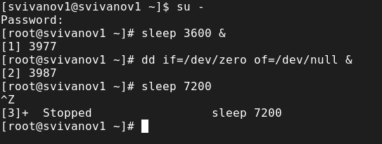{#fig:001 width=70%}

Введём jobs. Мы увидим три задания, которые только что запустили. Первые два имеют состояние Running, а последнее задание в настоящее время находится в состоянии Stopped. Для продолжения выполнения задания 3 в фоновом режиме введём bg 3. С помощью команды jobs посмотрим изменения в статусе заданий. (рис. 2).

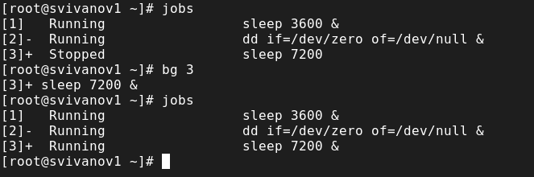{#fig:002 width=70%}

Для перемещения задания 1 на передний план введём fg 1. Введём Ctrl + c , чтобы отменить задание 1. С помощью команды jobs посмотрим изменения в статусе заданий. (рис. 3).

{#fig:003 width=70%}

Проделаем то же самое для отмены заданий 2 и 3 (рис. 4). 

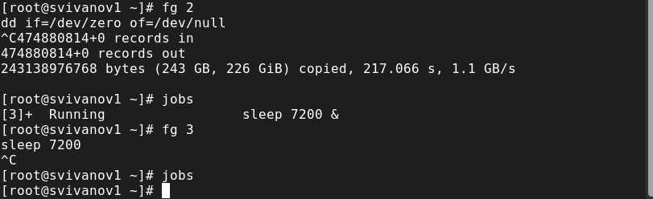{#fig:004 width=70%}

Откроем 2 терминал и под учётной записью своего пользователя введём в нём:
dd if=/dev/zero of=/dev/null &
Введём exit, чтобы закрыть второй терминал. (рис. 5). 

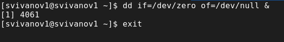{#fig:005 width=70%}

На другом терминале под учётной записью своего пользователя запустим top (рис. 6). 

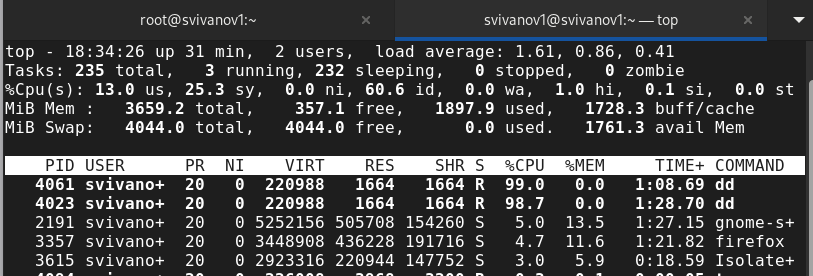{#fig:006 width=70%}

Вновь запустим top и в нём используем k , чтобы убить задание dd. После этого выйдем из top. (рис. 7).

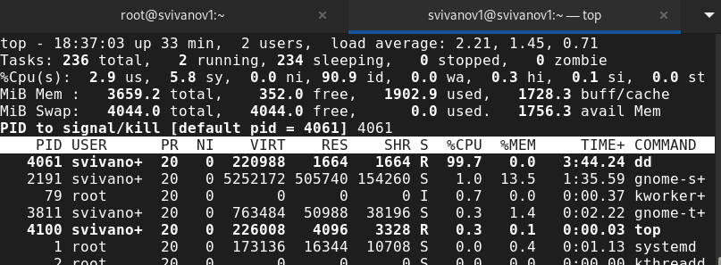{#fig:007 width=70%}

Получим полномочия администратора su - . Введём следующие команды:
dd if=/dev/zero of=/dev/null &
dd if=/dev/zero of=/dev/null &
dd if=/dev/zero of=/dev/null &
Введём ps aux | grep dd. Оно показывает все строки, в которых есть буквы dd. Запущенные процессы dd идут последними. (рис. 8).

{#fig:008 width=70%}

Используем PID одного из процессов dd, чтобы изменить приоритет. renice -n 5 4115. Введём ps fax | grep -B5 dd. Параметр -B5 показывает соответствующие запросу строки, включая пять строк до этого. Поскольку ps fax показывает иерархию отношений между процессами, мы также увидим оболочку, из которой были запущены все процессы dd, и её PID. (рис. 9).

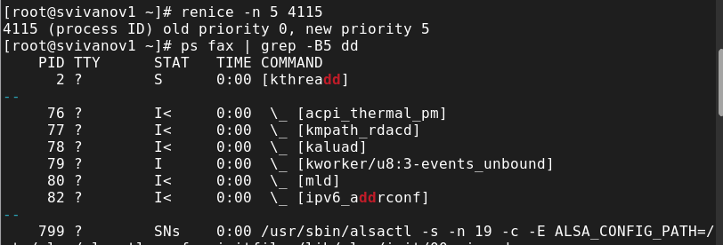{#fig:009 width=70%}

Найдём PID корневой оболочки, из которой были запущены процессы dd, и введём
kill -9 3949. Мы увидим, что корневая оболочка закрылась, а вместе с ней и все процессы dd (рис. 10).

{#fig:010 width=70%}

# Самостоятельная работа (задание 1)

Запустим команду dd if=/dev/zero of=/dev/null трижды как фоновое задание. Увеличим приоритет одной из этих команд, используя значение приоритета - 5. (renice -n 5 3592). Изменим приоритет того же процесса ещё раз, но используем на этот раз значение −15. Чем ниже значение nice, тем выше приоритет процесса. При значении -5 процесс получает более высокий приоритет по сравнению с процессами, у которых приоритет по умолчанию (0), но с nice -15 он будет ещё более приоритетным. Завершим все процессы dd, которые мы запустили.(killall dd) (рис. 11). 

{#fig:011 width=70%}

# Самостоятельная работа (задание 2)

Запустим программу yes в фоновом режиме с подавлением потока вывода (yes > /dev/null &). Запустим программу yes на переднем плане с подавлением потока вывода (yes > /dev/null). Приостановим выполнение программы (Ctrl+Z). Заново запустим программу yes с теми же параметрами (bg), затем завершим её выполнение (kill %2). (рис. 12).

{#fig:012 width=70%}

Запустим программу yes на переднем плане без подавления потока вывода (yes). Приостановим выполнение программы (Ctrl+Z). Заново запустим программу yes с теми же
параметрами (bg), затем завершим её выполнение. (Ctrl+C). (Т.к она без подавления потока вывода, первые команды не поместились в терминал на скрине.) 
Проверим состояния заданий, воспользовавшись командой jobs. (рис. 13)

{#fig:013 width=70%}

Переведем процесс, который выполняется в фоновом режиме, на передний
план (fg 1), затем остановим его (Ctrl+C) (рис. 14). 

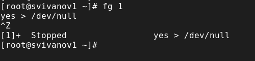{#fig:014 width=70%}

Переведём любой процесс с подавлением потока вывода в фоновый режим. Проверим состояния заданий, воспользовавшись командой jobs (рис. 15). 

{#fig:015 width=70%}

Запустим процесс в фоновом режиме таким образом, чтобы он продолжил свою
работу даже после отключения от терминала. (nohup yes > /dev/null &) (рис. 16).

{#fig:016 width=70%}

Закроем окно и заново запустите консоль. Убедимся, что процесс продолжил свою работу. (рис. 17)

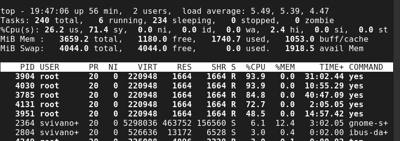{#fig:017 width=70%}

Получим информацию о запущенных в операционной системе процессах с помощью
утилиты top. (рис. 18)

{#fig:018 width=70%}

Запустим ещё три программы yes в фоновом режиме с подавлением потока вывода.
Убьем два процесса: для одного используем его PID (kill -9 4253), а для другого — его идентификатор задания (kill %2). (рис. 19)

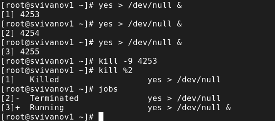{#fig:019 width=70%}

Попробуем послать сигнал 1 (SIGHUP) процессу, запущенному с помощью nohup,
и обычному процессу. (kill -1 4131 и kill -1 4255) (рис. 20)

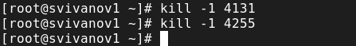{#fig:020 width=70%}

Запустим ещё несколько программ yes в фоновом режиме с подавлением потока
вывода. Завершим их работу одновременно, используя команду killall yes. (рис. 21)

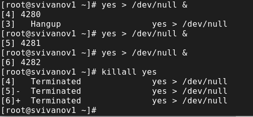{#fig:021 width=70%}

Запустим программу yes в фоновом режиме с подавлением потока вывода. Используя утилиту nice, запустим программу yes с теми же параметрами и с приоритетом, большим на 5. (nice -n 5 yes > /dev/null). Теперь у процеса 4285 приоритет 0, а у 4303 приоритет 5. Используя утилиту renice, изменим приоритет у одного из потоков yes таким образом, чтобы у обоих потоков приоритеты были равны. (renice -n 5 4285) (рис. 22)

{#fig:022 width=70%}

# Контрольные вопросы

**1. Какая команда даёт обзор всех текущих заданий оболочки?**

jobs.

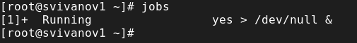{#fig:023 width=70%}

**2. Как остановить текущее задание оболочки, чтобы продолжить его выполнение в фоновом режиме?**

bg номер_задания.

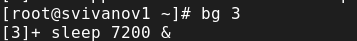{#fig:024 width=70%}

**3. Какую комбинацию клавиш можно использовать для отмены текущего задания оболочки?**

Ctrl+c. 

**4. Необходимо отменить одно из начатых заданий. Доступ к оболочке, в которой в данный момент работает пользователь, невозможен. Что можно сделать, чтобы отменить задание?**

Внутри top использовать k, чтобы убить задание.

{#fig:025 width=70%}

**5. Какая команда используется для отображения отношений между родительскими и дочерними процессами?**

ps fax.

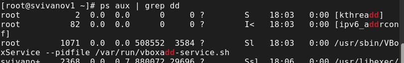{#fig:026 width=70%}

**6. Какая команда позволит изменить приоритет процесса с идентификатором 1234 на более высокий?**

renice -n приоритет_процесса <PID>.

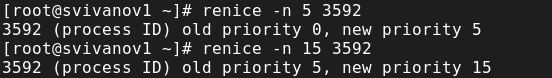{#fig:027 width=70%}

**7. В системе в настоящее время запущено 20 процессов dd. Как проще всего остановить их все сразу?**

killall dd. 

**8. Какая команда позволяет остановить команду с именем mycommand?**

Сначала узнаем PID процесса mycommand -ps aux | grep mycommand далее команда kill -9 <PID>.

**9. Какая команда используется в top, чтобы убить процесс?**

k. 

{#fig:028 width=70%}

**10. Как запустить команду с достаточно высоким приоритетом, не рискуя, что не хватит ресурсов для других процессов?**

Запустить команду в фоновом режиме.

# Выводы

В ходе выполнения лабораторной работы были получены навыки управления процессами операционной системы.

