---
## Front matter
lang: ru-RU
title: Лабораторная работа № 7
subtitle: Основы администрирования операционных систем
author:
  - Иванов Сергей Владимирович, НПИбд-01-23
institute:
  - Российский университет дружбы народов, Москва, Россия
date: 19 октября 2024

## i18n babel
babel-lang: russian
babel-otherlangs: english

## Formatting pdf
toc: false
slide_level: 2
aspectratio: 169
section-titles: true
theme: metropolis
header-includes:
 - \metroset{progressbar=frametitle,sectionpage=progressbar,numbering=fraction}
 - '\makeatletter'
 - '\beamer@ignorenonframefalse'
 - '\makeatother'

  ## Fonts
mainfont: PT Serif
romanfont: PT Serif
sansfont: PT Sans
monofont: PT Mono
mainfontoptions: Ligatures=TeX
romanfontoptions: Ligatures=TeX
sansfontoptions: Ligatures=TeX,Scale=MatchLowercase
monofontoptions: Scale=MatchLowercase,Scale=0.9
---

## Цель работы

Получить навыки работы с журналами мониторинга различных событий в системе.

## Задание

1. Продемонстрировать навыки работы с журналом мониторинга событий в реальном времени
2. Продемонстрировать навыки создания и настройки отдельного файла конфигурации мониторинга отслеживания событий веб-службы
3. Продемонстрировать навыки работы с journalctl 
4. Продемонстрировать навыки работы с journald 

# Выполнение работы

## Запуск 3 терминалов и получение суперпользователя

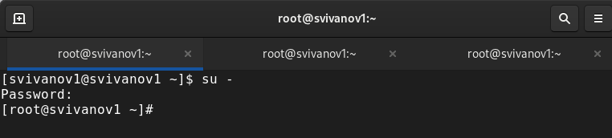{#fig:001 width=70%}

## Запуск мониторинга системных событий в реальном времени

{#fig:002 width=70%}

## Возвращение к учетной записи пользователя и ввод неправильного пароля

{#fig:003 width=70%}

## Ввод logger hello и просмотр мониторинга событий

{#fig:004 width=70%}

## Установка Apache

{#fig:005 width=70%}

## Запуск веб службы

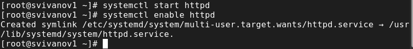{#fig:006 width=70%}

## Просмотр журнала сообщений об ошибках веб-службы

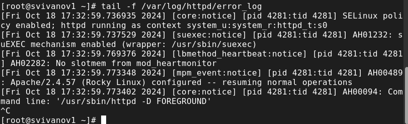{#fig:007 width=70%}

## Меняем файл конфигурации

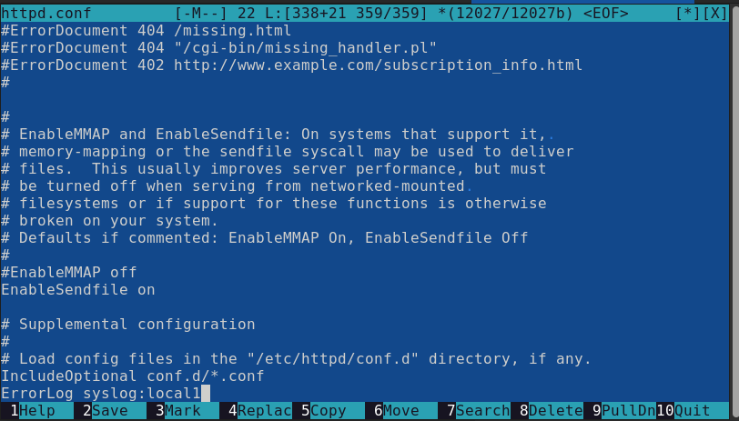{#fig:008 width=70%}

## Создание файла мониторинга событий веб-службы

{#fig:009 width=70%}

## Редактирование файла для мониторинга событий веб-службы

{#fig:010 width=70%}

## Перезагрузка rsyslogd и веб-службы

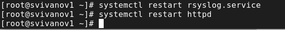{#fig:011 width=70%}

## Создание файла конфигурации для мониторинга отладочной информации

{#fig:012 width=70%}

## Перезапуск rsyslogd

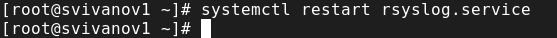{#fig:013 width=70%}

## Запуск мониторинга отладочной информации

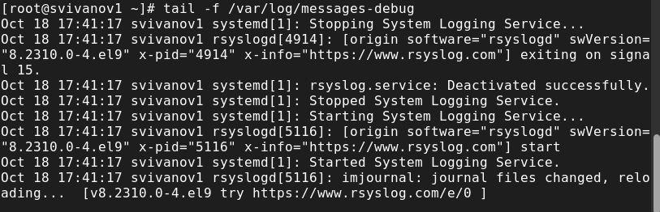{#fig:014 width=70%}

## Ввод сообщения отладки

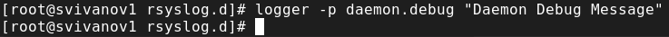{#fig:015 width=70%}

## Просмотр сообщения отладки

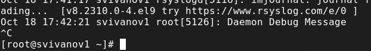{#fig:016 width=70%}

## Просмотр журнала с событиями с момента последнего запуска системы

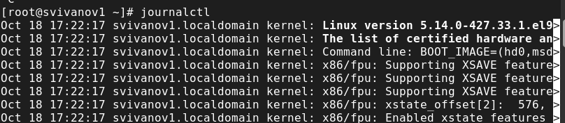{#fig:017 width=70%}

## Просмотр содержимого журнала без использования пейджера

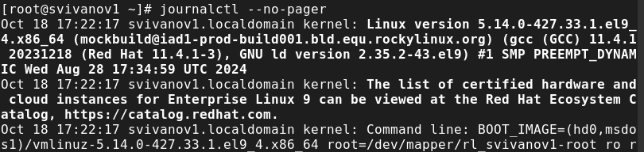{#fig:018 width=70%}

## Просмотр журнала в реальном времени

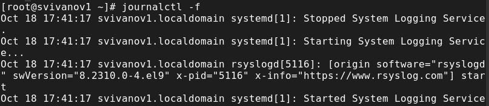{#fig:019 width=70%}

## Просмотр конкретных параметров journalctl

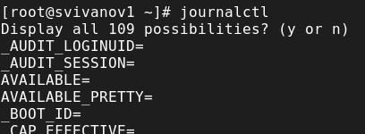{#fig:020 width=70%}

## Просмотр события для UID0

{#fig:021 width=70%}

## Отображение последних 20 строк журнала

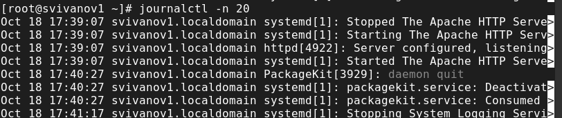{#fig:022 width=70%}

## Просмотр только сообщений об ошибках

{#fig:023 width=70%}

## Просмотр всех сообщений со вчерашнего дня

{#fig:024 width=70%}

## Все сообщения с ошибкой приоритета со вчерашнего дня

{#fig:025 width=70%}

## Получение детальной информации

{#fig:026 width=70%}

## Просмотр дополнительной информации о модуле sshd

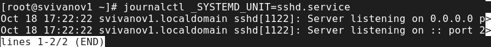{#fig:027 width=70%}

## Создание каталога, корректировка прав доступа

{#fig:022 width=70%}

# Вывод

## Вывод 

В ходе выполнения лабораторной работы были получены навыки работы с журналами мониторинга различных событий в системе.

## Список литературы

:::{#refs}

https://esystem.rudn.ru/mod/page/view.php?id=1098933

:::

