---
## Front matter
title: "Отчет по лабораторной работе №7"
subtitle: "Дисциплина: Основы администрирования операционных систем"
author: "Иванов Сергей Владимирович"

## Generic otions
lang: ru-RU
toc-title: "Содержание"

## Bibliography
bibliography: bib/cite.bib
csl: pandoc/csl/gost-r-7-0-5-2008-numeric.csl

## Pdf output format
toc: true # Table of contents
toc-depth: 2
lof: true # List of figures
fontsize: 12pt
linestretch: 1.5
papersize: a4
documentclass: scrreprt
## I18n polyglossia
polyglossia-lang:
  name: russian
  options:
	- spelling=modern
	- babelshorthands=true
polyglossia-otherlangs:
  name: english
## I18n babel
babel-lang: russian
babel-otherlangs: english
## Fonts
mainfont: PT Serif
romanfont: PT Serif
sansfont: PT Sans
monofont: PT Mono
mainfontoptions: Ligatures=TeX
romanfontoptions: Ligatures=TeX
sansfontoptions: Ligatures=TeX,Scale=MatchLowercase
monofontoptions: Scale=MatchLowercase,Scale=0.9
## Biblatex
biblatex: true
biblio-style: "gost-numeric"
biblatexoptions:
  - parentracker=true
  - backend=biber
  - hyperref=auto
  - language=auto
  - autolang=other*
  - citestyle=gost-numeric
## Pandoc-crossref LaTeX customization
figureTitle: "Рис."
listingTitle: "Листинг"
lofTitle: "Список иллюстраций"
lolTitle: "Листинги"
## Misc options
indent: true
header-includes:
  - \usepackage{indentfirst}
  - \usepackage{float} # keep figures where there are in the text
  - \floatplacement{figure}{H} # keep figures where there are in the text
---

# Цель работы

Получить навыки работы с журналами мониторинга различных событий в системе.

# Задание

1. Продемонстрировать навыки работы с журналом мониторинга событий в реальном времени
2. Продемонстрировать навыки создания и настройки отдельного файла конфигурации мониторинга отслеживания событий веб-службы
3. Продемонстрировать навыки работы с journalctl 
4. Продемонстрировать навыки работы с journald 

# Выполнение лабораторной работы

Запустим три вкладки терминала и в каждой из них получим полномочия администратора: su - (рис. 1).

{#fig:001 width=70%}

На второй вкладке терминала запустим мониторинг системных событий в реальном времени: tail -f /var/log/messages (рис. 2).

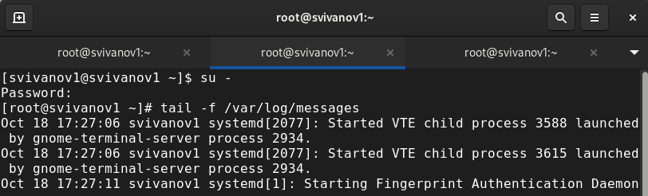{#fig:002 width=70%}

В третьей вкладке терминала вернемся к учётной записи своего пользователя (Ctrl + d) и попробуем получить полномочия администратора, но введем неправильный пароль. Во второй вкладке терминала появится сообщение «FAILED SU (to root) username ...». (рис. 3).

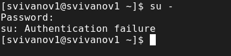{#fig:003 width=70%}

В третьей вкладке терминала из оболочки пользователя введем logger hello. Во второй вкладке терминала с мониторингом событий мы увидим сообщение. Во второй вкладке терминала с мониторингом остановим трассировку файла сообщений мониторинга реального времени, используя Ctrl+c. Затем запустим мониторинг сообщений безопасности tail -n 20 /var/log/secure. Мы увидим сообщения, которые ранее были зафиксированы во время ошибки авторизации при вводе команды su. (рис. 4). 

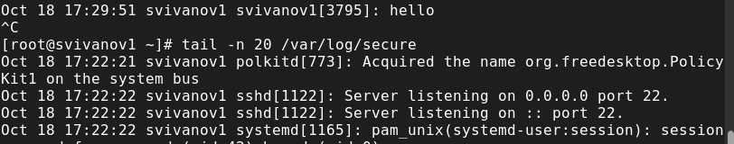{#fig:004 width=70%}

В первой вкладке терминала установим Apache: dnf -y install httpd (рис. 5). 

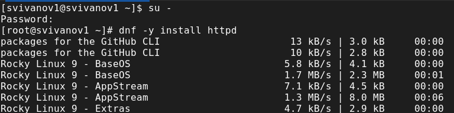{#fig:005 width=70%}

После окончания процесса установки запустим веб-службу:
systemctl start httpd
systemctl enable httpd (рис. 6). 

{#fig:006 width=70%}

Во второй вкладке терминала посмотрим журнал сообщений об ошибках веб-службы: tail -f /var/log/httpd/error_log (рис. 7).

{#fig:007 width=70%}

В третьей вкладке терминала получим полномочия администратора и в файле конфигурации /etc/httpd/conf/httpd.conf в конце добавим следующую строку:
ErrorLog syslog:local1 (рис. 8).

{#fig:008 width=70%}

В каталоге /etc/rsyslog.d создайте файл мониторинга событий веб-службы:
cd /etc/rsyslog.d
touch httpd.conf (рис. 9).

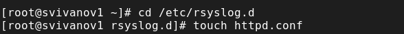{#fig:009 width=70%}

Открыв его на редактирование, пропишем в нём local1.* -/var/log/httpd-error.log. Эта строка позволит отправлять все сообщения, получаемые для объекта local1, в файл /var/log/httpd-error.log. (рис. 10).

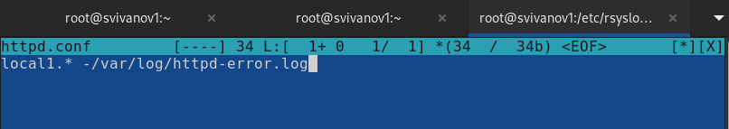{#fig:010 width=70%}

Перейдем в первую вкладку терминала и перезагрузим конфигурацию rsyslogd и веб-службу:
systemctl restart rsyslog.service
systemctl restart httpd (рис. 11). 

{#fig:011 width=70%}

В третьей вкладке терминала создадим отдельный файл конфигурации для мониторинга отладочной информации:
cd /etc/rsyslog.d
touch debug.conf
В этом же терминале введем: echo "*.debug /var/log/messages-debug" > /etc/rsyslog.d/debug.conf (рис. 12).

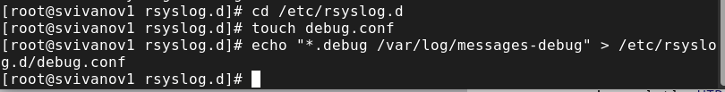{#fig:012 width=70%}

В первой вкладке терминала снова перезапустим rsyslogd:
systemctl restart rsyslog.service (рис. 13)

{#fig:013 width=70%}

Во второй вкладке терминала запустим мониторинг отладочной информации:
tail -f /var/log/messages-debug (рис. 14). 

{#fig:014 width=70%}

В третьей вкладке терминала введем: logger -p daemon.debug "Daemon Debug Message" (рис. 15). 

{#fig:015 width=70%}

В терминале с мониторингом посмотрим сообщение отладки. Чтобы закрыть трассировку файла журнала, используем Ctrl + c. (рис. 16).

{#fig:016 width=70%}

Во второй вкладке терминала посмотрим содержимое журнала с событиями с момента последнего запуска системы: journalctl (рис. 17)

{#fig:017 width=70%}

Просмотр содержимого журнала без использования пейджера: journalctl --no-pager (рис. 18)

{#fig:018 width=70%}

Режим просмотра журнала в реальном времени: journalctl -f. Используем Ctrl + c для прерывания просмотра. (рис. 19)

{#fig:019 width=70%}

Для использования фильтрации просмотра конкретных параметров журнала введем journalctl и дважды нажмем клавишу Tab . (рис. 20)

{#fig:020 width=70%}

Просмотрим события для UID0: journalctl _UID=0 (рис. 21)

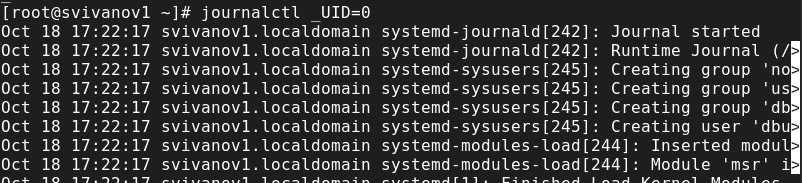{#fig:021 width=70%}

Для отображения последних 20 строк журнала введем journalctl -n 20 (рис. 22)

{#fig:022 width=70%}

Для просмотра только сообщений об ошибках введем journalctl -p err (рис. 23)

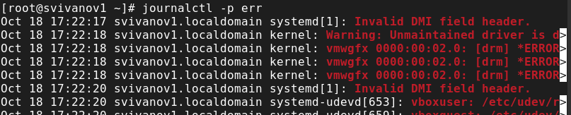{#fig:023 width=70%}

Для просмотра всех сообщений со вчерашнего дня введем journalctl --since yesterday (рис. 24)

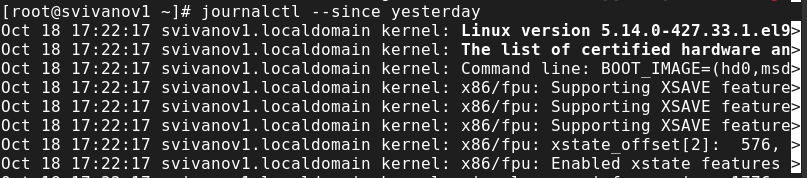{#fig:024 width=70%}

Чтобы показать все сообщения с ошибкой приоритета, которые были зафиксированы со вчерашнего дня, используем journalctl --since yesterday -p err (рис. 25)

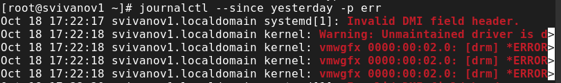{#fig:025 width=70%}

Для получения детальной информации, используем journalctl -o verbose (рис. 26)

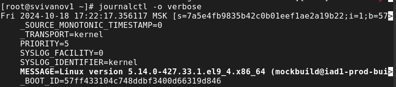{#fig:026 width=70%}

Для просмотра дополнительной информации о модуле sshd введем journalctl _SYSTEMD_UNIT=sshd.service (рис. 27)

{#fig:027 width=70%}

Запустим терминал и получим полномочия администратора. Создадим каталог для хранения записей журнала:
mkdir -p /var/log/journal
Скорректируем права доступа для каталога /var/log/journal, чтобы journald смог записывать в него информацию:
chown root:systemd-journal /var/log/journal
chmod 2755 /var/log/journal
Для принятия изменений используем команду:
killall -USR1 systemd-journald
Журнал systemd теперь постоянный. (рис. 28)

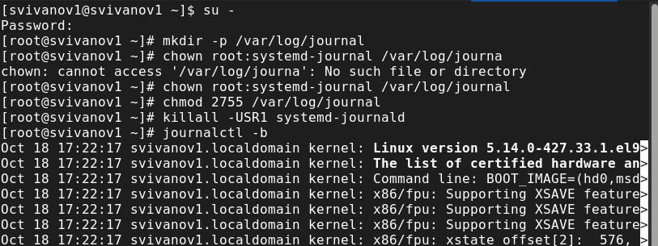{#fig:028 width=70%}

# Контрольные вопросы

**1. Какой файл используется для настройки rsyslogd?**

/etc/rsyslog.conf

**2. В каком файле журнала rsyslogd содержатся сообщения, связанные с аутентификацией?**

/var/log/secure

**3. Если вы ничего не настроите, то сколько времени потребуется для ротации файлов журналов?**

Неделя

**4. Какую строку следует добавить в конфигурацию для записи всех сообщений с приоритетом info в файл /var/log/messages.info?**

info.* - /var/log/messages.info

**5. Какая команда позволяет вам видеть сообщения журнала в режиме реального времени?**

tail -f /var/log/messages

**6. Какая команда позволяет вам видеть все сообщения журнала, которые были написаны для PID 1 между 9:00 и 15:00?**

journalctl _PID=1 -since “2022-02-01 09:00:00” –until “2022-02-01 15:00:00”

**7. Какая команда позволяет вам видеть сообщения journald после последней перезагрузки системы?**

journalctl - b

**8. Какая процедура позволяет сделать журнал journald постоянным**

Запустите терминал и получите полномочия администратора: su –
Создайте каталог для хранения записей журнала: mkdir -p /var/log/journal
Скорректируйте права доступа для каталога /var/log/journal, чтобы journald
смог записывать в него информацию:
chown root:systemd-journal /var/log/journal
chmod 2755 /var/log/journal
Для принятия изменений необходимо или перезагрузить систему (перезапустить службу systemd-journald недостаточно), или использовать команду: killall -USR1 systemd-journald

# Выводы

В ходе выполнения лабораторной работы были получены навыки работы с журналами мониторинга различных событий в системе.

