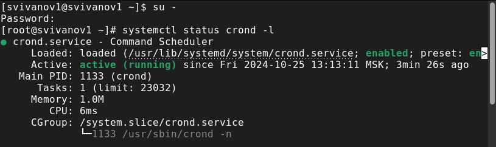
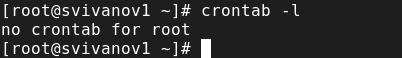
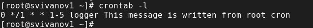
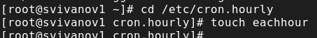
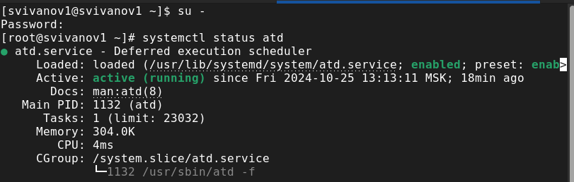
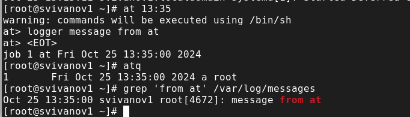

---
## Front matter
title: "Отчет по лабораторной работе №8"
subtitle: "Дисциплина: Основы администрирования операционных систем"
author: "Иванов Сергей Владимирович"

## Generic otions
lang: ru-RU
toc-title: "Содержание"

## Bibliography
bibliography: bib/cite.bib
csl: pandoc/csl/gost-r-7-0-5-2008-numeric.csl

## Pdf output format
toc: true # Table of contents
toc-depth: 2
lof: true # List of figures
fontsize: 12pt
linestretch: 1.5
papersize: a4
documentclass: scrreprt
## I18n polyglossia
polyglossia-lang:
  name: russian
  options:
	- spelling=modern
	- babelshorthands=true
polyglossia-otherlangs:
  name: english
## I18n babel
babel-lang: russian
babel-otherlangs: english
## Fonts
mainfont: PT Serif
romanfont: PT Serif
sansfont: PT Sans
monofont: PT Mono
mainfontoptions: Ligatures=TeX
romanfontoptions: Ligatures=TeX
sansfontoptions: Ligatures=TeX,Scale=MatchLowercase
monofontoptions: Scale=MatchLowercase,Scale=0.9
## Biblatex
biblatex: true
biblio-style: "gost-numeric"
biblatexoptions:
  - parentracker=true
  - backend=biber
  - hyperref=auto
  - language=auto
  - autolang=other*
  - citestyle=gost-numeric
## Pandoc-crossref LaTeX customization
figureTitle: "Рис."
listingTitle: "Листинг"
lofTitle: "Список иллюстраций"
lolTitle: "Листинги"
## Misc options
indent: true
header-includes:
  - \usepackage{indentfirst}
  - \usepackage{float} # keep figures where there are in the text
  - \floatplacement{figure}{H} # keep figures where there are in the text
---

# Цель работы

Получить навыки работы с планировщиками событий cron и at.

# Задание

1. Выполнить задания по планированию задач с помощью crond 
2. Выполнить задания по планированию задач с помощью atd 

# Выполнение лабораторной работы

Запустим терминал и получим полномочия администратора. Посмотрим статус демона crond:
systemctl status crond -l (рис. 1).

{#fig:001 width=70%}

Посмотрим содержимое файла конфигурации /etc/crontab: cat /etc/crontab (рис. 2).

{#fig:002 width=70%}

Посмотрим список заданий в расписании: crontab -l (рис. 3).

{#fig:003 width=70%}

Откроем файл расписания на редактирование: crontab -e . Команда запустит интерфейс редактора. Добавим следующую строку в файл расписания, используя Ins для перехода в vi в режим ввода:
*/1 * * * * logger This message is written from root cron
Закроем сеанс редактирования vi и сохраним изменения, используя :wq (рис. 4). 

{#fig:004 width=70%}

Посмотрим список заданий в расписании: crontab -l. В расписании появилась запись о запланированном событии. (рис. 5). 

{#fig:005 width=70%}

Не выключая систему, через 2–3 минуты просмотрим журнал системных событий:
grep written /var/log/messages (рис. 6). 

{#fig:006 width=70%}

Изменим запись в расписании crontab на следующую:
0 */1 * * 1-5 logger This message is written from root cron (рис. 7).

{#fig:007 width=70%}

Посмотрим список заданий в расписании: crontab -l (рис. 8).

{#fig:008 width=70%}

Перейдем в каталог /etc/cron.hourly и создадим в нём файл сценария с именем
eachhour: cd /etc/cron.hourly
touch eachhour (рис. 9).

{#fig:009 width=70%}

Откроем файл eachhour для редактирования и пропишем в нём следующий скрипт:
#!/bin/sh
logger This message is written at $(date) (рис. 10).

{#fig:010 width=70%}

Сделаем файл сценария eachhour исполняемым: chmod +x eachhour. Теперь перейдем в каталог /etc/crond.d и создадим в нём файл с расписанием eachhour:
cd /etc/cron.d
touch eachhour (рис. 11). 

{#fig:011 width=70%}

Откроем этот файл для редактирования и поместим в него следующее содержимое:
11 * * * * root logger This message is written from /etc/cron.d
Сохраним изменения (рис. 12).

{#fig:012 width=70%}

Не выключая систему, 2–3 часа просмотрим журнал системных событий:
grep written /var/log/messages
По журналу видим, что был осуществлён запуск сценария eachhour в соответствии с заданным расписанием. (рис. 13)

{#fig:013 width=70%}

Запустим терминал и получим полномочия администратора. Проверим, что служба atd загружена и включена:
systemctl status atd (рис. 14). 

{#fig:014 width=70%}

Зададим выполнение команды logger message from at в 13:35. Для этого введем at 13:35. Затем введем:
logger message from at
Убедимся, что задание действительно запланировано: atq.
С помощью команды grep 'from at' /var/log/messages посмотрим, появилось
ли соответствующее сообщение в лог-файле в указанное вами время. Видим, что появилось (рис. 15). 

{#fig:015 width=70%}

# Контрольные вопросы

**1. Как настроить задание cron, чтобы оно выполнялось раз в 2 недели?**

00 00 1,15 * * logger task

**2. Как настроить задание cron, чтобы оно выполнялось 1-го и 15-го числа каждого месяца в 2 часа ночи?**

00 02 1,15 * * logger task

**3. Как настроить задание cron, чтобы оно выполнялось каждые 2 минуты каждый день?**

*/2 * * * * logger task

**4. Как настроить задание cron, чтобы оно выполнялось 19 сентября ежегодно?**

'' * * 19 9 logger task

**5. Как настроить задание cron, чтобы оно выполнялось каждый четверг сентября ежегодно?**

'' * * * * 4 logger task

**6. Какая команда позволяет вам назначить задание cron для пользователя alice? Приведите подтверждающий пример.**

'' * * * * alice logger task

**7. Как указать, что пользователю bob никогда не разрешено назначать задания через cron? Приведите подтверждающий пример.**

Записать его в /etc/cron.deny

**8. Вам нужно убедиться, что задание выполняется каждый день, даже если сервер во время выполнения временно недоступен. Как это сделать?**

Найти задание в логах grep cron /var/log/messages

**9. Какая команда позволяет узнать, запланированы ли какие-либо задания на выполнение планировщиком atd?**

atq

# Выводы

В ходе выполнения лабораторной работы были получены навыки работы с планировщиками событий cron и at.

