---
## Front matter
lang: ru-RU
title: Лабораторная работа № 9
subtitle: Основы администрирования операционных систем
author:
  - Иванов Сергей Владимирович, НПИбд-01-23
institute:
  - Российский университет дружбы народов, Москва, Россия
date: 25 октября 2024

## i18n babel
babel-lang: russian
babel-otherlangs: english

## Formatting pdf
toc: false
slide_level: 2
aspectratio: 169
section-titles: true
theme: metropolis
header-includes:
 - \metroset{progressbar=frametitle,sectionpage=progressbar,numbering=fraction}
 - '\makeatletter'
 - '\beamer@ignorenonframefalse'
 - '\makeatother'

  ## Fonts
mainfont: PT Serif
romanfont: PT Serif
sansfont: PT Sans
monofont: PT Mono
mainfontoptions: Ligatures=TeX
romanfontoptions: Ligatures=TeX
sansfontoptions: Ligatures=TeX,Scale=MatchLowercase
monofontoptions: Scale=MatchLowercase,Scale=0.9
---

## Цель работы

Получить навыки работы с контекстом безопасности и политиками SELinux.

## Задание

1. Продемонстровать навыки по управлению режимами SELinux
2. Продемонстровать навыки по восстановлению контекста безопасности SELinux 
3. Настроить контекст безопасности для нестандартного расположения файлов вебслужбы
4. Продемонстровать навыки работы с переключателями SELinux

# Выполнение работы

## Получение прав администратора, просмотр состояния SELinux

{#fig:001 width=70%}

## Просмотр режима SELinux, изменение режима работы

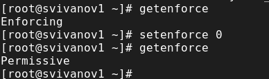{#fig:002 width=70%}

## Редактирование файла и перезагрузка

{#fig:003 width=70%}

## Просмотр статуса SELinux. Попытка переключить режим SELinux

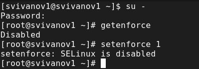{#fig:004 width=70%}

## Редактирование файла и перезагрузка

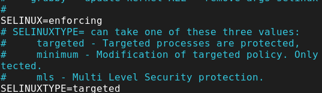{#fig:005 width=70%}

## Получение предупреждающего сообщения при перезагрузке системы

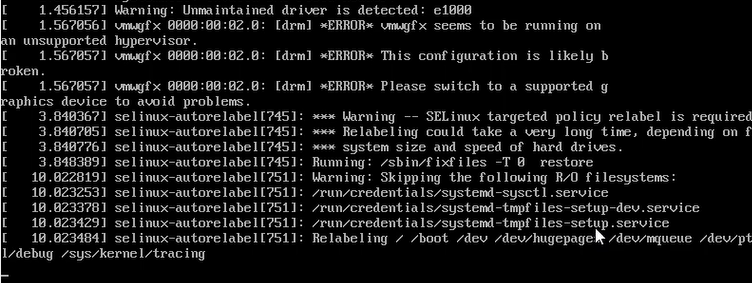{#fig:006 width=70%}

## Просмотр информации о состоянии SELinux

{#fig:007 width=70%}

## Действия с контекстом безопасности 

{#fig:008 width=70%}

## Просмотр загрузочных сообщений после нажатия клавиши “Esc”

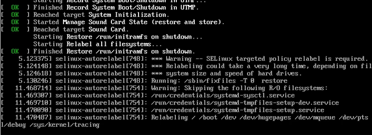{#fig:009 width=70%}

## Установка необходимого программного обеспечения

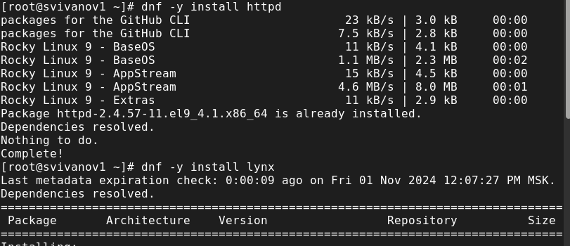{#fig:010 width=70%}

## Создание нового хранилища и файла в этом хранилище

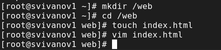{#fig:011 width=70%}

## Добавление текста в файл

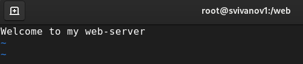{#fig:012 width=70%}

## Редактируем конфигурационный файл

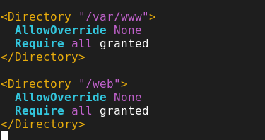{#fig:013 width=70%}

## Запуск веб-сервера и службы httpd

{#fig:014 width=70%}

## Обращение к веб-серверу в текстовом браузере lynx

{#fig:015 width=70%}

## Применение новой метки контекста и восстановление контекста безопасности

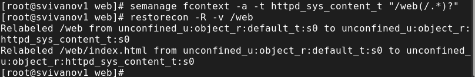{#fig:016 width=70%}

## Пользовательская веб-страница

{#fig:017 width=70%}

## Действия с переключателями службы 

{#fig:018 width=70%}

## Действия с переключателями службы 

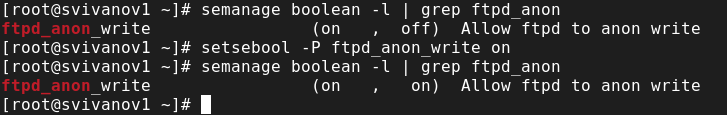{#fig:019 width=70%}

# Вывод

## Вывод 

В ходе выполнения лабораторной работы были получены навыки работы с контекстом безопасности и политиками SELinux.

## Список литературы

:::{#refs}

https://esystem.rudn.ru/mod/page/view.php?id=1098933

:::

