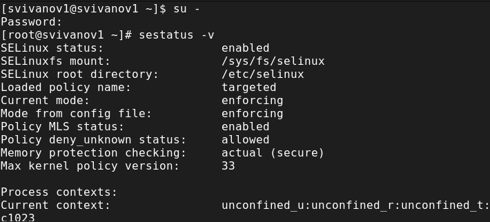
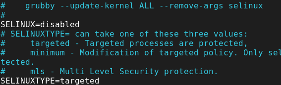
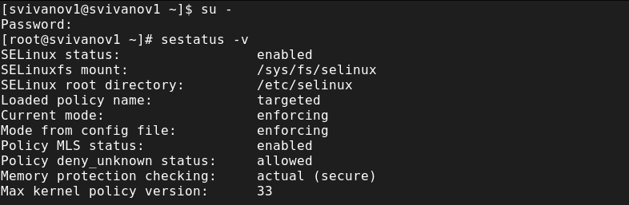
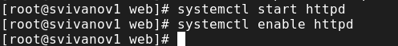
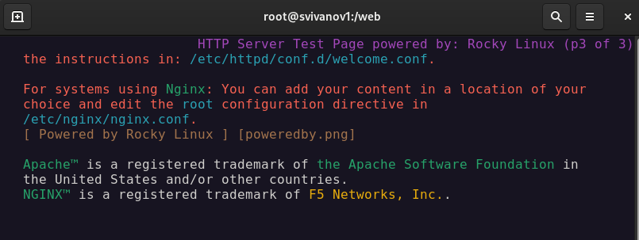
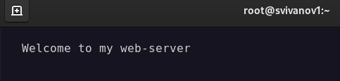

---
## Front matter
title: "Отчет по лабораторной работе №9"
subtitle: "Дисциплина: Основы администрирования операционных систем"
author: "Иванов Сергей Владимирович"

## Generic otions
lang: ru-RU
toc-title: "Содержание"

## Bibliography
bibliography: bib/cite.bib
csl: pandoc/csl/gost-r-7-0-5-2008-numeric.csl

## Pdf output format
toc: true # Table of contents
toc-depth: 2
lof: true # List of figures
fontsize: 12pt
linestretch: 1.5
papersize: a4
documentclass: scrreprt
## I18n polyglossia
polyglossia-lang:
  name: russian
  options:
	- spelling=modern
	- babelshorthands=true
polyglossia-otherlangs:
  name: english
## I18n babel
babel-lang: russian
babel-otherlangs: english
## Fonts
mainfont: PT Serif
romanfont: PT Serif
sansfont: PT Sans
monofont: PT Mono
mainfontoptions: Ligatures=TeX
romanfontoptions: Ligatures=TeX
sansfontoptions: Ligatures=TeX,Scale=MatchLowercase
monofontoptions: Scale=MatchLowercase,Scale=0.9
## Biblatex
biblatex: true
biblio-style: "gost-numeric"
biblatexoptions:
  - parentracker=true
  - backend=biber
  - hyperref=auto
  - language=auto
  - autolang=other*
  - citestyle=gost-numeric
## Pandoc-crossref LaTeX customization
figureTitle: "Рис."
listingTitle: "Листинг"
lofTitle: "Список иллюстраций"
lolTitle: "Листинги"
## Misc options
indent: true
header-includes:
  - \usepackage{indentfirst}
  - \usepackage{float} # keep figures where there are in the text
  - \floatplacement{figure}{H} # keep figures where there are in the text
---

# Цель работы

Получить навыки работы с контекстом безопасности и политиками SELinux.

# Задание

1. Продемонстровать навыки по управлению режимами SELinux
2. Продемонстровать навыки по восстановлению контекста безопасности SELinux 
3. Настроить контекст безопасности для нестандартного расположения файлов вебслужбы
4. Продемонстровать навыки работы с переключателями SELinux

# Выполнение лабораторной работы

Запустим терминал и получим полномочия администратора, просмотрим текущую информацию о состоянии SELinux:
sestatus -v (рис. 1).

{#fig:001 width=70%}

Посмотрим, в каком режиме работает SELinux: getenforce. По умолчанию SELinux находится в режиме принудительного исполнения (Enforcing). Изменим режим работы SELinux на разрешающий (Permissive):
setenforce 0 и снова введем getenforce (рис. 2).

{#fig:002 width=70%}

В файле /etc/sysconfig/selinux с помощью редактора установим
SELINUX=disabled
Перезагрузим систему (рис. 3).

{#fig:003 width=70%}

Посмотрим статус SELinux:
getenforce
Мы увидим, что SELinux теперь отключён. Попробуем переключить режим работы SELinux:
setenforce 1 (рис. 4). 

{#fig:004 width=70%}

Откроем файл /etc/sysconfig/selinux с помощью редактора и установим:
SELINUX=enforcing
Перезагрузим систему. (рис. 5). 

{#fig:005 width=70%}

Во время загрузки системы мы получили предупреждающее сообщение о необходимости восстановления меток SELinux. (рис. 6). 

{#fig:006 width=70%}

После перезагрузки в терминале с полномочиями администратора просмотрим текущую информацию о состоянии SELinux:
sestatus -v
Убедимся, что система работает в принудительном режиме (enforcing) использования SELinux. (рис. 7).

{#fig:007 width=70%}

Запустим терминал и получим полномочия администратора.Посмотрим контекст безопасности файла /etc/hosts:
ls -Z /etc/hosts
Мы увидим, что у файла есть метка контекста net_conf_t. Скопируем файл /etc/hosts в домашний каталог:
cp /etc/hosts ~/
Проверим контекст файла ~/hosts:
ls -Z ~/hosts
Попытаемся перезаписать существующий файл hosts из домашнего каталога в каталог /etc:
mv ~/hosts /etc и подтвердим, что хотитим сделать это. Убедимся, что тип контекста по-прежнему установлен на admin_home_t:
ls -Z /etc/hosts
Исправим контекст безопасности:
restorecon -v /etc/hosts
Убедимся, что тип контекста изменился:
ls -Z /etc/hosts
Для массового исправления контекста безопасности на файловой системе введите
touch /.autorelabel (рис. 8).

{#fig:008 width=70%}

Во время перезапуска не забываем нажать клавишу Esc на клавиатуре, чтобы мы видели загрузочные сообщения. Мы видим, что файловая система автоматически перемаркирована (рис. 9).

{#fig:009 width=70%}

Запустим терминал и получим полномочия администратора. Установим необходимое программное обеспечение:
dnf -y install httpd
dnf -y install lynx (рис. 10).

{#fig:010 width=70%}

Создадим новое хранилище для файлов web-сервера:
mkdir /web
Создадим файл index.html в каталоге с контентом веб-сервера:
cd /web
touch index.html (рис. 11). 

{#fig:011 width=70%}

Поместим в файл следующий текст: Welcome to my web-server (рис. 12).

{#fig:012 width=70%}

В файле /etc/httpd/conf/httpd.conf закомментируем строку
DocumentRoot "/var/www/html" и ниже добавим строку
DocumentRoot "/web"
Затем в этом же файле ниже закомментируем раздел
<Directory "/var/www">
  AllowOverride None
  Require all granted
</Directory>
и добавим следующий раздел, определяющий правила доступа:
<Directory "/web">
  AllowOverride None
  Require all granted
</Directory> (рис. 13)

{#fig:013 width=70%}

Запустим веб-сервер и службу httpd:
systemctl start httpd
systemctl enable httpd (рис. 14). 

{#fig:014 width=70%}

В терминале под учётной записью своего пользователя обратимся к веб-серверу в текстовом браузере lynx: lynx http://localhost (рис. 15). 

{#fig:015 width=70%}

В терминале с полномочиями администратора применим новую метку контекста к /web:
semanage fcontext -a -t httpd_sys_content_t "/web(/.*)?"
Восстановим контекст безопасности:
restorecon -R -v /web (рис. 16). 

{#fig:016 width=70%}

В терминале под учётной записью своего пользователя снова обратимся к веб-серверу:
lynx http://localhost
Теперь мы получили доступ к своей пользовательской веб-странице (рис. 17). 

{#fig:017 width=70%}

Запустим терминал и получим полномочия администратора. Посмотрим список переключателей SELinux для службы ftp:
getsebool -a | grep ftp
Мы увидим переключатель ftpd_anon_write с текущим значением off. Для службы ftpd_anon посмотрим список переключателей с пояснением, за что отвечает каждый переключатель, включён он или выключен:
semanage boolean -l | grep ftpd_anon
Изменим текущее значение переключателя для службы ftpd_anon_write с off на on:
setsebool ftpd_anon_write on
Повторно посмотрим список переключателей SELinux для службы ftpd_anon_write:
getsebool ftpd_anon_write (рис. 18). 

{#fig:018 width=70%}

Посмотрим список переключателей с пояснением:
semanage boolean -l | grep ftpd_anon
Изменим постоянное значение переключателя для службы ftpd_anon_write с off на on:
setsebool -P ftpd_anon_write on
Посмотрим список переключателей:
semanage boolean -l | grep ftpd_anon (переключатель имеет состояние on) (рис. 19). 

{#fig:019 width=70%}

# Контрольные вопросы

**1. Вы хотите временно поставить SELinux в разрешающем режиме. Какую команду вы используете?**

setenforce 0

**2. Вам нужен список всех доступных переключателей SELinux. Какую команду вы используете?**

getsebol -a

**3. Каково имя пакета, который требуется установить для получения легко читаемых сообщений журнала SELinux в журнале аудита?**

audit2allow

**4. Какие команды вам нужно выполнить, чтобы применить тип контекста httpd_sys_content_t к каталогу /web?**

semanage fcontext -a -t httpd_sys_content_t "/web(/.*)?"
restorecon -R -v /web

**5. Какой файл вам нужно изменить, если вы хотите полностью отключить SELinux?**

/etc/sysconfig/selinux

**6. Где SELinux регистрирует все свои сообщения?**

По умолчанию в /var/log/audit/audit.log

**7. Вы не знаете, какие типы контекстов доступны для службы ftp. Какая команда позволяет получить более конкретную информацию?**

getsebool -a | grep ftp

**8. Ваш сервис работает не так, как ожидалось, и вы хотите узнать, связано ли это с SELinux или чем-то ещё. Какой самый простой способ узнать?**

Просмотреть контекст безопасности процессора ps -eZ или id -Z

# Выводы

В ходе выполнения лабораторной работы были получены навыки работы с контекстом безопасности и политиками SELinux.

