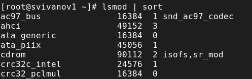
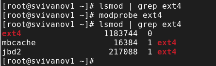
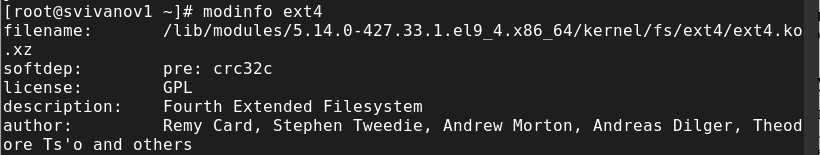
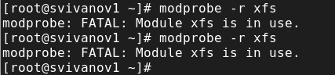
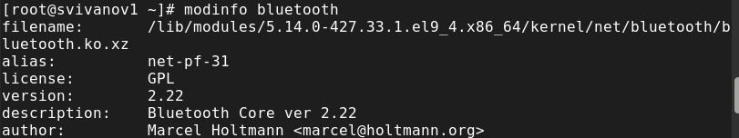
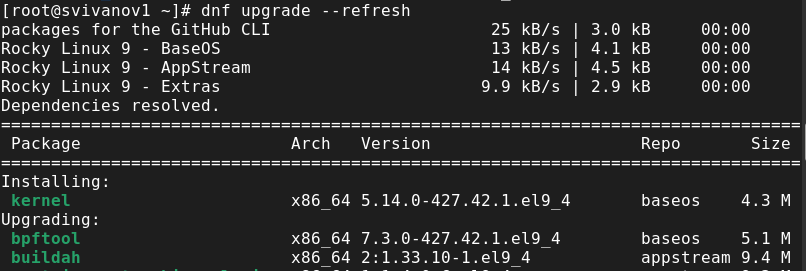
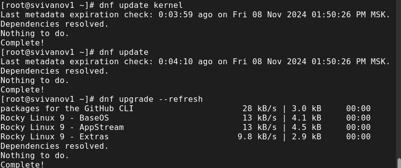
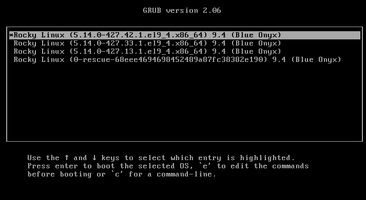
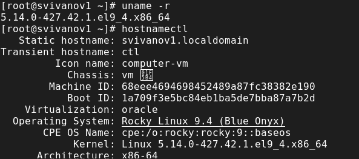

---
## Front matter
lang: ru-RU
title: Лабораторная работа № 10
subtitle: Основы администрирования операционных систем
author:
  - Иванов Сергей Владимирович, НПИбд-01-23
institute:
  - Российский университет дружбы народов, Москва, Россия
date: 9 ноября 2024

## i18n babel
babel-lang: russian
babel-otherlangs: english

## Formatting pdf
toc: false
slide_level: 2
aspectratio: 169
section-titles: true
theme: metropolis
header-includes:
 - \metroset{progressbar=frametitle,sectionpage=progressbar,numbering=fraction}
 - '\makeatletter'
 - '\beamer@ignorenonframefalse'
 - '\makeatother'

  ## Fonts
mainfont: PT Serif
romanfont: PT Serif
sansfont: PT Sans
monofont: PT Mono
mainfontoptions: Ligatures=TeX
romanfontoptions: Ligatures=TeX
sansfontoptions: Ligatures=TeX,Scale=MatchLowercase
monofontoptions: Scale=MatchLowercase,Scale=0.9
---

## Цель работы

Получить навыки работы с утилитами управления модулями ядра операционной системы.

## Задание

1. Продемонстровать навыки работы по управлению модулями ядра 
2. Продемонстровать навыки работы по загрузке модулей ядра с параметрами 

# Выполнение работы

## Получение прав администратора, просмотр устройств и модулей ядра

{#fig:001 width=70%}

## Просмотр загруженных модулей ядра

{#fig:002 width=70%}

## Загрузка и просмотр модуля ядра ext4

{#fig:003 width=70%}

## Просмотр информации о модуле ядра ext4

{#fig:004 width=70%}

## Попытка выгрузить модуль ядра ext4

{#fig:005 width=70%}

## Попытка выгрузить модуль ядра xfs

{#fig:006 width=70%}

## Загрузка bluetooth и просмотр модулей ядра

{#fig:007 width=70%}

## Просмотр информации о модуле bluetooth 

{#fig:008 width=70%}

## Выгрузка модуля ядра bluetooth

{#fig:009 width=70%}

## Просмотр версии ядра и списка пакетов ядра ОС

{#fig:010 width=70%}

## Обновление системы

{#fig:011 width=70%}

## Обновления ОС

{#fig:012 width=70%}

## Перезагрузка системы. Выбор нового ядра

{#fig:013 width=70%}

## Просмотр версии ядра ОС

{#fig:014 width=70%}

# Вывод

## Вывод 

В ходе выполнения лабораторной работы были получены навыки работы с утилитами управления модулями ядра операционной системы.

## Список литературы

:::{#refs}

https://esystem.rudn.ru/mod/page/view.php?id=1098933

:::

