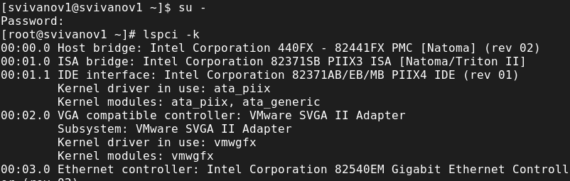
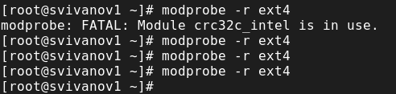
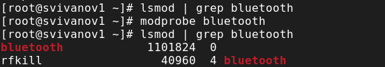
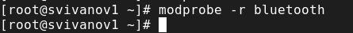
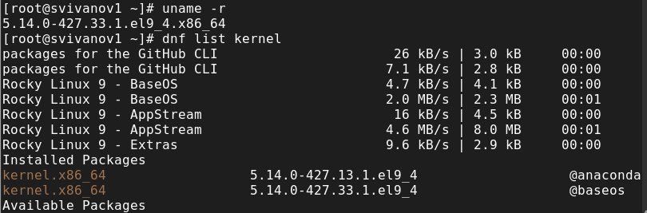

---
## Front matter
title: "Отчет по лабораторной работе №10"
subtitle: "Дисциплина: Основы администрирования операционных систем"
author: "Иванов Сергей Владимирович"

## Generic otions
lang: ru-RU
toc-title: "Содержание"

## Bibliography
bibliography: bib/cite.bib
csl: pandoc/csl/gost-r-7-0-5-2008-numeric.csl

## Pdf output format
toc: true # Table of contents
toc-depth: 2
lof: true # List of figures
fontsize: 12pt
linestretch: 1.5
papersize: a4
documentclass: scrreprt
## I18n polyglossia
polyglossia-lang:
  name: russian
  options:
	- spelling=modern
	- babelshorthands=true
polyglossia-otherlangs:
  name: english
## I18n babel
babel-lang: russian
babel-otherlangs: english
## Fonts
mainfont: PT Serif
romanfont: PT Serif
sansfont: PT Sans
monofont: PT Mono
mainfontoptions: Ligatures=TeX
romanfontoptions: Ligatures=TeX
sansfontoptions: Ligatures=TeX,Scale=MatchLowercase
monofontoptions: Scale=MatchLowercase,Scale=0.9
## Biblatex
biblatex: true
biblio-style: "gost-numeric"
biblatexoptions:
  - parentracker=true
  - backend=biber
  - hyperref=auto
  - language=auto
  - autolang=other*
  - citestyle=gost-numeric
## Pandoc-crossref LaTeX customization
figureTitle: "Рис."
listingTitle: "Листинг"
lofTitle: "Список иллюстраций"
lolTitle: "Листинги"
## Misc options
indent: true
header-includes:
  - \usepackage{indentfirst}
  - \usepackage{float} # keep figures where there are in the text
  - \floatplacement{figure}{H} # keep figures where there are in the text
---

# Цель работы

Получить навыки работы с утилитами управления модулями ядра операционной системы.

# Задание

1. Продемонстровать навыки работы по управлению модулями ядра 
2. Продемонстровать навыки работы по загрузке модулей ядра с параметрами 

# Выполнение лабораторной работы

Запустим терминал и получим полномочия администратора, посмотрим, какие устройства имеются в нашей системе и какие модули ядра с ними
связаны: lspci -k (рис. 1).

{#fig:001 width=70%}

Посмотрим, какие модули ядра загружены: lsmod | sort (рис. 2).

{#fig:002 width=70%}

Посмотрим, загружен ли модуль ext4: lsmod | grep ext4. Загрузим модуль ядра ext4: modprobe ext4
Убедимся, что модуль загружен, посмотрев список загруженных модулей: lsmod | grep ext4 (рис. 3).

{#fig:003 width=70%}

Посмотрим информацию о модуле ядра ext4: modinfo ext4 (рис. 4). 

{#fig:004 width=70%}

Попробуем выгрузить модуль ядра ext4: modprobe -r ext4. Команду потребовалось ввести 2 раза. (рис. 5). 

{#fig:005 width=70%}

Попробуем выгрузить модуль ядра xfs:
modprobe -r xfs
Обратим внимание, что мы получаем сообщение об ошибке, поскольку модуль ядра в данный момент используется. (рис. 6). 

{#fig:006 width=70%}

Посмотрим, загружен ли модуль bluetooth: lsmod | grep bluetooth
Загрузим модуль ядра bluetooth: modprobe bluetooth
Посмотрим список модулей ядра, отвечающих за работу с Bluetooth: lsmod | grep bluetooth (рис. 7).

{#fig:007 width=70%}

Посмотрим информацию о модуле bluetooth: modinfo bluetooth (рис. 8).

{#fig:008 width=70%}

Выгрузим модуль ядра bluetooth: modprobe -r bluetooth (рис. 9).

{#fig:009 width=70%}

Посмотрим версию ядра, используемую в операционной системе: uname -r
Выведем на экран список пакетов, относящихся к ядру операционной системы: dnf list kernel (рис. 10).

{#fig:010 width=70%}

Обновим систему, чтобы убедиться, что все существующие пакеты обновлены, так
как это важно при установке/обновлении ядер Linux и избежания конфликтов: dnf upgrade --refresh (рис. 11). 

{#fig:011 width=70%}

Обновим ядро операционной системы, а затем саму операционную систему:
dnf update kernel
dnf update
dnf upgrade --refresh (рис. 12).

{#fig:012 width=70%}

Перегрузим систему. При загрузке выберем новое ядро. (рис. 13)

{#fig:013 width=70%}

Посмотрим версию ядра, используемую в операционной системы:
uname -r
hostnamectl (рис. 14). 

{#fig:014 width=70%}

# Контрольные вопросы

**1. Какая команда показывает текущую версию ядра, которая используется на вашей системе?**

uname -r

**2. Как можно посмотреть более подробную информацию о текущей версии ядра операционной системы?**

hostnamectl

**3. Какая команда показывает список загруженных модулей ядра?**

lsmod | sort

**4. Какая команда позволяет вам определять параметры модуля ядра?**

modprobe <имя модуля> <параметры> = <значение модуля>

**5. Как выгрузить модуль ядра?**

modprobe -r <модуль>

**6. Что вы можете сделать, если получите сообщение об ошибке при попытке выгрузить модуль ядра?**

Сперва выгружаем тот модуль, который занимает нужный нам модуль, а потом выгружаем первоначальный.

**7. Как определить, какие параметры модуля ядра поддерживаются?**

modinfo <модуль>

**8. Как установить новую версию ядра?**

1) Обновим систему, чтобы убедиться, что все существующие пакеты обновлены, так как это важно при установке/обновлении ядер Linux и избежания конфликтов:
dnf upgrade --refresh
2) Обновим ядро операционной системы, а затем саму операционную систему:
dnf update kernel
dnf update dnf upgrade --refresh
3) Перегрузим систему. При загрузке выберем новое ядро

# Выводы

В ходе выполнения лабораторной работы были получены навыки работы с утилитами управления модулями ядра операционной системы.
