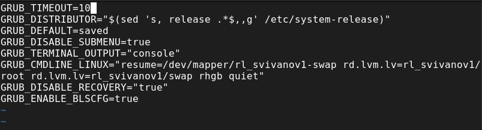
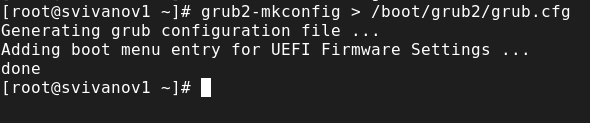
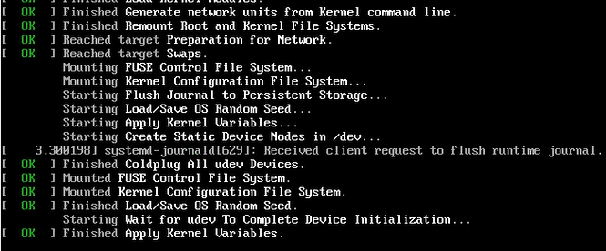
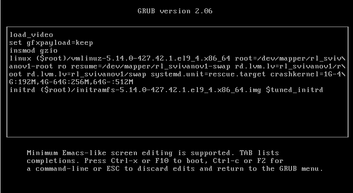
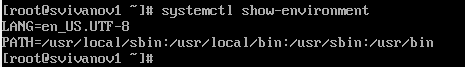
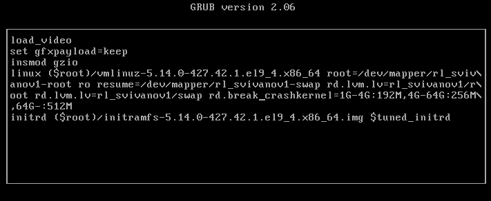

---
## Front matter
lang: ru-RU
title: Лабораторная работа № 11
subtitle: Основы администрирования операционных систем
author:
  - Иванов Сергей Владимирович, НПИбд-01-23
institute:
  - Российский университет дружбы народов, Москва, Россия
date: 15 ноября 2024

## i18n babel
babel-lang: russian
babel-otherlangs: english

## Formatting pdf
toc: false
slide_level: 2
aspectratio: 169
section-titles: true
theme: metropolis
header-includes:
 - \metroset{progressbar=frametitle,sectionpage=progressbar,numbering=fraction}
 - '\makeatletter'
 - '\beamer@ignorenonframefalse'
 - '\makeatother'

  ## Fonts
mainfont: PT Serif
romanfont: PT Serif
sansfont: PT Sans
monofont: PT Mono
mainfontoptions: Ligatures=TeX
romanfontoptions: Ligatures=TeX
sansfontoptions: Ligatures=TeX,Scale=MatchLowercase
monofontoptions: Scale=MatchLowercase,Scale=0.9
---

## Цель работы

Получить навыки работы с загрузчиком системы GRUB2.

## Задание

1. Продемонстрировать навыки по изменению параметров GRUB и записи изменений
в файл конфигурации 
2. Продемонстрировать навыки устранения неполадок при работе с GRUB 
3. Продемонстрировать навыки работы с GRUB без использования root 

# Выполнение работы

## Получение прав администратора, установка параметра

{#fig:001 width=70%}

## Запись изменений в GRUB2

{#fig:002 width=70%}

## Перезагрузка и просмотр загрузочных сообщений

{#fig:003 width=70%}

## Редактирование в меню GRUB

{#fig:004 width=70%}

## Просмотр списка всех файлов модулей

{#fig:005 width=70%}

## Задействованные переменные среды оболочки

{#fig:006 width=70%}

## Редактирование в меню GRUB

{#fig:007 width=70%}

## Просмотр списка всех загруженных файлов модулей 

{#fig:008 width=70%}

## Редактирование в меню GRUB

{#fig:009 width=70%}

## Получение доступа к системному образу

{#fig:010 width=70%}

## Установка нового пароля

{#fig:011 width=70%}

## Загрузка политики SELinux

{#fig:012 width=70%}

## Установка типа контекста и перезагрузка

{#fig:013 width=70%}

# Вывод

## Вывод 

В ходе выполнения лабораторной работы были получены навыки работы с загрузчиком системы GRUB2.

## Список литературы

:::{#refs}

https://esystem.rudn.ru/mod/page/view.php?id=1098933

:::

