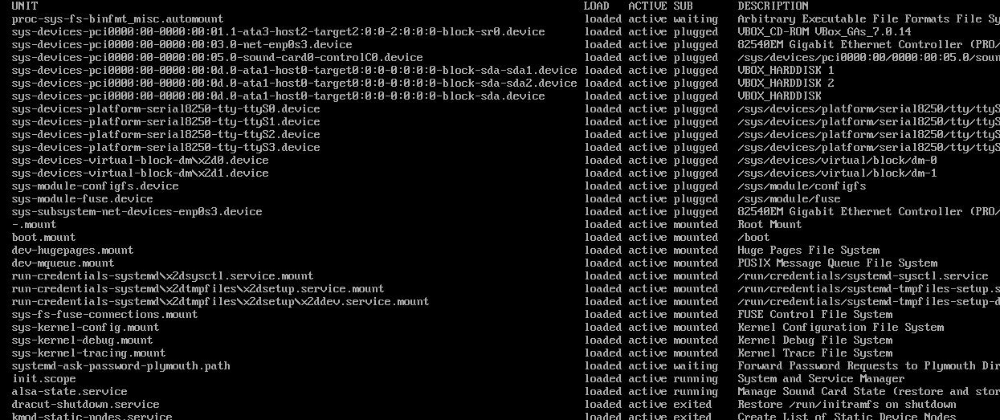
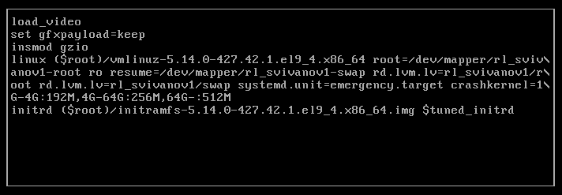
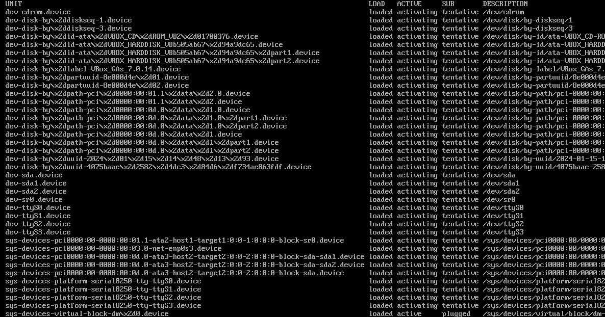
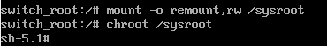
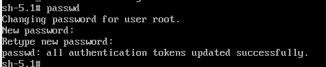
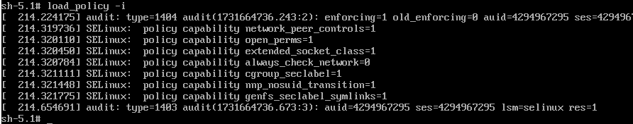
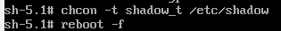

---
## Front matter
title: "Отчет по лабораторной работе №11"
subtitle: "Дисциплина: Основы администрирования операционных систем"
author: "Иванов Сергей Владимирович"

## Generic otions
lang: ru-RU
toc-title: "Содержание"

## Bibliography
bibliography: bib/cite.bib
csl: pandoc/csl/gost-r-7-0-5-2008-numeric.csl

## Pdf output format
toc: true # Table of contents
toc-depth: 2
lof: true # List of figures
fontsize: 12pt
linestretch: 1.5
papersize: a4
documentclass: scrreprt
## I18n polyglossia
polyglossia-lang:
  name: russian
  options:
	- spelling=modern
	- babelshorthands=true
polyglossia-otherlangs:
  name: english
## I18n babel
babel-lang: russian
babel-otherlangs: english
## Fonts
mainfont: PT Serif
romanfont: PT Serif
sansfont: PT Sans
monofont: PT Mono
mainfontoptions: Ligatures=TeX
romanfontoptions: Ligatures=TeX
sansfontoptions: Ligatures=TeX,Scale=MatchLowercase
monofontoptions: Scale=MatchLowercase,Scale=0.9
## Biblatex
biblatex: true
biblio-style: "gost-numeric"
biblatexoptions:
  - parentracker=true
  - backend=biber
  - hyperref=auto
  - language=auto
  - autolang=other*
  - citestyle=gost-numeric
## Pandoc-crossref LaTeX customization
figureTitle: "Рис."
listingTitle: "Листинг"
lofTitle: "Список иллюстраций"
lolTitle: "Листинги"
## Misc options
indent: true
header-includes:
  - \usepackage{indentfirst}
  - \usepackage{float} # keep figures where there are in the text
  - \floatplacement{figure}{H} # keep figures where there are in the text
---

# Цель работы

Получить навыки работы с загрузчиком системы GRUB2.

# Задание

1. Продемонстрировать навыки по изменению параметров GRUB и записи изменений
в файл конфигурации 
2. Продемонстрировать навыки устранения неполадок при работе с GRUB 
3. Продемонстрировать навыки работы с GRUB без использования root 

# Выполнение лабораторной работы

Запустим терминал и получим полномочия администратора, в файле /etc/default/grub установим параметр отображения меню загрузки в течение 10 секунд:
GRUB_TIMEOUT=10 (рис. 1).

{#fig:001 width=70%}

Запишите изменения в GRUB2, введя в командной строке: grub2-mkconfig > /boot/grub2/grub.cfg (рис. 2).

{#fig:002 width=70%}

Перезагрузим систему и убедимся, что при загрузке видим прокрутку загрузочных сообщений. (рис. 3).

{#fig:003 width=70%}

Перегрузим систему. Как только появится меню GRUB, выберем строку с текущей версией ядра в меню и нажмем e для редактирования.
Прокрутим вниз до строки, начинающейся с linux ($root)/vmlinuz-. Эта строка загружает ядро системы. В конце этой строки введем
systemd.unit=rescue.target и удалим опции rhgb и quit из этой строки. Нажмем Ctrl + x для продолжения процесса загрузки. (рис. 4). 

{#fig:004 width=70%}

Введем пароль пользователя root при появлении запроса. Посмотрим список всех файлов модулей, которые загружены в настоящее время: systemctl list-units (рис. 5). 

{#fig:005 width=70%}

Посмотрим задействованные переменные среды оболочки: systemctl show-environment (рис. 6). 

{#fig:006 width=70%}

Перегрузим систему, используя systemctl reboot. Как только отобразится меню GRUB, ещё раз нажмем e на строке с текущей версией
ядра, чтобы войти в режим редактора. В конце строки, загружающей ядро, введем systemd.unit=emergency.target и удалим опции rhgb и quit.
Нажмем Ctrl + x для продолжения процесса загрузки. (рис. 7).

{#fig:007 width=70%}

После успешного входа в систему посмотрим список всех загруженных файлов модулей: systemctl list-units (рис. 8).

{#fig:008 width=70%}

Перегрузим компьютер. Когда отобразится меню GRUB, выберем в меню строку с текущей версией ядра системы и нажмем e , чтобы войти в режим редактора.
В конце строки, загружающей ядро, введем rd.break и удалим опции rhgb и quit. Нажмем Ctrl + x для продолжения процесса загрузки. (рис. 9).

{#fig:009 width=70%}

Чтобы получить доступ к системному образу для чтения и записи, наберем mount -o remount,rw /sysroot.
Сделаем содержимое каталога /sysimage новым корневым каталогом, набрав chroot /sysroot (рис. 10).

{#fig:010 width=70%}

Теперь мы можем ввести команду задания пароля: passwd
и установить новый пароль для пользователя root. (рис. 11). 

{#fig:011 width=70%}

Загрузим политику SELinux с помощью команды load_policy -i (рис. 12).

{#fig:012 width=70%}

Теперь мы можем вручную установить правильный тип контекста для /etc/shadow.
Для этого введем chcon -t shadow_t /etc/shadow. Перезагрузим систему с помощью команды reboot -f и войдем в систему
с изменённым паролем для пользователя root (рис. 13)

{#fig:013 width=70%}

# Контрольные вопросы

**1. Какой файл конфигурации следует изменить для применения общих изменений в GRUB2?**

/etc/default/grub

**2. Как называется конфигурационный файл GRUB2, в котором вы применяете изменения для GRUB2?**

/boot/grub2/grub.cfg

**3. После внесения изменений в конфигурацию GRUB2, какую команду вы должны выполнить, чтобы изменения сохранились и воспринялись при загрузке системы?**

systemctl reboot

# Выводы

В ходе выполнения лабораторной работы были получены навыки работы с загрузчиком системы GRUB2.
