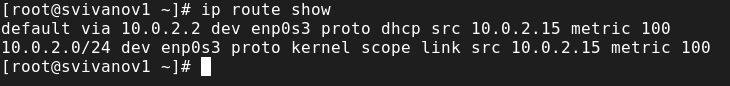
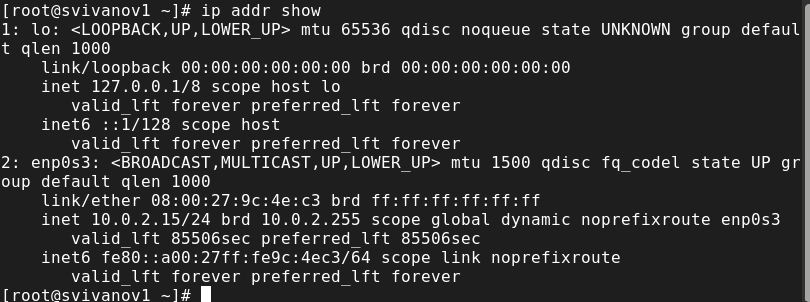
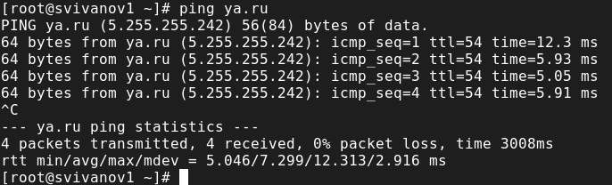
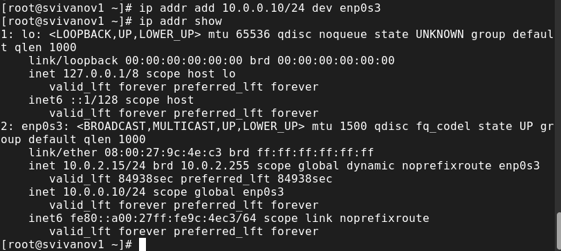
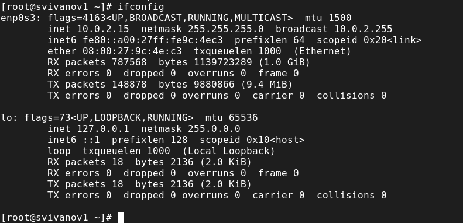
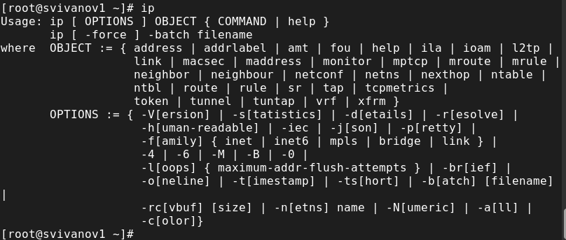
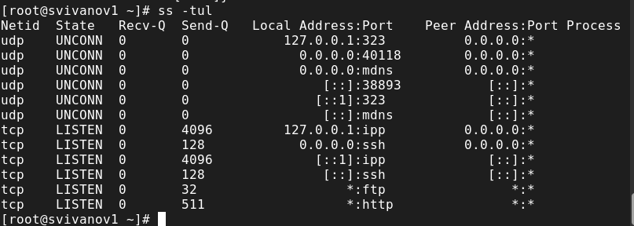
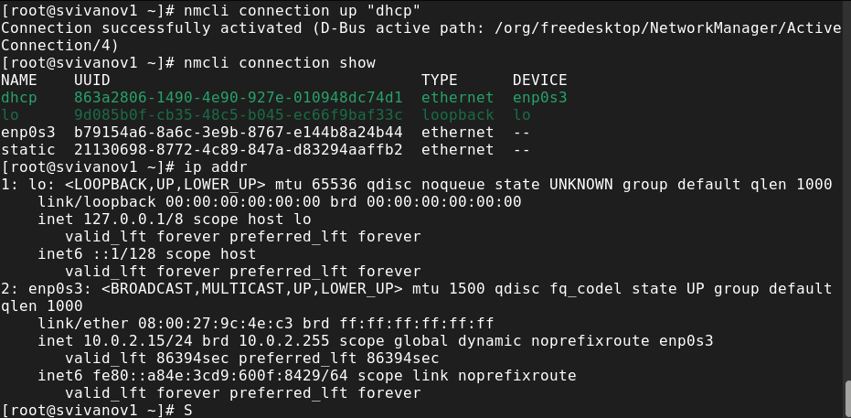
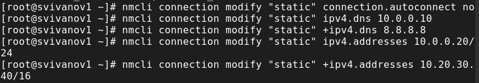
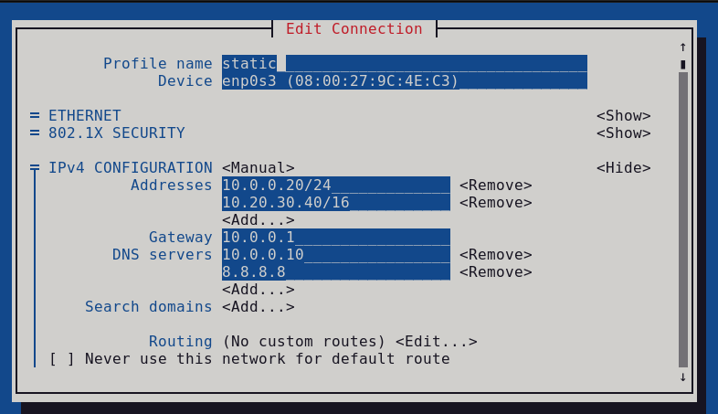

---
## Front matter
title: "Отчет по лабораторной работе №12"
subtitle: "Дисциплина: Основы администрирования операционных систем"
author: "Иванов Сергей Владимирович"

## Generic otions
lang: ru-RU
toc-title: "Содержание"

## Bibliography
bibliography: bib/cite.bib
csl: pandoc/csl/gost-r-7-0-5-2008-numeric.csl

## Pdf output format
toc: true # Table of contents
toc-depth: 2
lof: true # List of figures
fontsize: 12pt
linestretch: 1.5
papersize: a4
documentclass: scrreprt
## I18n polyglossia
polyglossia-lang:
  name: russian
  options:
	- spelling=modern
	- babelshorthands=true
polyglossia-otherlangs:
  name: english
## I18n babel
babel-lang: russian
babel-otherlangs: english
## Fonts
mainfont: PT Serif
romanfont: PT Serif
sansfont: PT Sans
monofont: PT Mono
mainfontoptions: Ligatures=TeX
romanfontoptions: Ligatures=TeX
sansfontoptions: Ligatures=TeX,Scale=MatchLowercase
monofontoptions: Scale=MatchLowercase,Scale=0.9
## Biblatex
biblatex: true
biblio-style: "gost-numeric"
biblatexoptions:
  - parentracker=true
  - backend=biber
  - hyperref=auto
  - language=auto
  - autolang=other*
  - citestyle=gost-numeric
## Pandoc-crossref LaTeX customization
figureTitle: "Рис."
listingTitle: "Листинг"
lofTitle: "Список иллюстраций"
lolTitle: "Листинги"
## Misc options
indent: true
header-includes:
  - \usepackage{indentfirst}
  - \usepackage{float} # keep figures where there are in the text
  - \floatplacement{figure}{H} # keep figures where there are in the text
---

# Цель работы

Получить навыки настройки сетевых параметров системы.

# Задание

1. Продемонстровать навыки использования утилиты ip 
2. Продемонстровать навыки использования утилиты nmcli

# Выполнение лабораторной работы

Запустим терминал и получим полномочия администратора, выведем на экран информацию о существующих сетевых подключениях, а также
статистику о количестве отправленных пакетов и связанных с ними сообщениях об ошибках: ip -s link (рис. 1).

{#fig:001 width=70%}

Выведите на экран информацию о текущих маршрутах: ip route show (рис. 2).

{#fig:002 width=70%}

Выведем на экран информацию о текущих назначениях адресов для сетевых интерфейсов на устройстве: ip addr show (рис. 3).

{#fig:003 width=70%}

Используем команду ping для проверки правильности подключения к Интернету. (рис. 4). 

{#fig:004 width=70%}

Добавим дополнительный адрес к нашему интерфейсу: ip addr add 10.0.0.10/24 dev enp0s3 .
Проверим, что адрес добавился: ip addr show (рис. 5). 

{#fig:005 width=70%}

Сравните вывод информации от утилиты ip и от команды ifconfig: ifconfig (рис. 6). 

{#fig:006 width=70%}

{#fig:007 width=70%}

Выведем на экран список всех прослушиваемых системой портов UDP и TCP: ss -tul (рис. 8).

{#fig:008 width=70%}

Выведем на экран информацию о текущих соединениях: nmcli connection show (рис. 9).

{#fig:009 width=70%}

Добавим Ethernet-соединение с именем dhcp к интерфейсу:
nmcli connection add con-name "dhcp" type ethernet ifname enp0s3
Добавим к этому же интерфейсу Ethernet-соединение с именем static, статическим IPv4-адресом адаптера и статическим адресом шлюза:
nmcli connection add con-name "static" ifname enp0s3 autoconnect no type ethernet ip4 10.0.0.10/24 gw4 10.0.0.1 ifname enp0s3 (рис. 10).

{#fig:010 width=70%}

Переключимся на статическое соединение: nmcli connection up "static"
Проверим успешность переключения при помощи nmcli connection show и ip addr. (рис. 11). 

{#fig:011 width=70%}

Вернемся к соединению dhcp: nmcli connection up "dhcp"
Проверим успешность переключения при помощи nmcli connection show и ip addr. (рис. 12).

{#fig:012 width=70%}

Отключим автоподключение статического соединения: nmcli connection modify "static" connection.autoconnect no
Добавим DNS-сервер в статическое соединение: nmcli connection modify "static" ipv4.dns 10.0.0.10
Добавим второй DNS-сервер: nmcli connection modify "static" +ipv4.dns 8.8.8.8
Изменим IP-адрес статического соединения: nmcli connection modify "static" ipv4.addresses 10.0.0.20/24
Добавим другой IP-адрес для статического соединения: nmcli connection modify "static" +ipv4.addresses 10.20.30.40/16 (рис. 13)

{#fig:013 width=70%}

После изменения свойств соединения активируем его: nmcli connection up "static"
Проверим успешность переключения при помощи nmcli connection show и ip addr. (рис. 14)

{#fig:014 width=70%}

Используя nmtui, посмотрим настройки сети на устройстве, посмотрим настройки сетевых соединений в графическом интерфейсе операционной системы. (рис. 15)

{#fig:015 width=70%}

Переключимся на первоначальное сетевое соединение: nmcli connection up "enp0s3" (рис. 16)

{#fig:016 width=70%}

# Контрольные вопросы

**1. Какая команда отображает только статус соединения, но не IP-адрес?**

ip link или netstat

**2. Какая служба управляет сетью в ОС типа RHEL?**

NetworkManager

**3. Какой файл содержит имя узла (устройства) в ОС типа RHEL?**

/etc/hosts – список всех хостов
/etc/hostname – имя хоста локального устройства

**4. Какая команда позволяет вам задать имя узла (устройства)?**

hostamectl set-hostname

**5. Какой конфигурационный файл можно изменить для включения разрешения имён для конкретного IP-адреса?**

Если система пытается разрешить имя и находит его в /etc/hosts, она не будет пытаться смотреть записи в DNS. Поэтому нужно изменить именно этот файл.

**6. Какая команда показывает текущую конфигурацию маршрутизации?**

ip route show

**7. Как проверить текущий статус службы NetworkManager?**

systemctl status NetworkManager

**8. Какая команда позволяет вам изменить текущий IP-адрес и шлюз по умолчанию для вашего сетевого соединения?**

nmcli con mod <имя соединения> ipv4.addresses "<текущий ip>,<новый ip>'' gw4 <новый ip> - изменить текущий ip адрес и шлюз.
nmcli con mod <имя соединения> ipv4.addresses "<текущий ip>,<новый ip>'' - изменить текущий ip адрес.
route add default GW <новый ip> <название интерфейса> — изменитьшлюз по умолчанию.

# Выводы

В ходе выполнения лабораторной работы были получены навыки настройки сетевых параметров системы.
