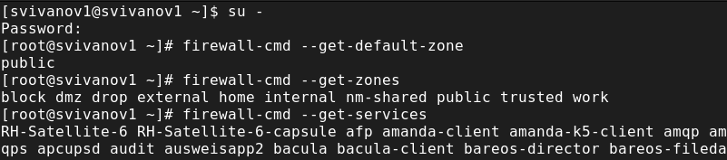
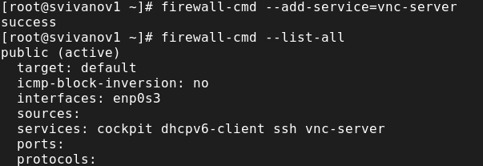
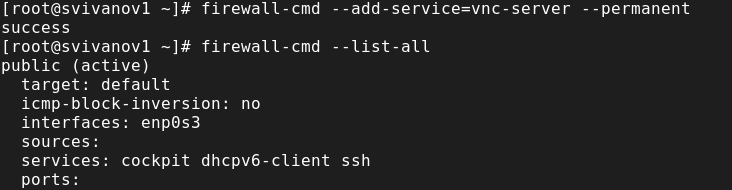
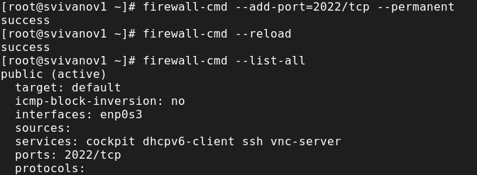
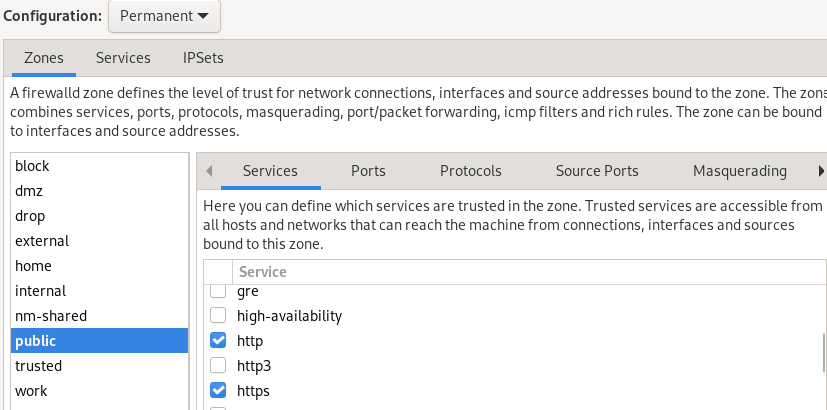
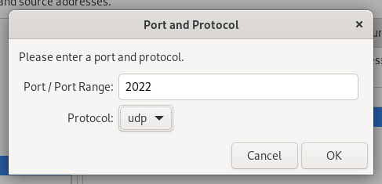
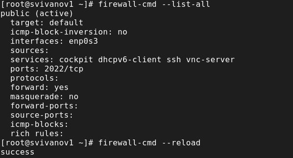
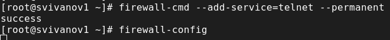
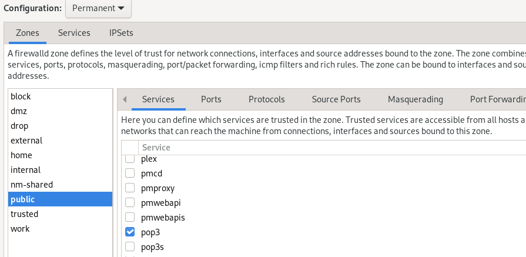
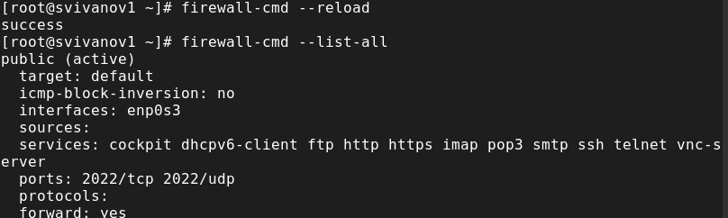

---
## Front matter
lang: ru-RU
title: Лабораторная работа № 13
subtitle: Основы администрирования операционных систем
author:
  - Иванов Сергей Владимирович, НПИбд-01-23
institute:
  - Российский университет дружбы народов, Москва, Россия
date: 29 ноября 2024

## i18n babel
babel-lang: russian
babel-otherlangs: english

## Formatting pdf
toc: false
slide_level: 2
aspectratio: 169
section-titles: true
theme: metropolis
header-includes:
 - \metroset{progressbar=frametitle,sectionpage=progressbar,numbering=fraction}
 - '\makeatletter'
 - '\beamer@ignorenonframefalse'
 - '\makeatother'

  ## Fonts
mainfont: PT Serif
romanfont: PT Serif
sansfont: PT Sans
monofont: PT Mono
mainfontoptions: Ligatures=TeX
romanfontoptions: Ligatures=TeX
sansfontoptions: Ligatures=TeX,Scale=MatchLowercase
monofontoptions: Scale=MatchLowercase,Scale=0.9
---

## Цель работы

Получить навыки настройки пакетного фильтра в Linux.

## Задание

1. Используя firewall-cmd:
- определить текущую зону по умолчанию; доступные для настройки зоны; службы, включённые в текущую зону;
- добавить сервер VNC в конфигурацию брандмауэра.
2. Используя firewall-config:
- добавить службы http и ssh в зону public; порт 2022 протокола UDP в зону public; добавить службу ftp.

# Выполнение работы

## Получение прав администратора, определение зон и служб

{#fig:001 width=70%}

## Определение доступных служб в текущей зоне

{#fig:002 width=70%}

## Сравнение вывода двух команд

{#fig:003 width=70%}

## Добавление сервера VNC и проверка добавления

{#fig:004 width=70%}

## Перезапуск службы и повторная проверка

{#fig:005 width=70%}

## Повторное добавление и проверка наличия службы

{#fig:006 width=70%}

## Перезагрузка конфигурации и просмотр время выполнения

{#fig:007 width=70%}

## Добавление порта 2022, перезагрузка конфигурации и проверка добавления 

{#fig:008 width=70%}

## Запуск интерфейса GUI firewall-config

{#fig:009 width=70%}

## Включение служб в интерфейсе GUI firewall-config

{#fig:010 width=70%}

## Добавление порта, закрытие утилиты

{#fig:011 width=70%}

## Проверка конфигурации и перезагрузка

{#fig:012 width=70%}

## Проверка добавления порта в конфицигурацию

{#fig:013 width=70%}

# Самостоятельная работа

## Создание конфигурации командной строкой

{#fig:014 width=70%}

## Создание конфигурации в графическом интерфейсе 

{#fig:015 width=70%}

## Перезагрузка конфигурации firewall-cmd 

{#fig:016 width=70%}

# Вывод

## Вывод 

В ходе выполнения лабораторной работы были получены навыки настройки пакетного фильтра в Linux.

## Список литературы

:::{#refs}

https://esystem.rudn.ru/mod/page/view.php?id=1098933

:::

