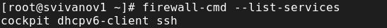
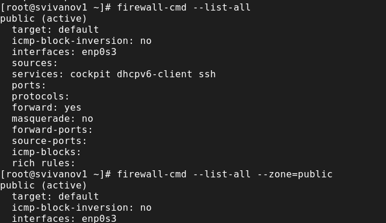
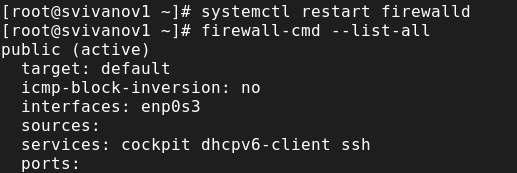
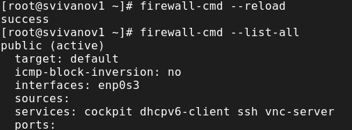
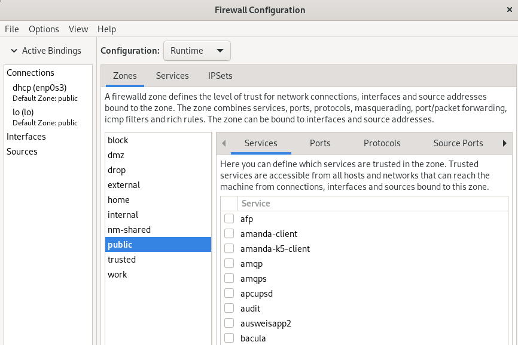
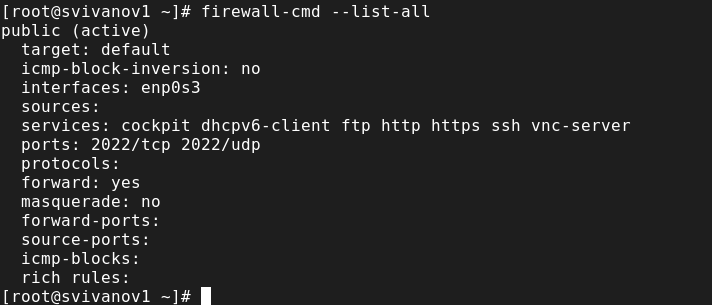

---
## Front matter
title: "Отчет по лабораторной работе №13"
subtitle: "Дисциплина: Основы администрирования операционных систем"
author: "Иванов Сергей Владимирович"

## Generic otions
lang: ru-RU
toc-title: "Содержание"

## Bibliography
bibliography: bib/cite.bib
csl: pandoc/csl/gost-r-7-0-5-2008-numeric.csl

## Pdf output format
toc: true # Table of contents
toc-depth: 2
lof: true # List of figures
fontsize: 12pt
linestretch: 1.5
papersize: a4
documentclass: scrreprt
## I18n polyglossia
polyglossia-lang:
  name: russian
  options:
	- spelling=modern
	- babelshorthands=true
polyglossia-otherlangs:
  name: english
## I18n babel
babel-lang: russian
babel-otherlangs: english
## Fonts
mainfont: PT Serif
romanfont: PT Serif
sansfont: PT Sans
monofont: PT Mono
mainfontoptions: Ligatures=TeX
romanfontoptions: Ligatures=TeX
sansfontoptions: Ligatures=TeX,Scale=MatchLowercase
monofontoptions: Scale=MatchLowercase,Scale=0.9
## Biblatex
biblatex: true
biblio-style: "gost-numeric"
biblatexoptions:
  - parentracker=true
  - backend=biber
  - hyperref=auto
  - language=auto
  - autolang=other*
  - citestyle=gost-numeric
## Pandoc-crossref LaTeX customization
figureTitle: "Рис."
listingTitle: "Листинг"
lofTitle: "Список иллюстраций"
lolTitle: "Листинги"
## Misc options
indent: true
header-includes:
  - \usepackage{indentfirst}
  - \usepackage{float} # keep figures where there are in the text
  - \floatplacement{figure}{H} # keep figures where there are in the text
---

# Цель работы

Получить навыки настройки пакетного фильтра в Linux.

# Задание

1. Используя firewall-cmd:
- определить текущую зону по умолчанию; доступные для настройки зоны; службы, включённые в текущую зону;
- добавить сервер VNC в конфигурацию брандмауэра.
2. Используя firewall-config:
- добавить службы http и ssh в зону public;
- добавить порт 2022 протокола UDP в зону public;
- добавить службу ftp.

# Выполнение лабораторной работы

Запустим терминал и получим полномочия администратора, определим текущую зону по умолчанию, введя:
firewall-cmd --get-default-zone
Определим доступные зоны, введя:
firewall-cmd --get-zones
Посмотрим службы, доступные на компьютере, используя
firewall-cmd --get-services (рис. 1).

{#fig:001 width=70%}

Определим доступные службы в текущей зоне:
firewall-cmd --list-services (рис. 2).

{#fig:002 width=70%}

Сравним результаты вывода информации при использовании команды firewall-cmd --list-all и команды firewall-cmd --list-all --zone=public (рис. 3).

{#fig:003 width=70%}

Добавим сервер VNC в конфигурацию брандмауэра:
firewall-cmd --add-service=vnc-server
Проверим, добавился ли vnc-server в конфигурацию:
firewall-cmd --list-all (рис. 4). 

{#fig:004 width=70%}

Перезапустим службу firewalld:
systemctl restart firewalld
Проверим, есть ли vnc-server в конфигурации:
firewall-cmd --list-all (рис. 5). 

{#fig:005 width=70%}

Добавим службу vnc-server ещё раз, но на этот раз сделаем её постоянной, используя команду
firewall-cmd --add-service=vnc-server --permanent
Проверим наличие vnc-server в конфигурации:
firewall-cmd --list-all (рис. 6). 

{#fig:006 width=70%}

Перезагрузим конфигурацию firewalld и просмотрим конфигурацию времени выполнения:
firewall-cmd --reload
firewall-cmd --list-all (рис. 7)

{#fig:007 width=70%}

Добавим в конфигурацию межсетевого экрана порт 2022 протокола TCP:
firewall-cmd --add-port=2022/tcp --permanent
Затем перезагрузим конфигурацию firewalld:
firewall-cmd --reload
Проверим, что порт добавлен в конфигурацию:
firewall-cmd --list-all (рис. 8).

{#fig:008 width=70%}

Откроем терминал и под учётной записью своего пользователя запустите интерфейс GUI firewall-config: firewall-config (рис. 9).

{#fig:009 width=70%}

Нажмём выпадающее меню рядом с параметром Configuration. Откроем раскрывающийся список и выберем Permanent.
Выберем зону public и отметим службы http, https и ftp, чтобы включить их. (рис. 10).

{#fig:010 width=70%}

Выберем вкладку Ports и на этой вкладке нажмеме Add. Введем порт 2022 и протокол
udp, нажмем ОК, чтобы добавить их в список. Закроем утилиту firewall-config. (рис. 11). 

{#fig:011 width=70%}

В окне терминала введём:
firewall-cmd --list-all
Перегрузим конфигурацию firewall-cmd:
firewall-cmd --reload (рис. 12).

{#fig:012 width=70%}

Проверим список доступных сервисов. Видим, что изменения были применены (рис. 13)

{#fig:013 width=70%}

# Самостоятельная работа

Запустим терминал и получим полномочия администратора: su -. Создадим
конфигурацию межсетевого экрана, которая позволяет получить доступ к
следующим службам:
- telnet;
- imap;
- pop3;
- smtp;
Сделаем это как в командной строке (для службы telnet): firewall-cmd—add-
service=telnet --permanent, так и в графическом интерфейсе (для служб imap,
pop3, smtp): firewall-config (рис. 14)

{#fig:014 width=70%}

Нажмём на выпадающее меню рядом с параметром Configuration. Откроем раскрывающийся список и выберем Permanent. Далее выберем зону public и
отметим службы imap, pop3 и smtp, чтобы включить их. Затем закроем утилиту firewall-config (рис. 15)

{#fig:015 width=70%}

Убедимся, что конфигурация является постоянной и будет активирована после перезагрузки компьютера (рис. 16)

{#fig:016 width=70%}

# Контрольные вопросы

**1. Какая служба должна быть запущена перед началом работы с менеджером конфигурации брандмауэра firewall-config?**

sudo systemctl start firewalld

**2. Какая команда позволяет добавить UDP-порт 2355 в конфигурацию брандмауэра в зоне по умолчанию?**

firewall-cmd -add-port/udp –permanent

**3. Какая команда позволяет показать всю конфигурацию брандмауэра во всех зонах?**

firewall-cmd –list-all-zones

**4. Какая команда позволяет удалить службу vnc-server из текущей конфигурации брандмауэра?**

firewall-cmd –remove-service=vnc-server

**5. Какая команда firewall-cmd позволяет активировать новую конфигурацию, добавленную опцией --permanent?**

firewall-cmd –reload

**6. Какой параметр firewall-cmd позволяет проверить, что новая конфигурация была добавлена в текущую зону и теперь активна?**

firewall-cmd --list-all --zone=<zone-name>

**7. Какая команда позволяет добавить интерфейс eno1 в зону public?**

firewall-cmd –zone=public –change-interface=enol

**8. Если добавить новый интерфейс в конфигурацию брандмауэра, пока не указана зона, в какую зону он будет добавлен?**

В зону по умолчанию (firewall-cmd –get-default-zone)

# Выводы

В ходе выполнения лабораторной работы были получены навыки настройки пакетного фильтра в Linux.
