---
## Front matter
lang: ru-RU
title: Лабораторная работа № 14
subtitle: Основы администрирования операционных систем
author:
  - Иванов Сергей Владимирович, НПИбд-01-23
institute:
  - Российский университет дружбы народов, Москва, Россия
date: 6 декабря 2024

## i18n babel
babel-lang: russian
babel-otherlangs: english

## Formatting pdf
toc: false
slide_level: 2
aspectratio: 169
section-titles: true
theme: metropolis
header-includes:
 - \metroset{progressbar=frametitle,sectionpage=progressbar,numbering=fraction}
 - '\makeatletter'
 - '\beamer@ignorenonframefalse'
 - '\makeatother'

  ## Fonts
mainfont: PT Serif
romanfont: PT Serif
sansfont: PT Sans
monofont: PT Mono
mainfontoptions: Ligatures=TeX
romanfontoptions: Ligatures=TeX
sansfontoptions: Ligatures=TeX,Scale=MatchLowercase
monofontoptions: Scale=MatchLowercase,Scale=0.9
---

## Цель работы

Целью данной работы является получение навыков создания разделов на диске и файловых систем, а также навыков монтирования файловых систем.

# Выполнение работы

## Добавление дисков

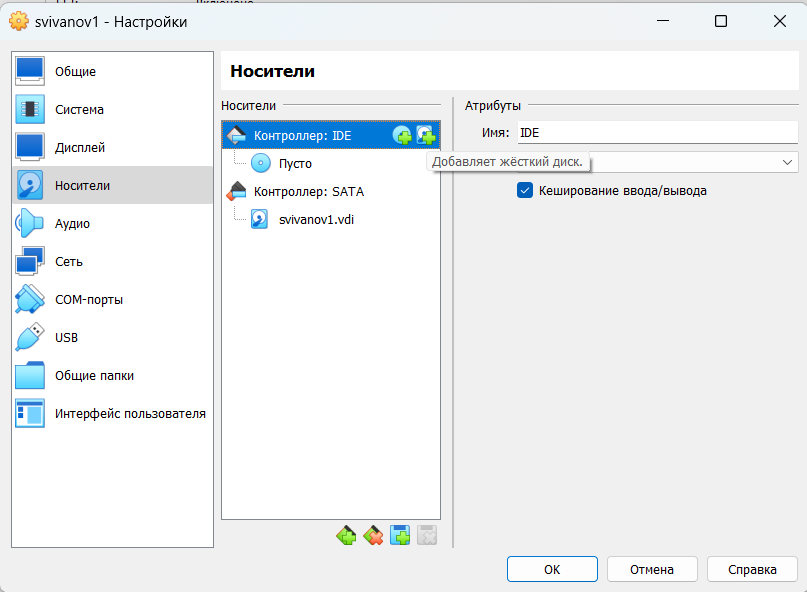{#fig:001 width=70%}

## Тип диска

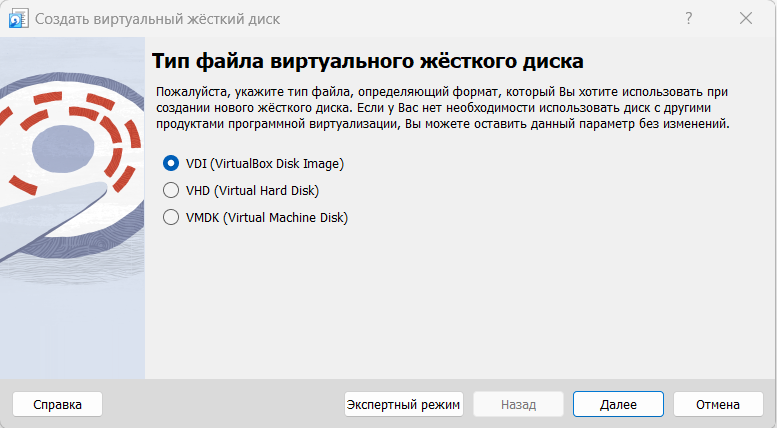{#fig:002 width=70%}

## Формат диска

{#fig:003 width=70%}

## Имя и размер файла

{#fig:004 width=70%}

## Выбор дисков

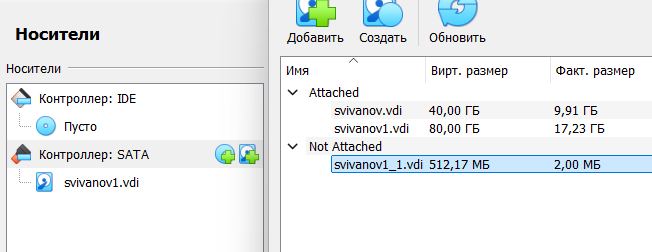{#fig:005 width=70%}

## Перечень разделов

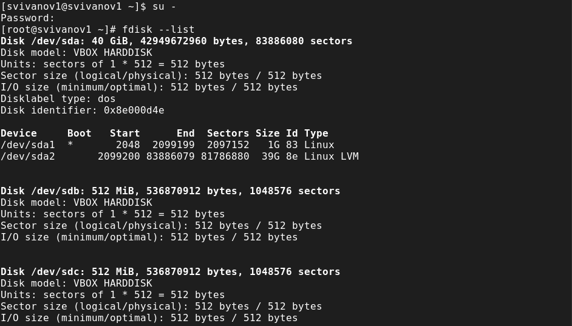{#fig:006 width=70%}

## Процесс по разметке диска

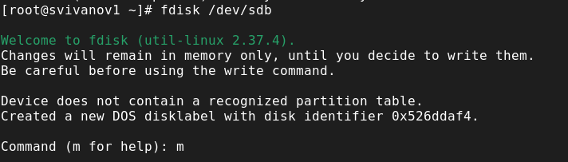{#fig:007 width=70%}

## Добавление и запись 

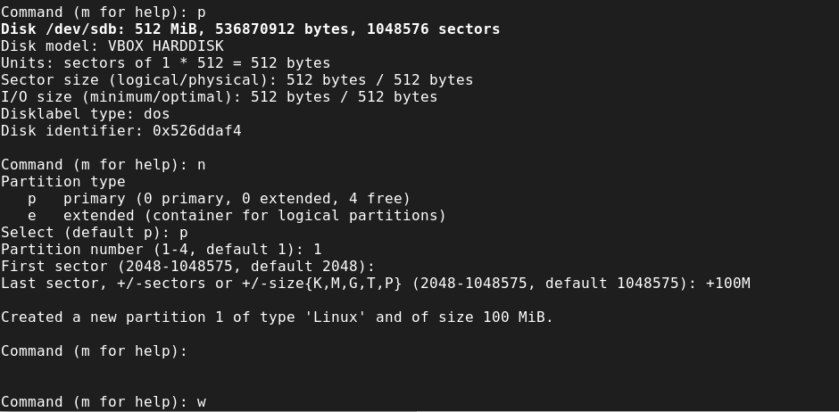{#fig:008 width=70%}

## Сравнение

{#fig:009 width=70%}

## Запуск, добавление, создание

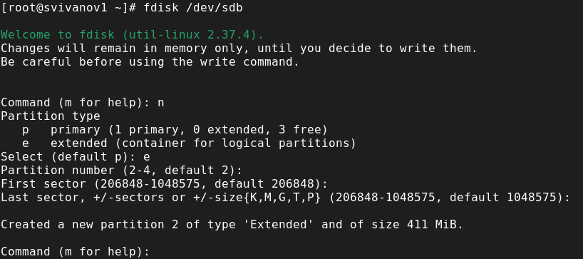{#fig:010 width=70%}

## Логический раздел

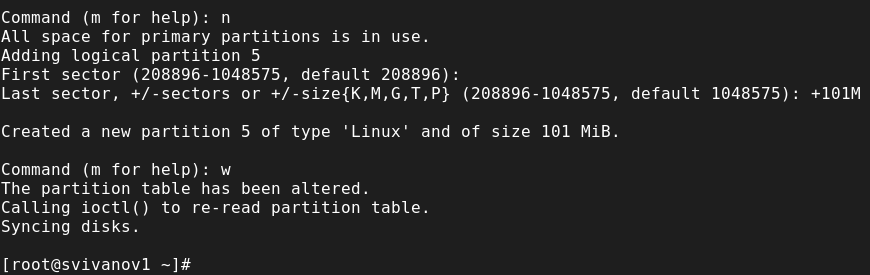{#fig:011 width=70%}

## Завершение процедуры

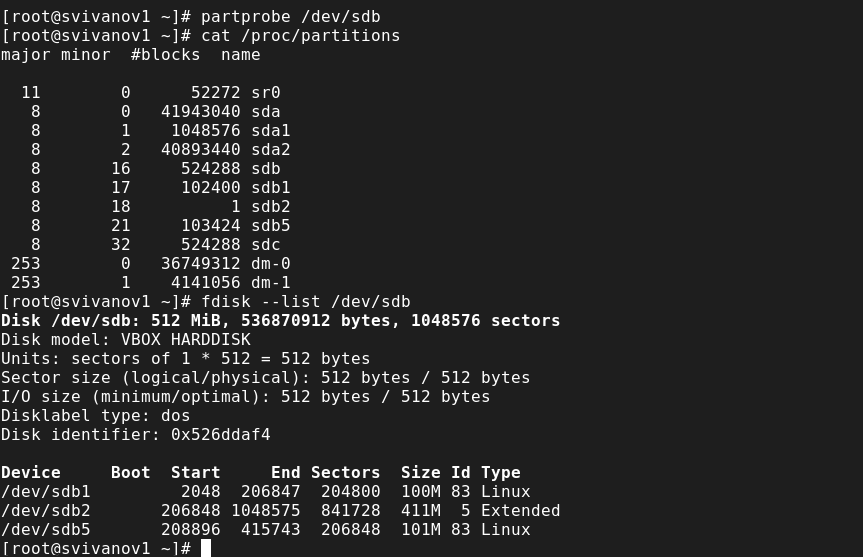{#fig:012 width=70%}

## Запуск fdisk

{#fig:013 width=70%}

## Завершение процедуры

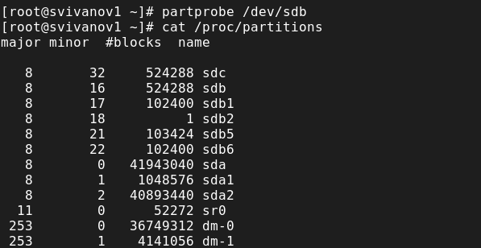{#fig:014 width=70%}

## Форматирование и другие действия

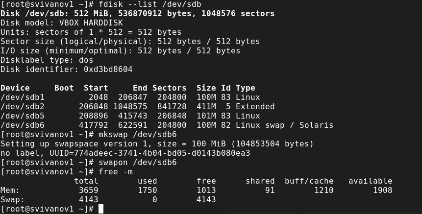{#fig:015 width=70%}

## Просмотр таблиц

{#fig:016 width=70%}

## gdisk

{#fig:017 width=70%}

## Отображение разбиений

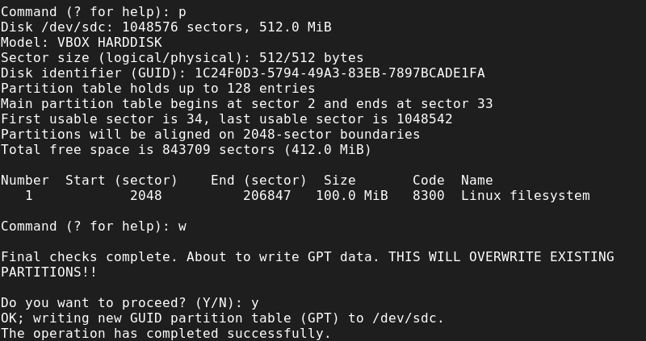{#fig:018 width=70%}

## Обновление таблиц

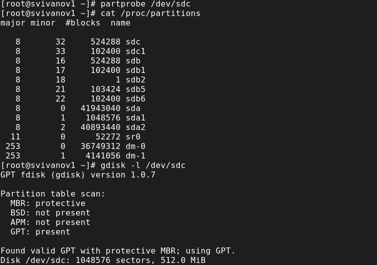{#fig:019 width=70%}

## XFS

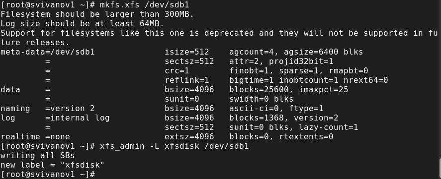{#fig:020 width=70%}

## EXT4

{#fig:021 width=70%}

## Точка монтирования

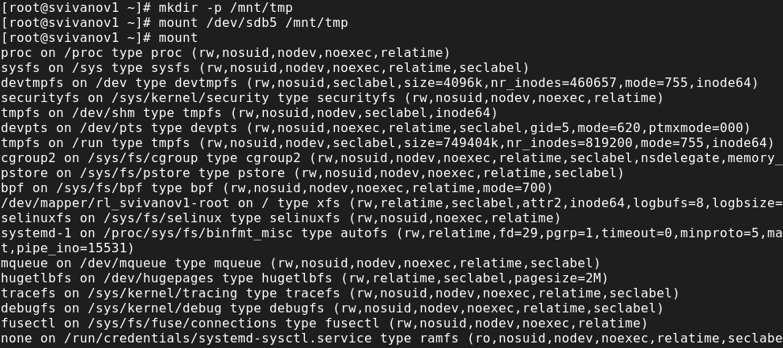{#fig:022 width=70%}

## Монтирование раздела

{#fig:023 width=70%}

## UUID

{#fig:024 width=70%}

## Добавление строки

{#fig:025 width=70%}

## Монтирование

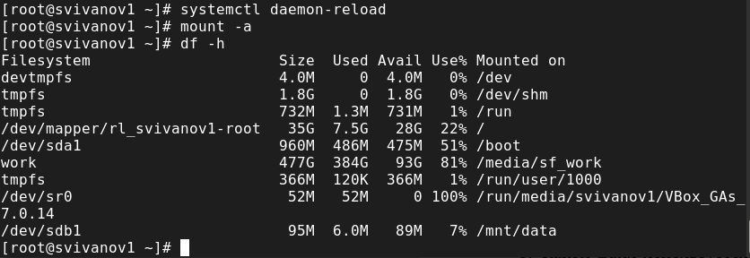{#fig:026 width=70%}

# Самостоятельная работа

## Создание первого раздела

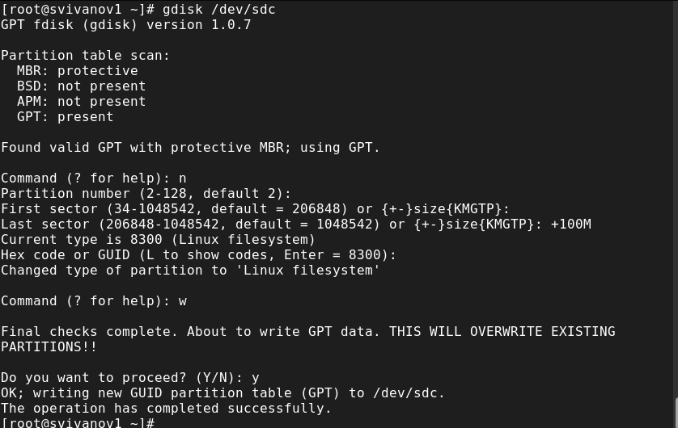{#fig:027 width=70%}

## Форматирование первого раздела

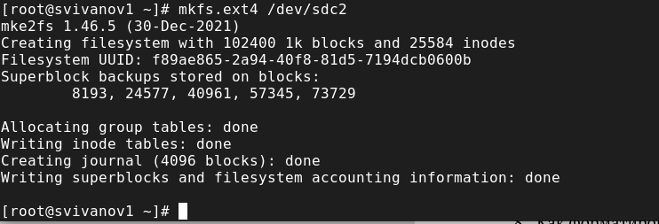{#fig:028 width=70%}

## Создание второго раздела

{#fig:029 width=70%}

## Настройка второго раздела как swap-пространство

{#fig:030 width=70%}

## Настройка сервера

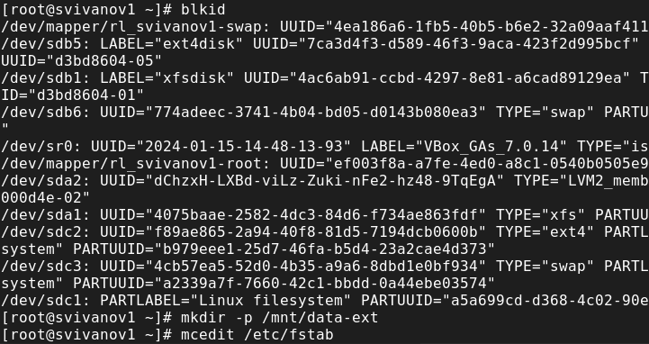{#fig:031 width=70%}

## Настройка сервера

{#fig:032 width=70%}

## Настройка сервера

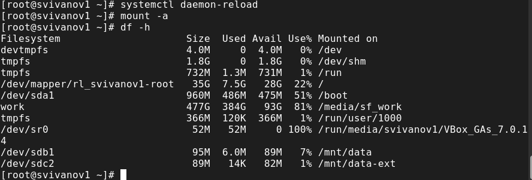{#fig:033 width=70%}

## Перезагрузка и проверка

{#fig:034 width=70%}

# Вывод

## Вывод 

В ходе выполнения лабораторной работы были получены навыки создания разделов на диске и файловых систем, а также навыки монтирования файловых систем.

## Список литературы

:::{#refs}

https://esystem.rudn.ru/mod/page/view.php?id=1098933

:::

