---
## Front matter
title: "Отчет по лабораторной работе №14"
subtitle: "Дисциплина: Основы администрирования операционных систем"
author: "Иванов Сергей Владимирович"

## Generic otions
lang: ru-RU
toc-title: "Содержание"

## Bibliography
bibliography: bib/cite.bib
csl: pandoc/csl/gost-r-7-0-5-2008-numeric.csl

## Pdf output format
toc: true # Table of contents
toc-depth: 2
lof: true # List of figures
fontsize: 12pt
linestretch: 1.5
papersize: a4
documentclass: scrreprt
## I18n polyglossia
polyglossia-lang:
  name: russian
  options:
	- spelling=modern
	- babelshorthands=true
polyglossia-otherlangs:
  name: english
## I18n babel
babel-lang: russian
babel-otherlangs: english
## Fonts
mainfont: PT Serif
romanfont: PT Serif
sansfont: PT Sans
monofont: PT Mono
mainfontoptions: Ligatures=TeX
romanfontoptions: Ligatures=TeX
sansfontoptions: Ligatures=TeX,Scale=MatchLowercase
monofontoptions: Scale=MatchLowercase,Scale=0.9
## Biblatex
biblatex: true
biblio-style: "gost-numeric"
biblatexoptions:
  - parentracker=true
  - backend=biber
  - hyperref=auto
  - language=auto
  - autolang=other*
  - citestyle=gost-numeric
## Pandoc-crossref LaTeX customization
figureTitle: "Рис."
listingTitle: "Листинг"
lofTitle: "Список иллюстраций"
lolTitle: "Листинги"
## Misc options
indent: true
header-includes:
  - \usepackage{indentfirst}
  - \usepackage{float} # keep figures where there are in the text
  - \floatplacement{figure}{H} # keep figures where there are in the text
---

# Цель работы

Целью данной работы является получение навыков создания разделов на диске и файловых систем, а также навыков монтирования файловых систем.

# Задание

1. Добавьте два диска на виртуальной машине (раздел 14.4.1).
2. Продемонстрируйте навыки создания разделов MBR с помощью fdisk (раздел 14.4.2).
3. Продемонстрируйте навыки создания логических разделов с помощью fdisk (раздел 14.4.3).
4. Продемонстрируйте навыки создания раздела подкачки с помощью fdisk (раздел 14.4.4).
5. Продемонстрируйте навыки создания разделов GPT с помощью gdisk (раздел 14.4.5).
6. Продемонстрируйте навыки форматирования файловой системы XFS (раздел 14.4.6).
7. Продемонстрируйте навыки форматирования файловой системы EXT4 (раздел 14.4.7).
8. Продемонстрируйте навыки ручного монтирования файловых систем (раздел 14.4.8).
9. Продемонстрируйте навыки монтирования файловых систем с помощью /etc/fstab
(раздел 14.4.9).
10. Выполните задание для самостоятельной работы (раздел 14.5).

# Выполнение лабораторной работы

**Создание виртуальных носителей:**

Добавим к нашей виртуальной машине два диска размером 512 МБ. Для добавления диска в VirtualBox для нашей виртуальной машины нажмём на меню «Настроить», 
выберем «Носители», затем на контроллере SATA нажмём «Добавить жёсткий диск» (рис. 1).

{#fig:001 width=70%}

В открывшемся окне нажмём «Создать образ диска», в следующем окне выберем «VDI» и нажмём «Далее» (рис. 2).

{#fig:002 width=70%}

Затем отметим «Динамический виртуальный жёсткий диск» и нажмите «Далее»  (рис. 3).

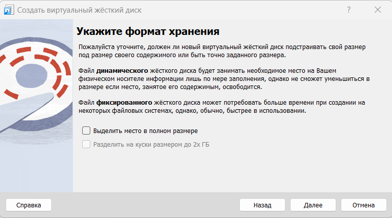{#fig:003 width=70%}

Укажем месторасположение диска и его название (disk1.vdi или disk2.vdi), а также его размер — 512 МБ, после чего нажимаем «Создать»  (рис. 4). 

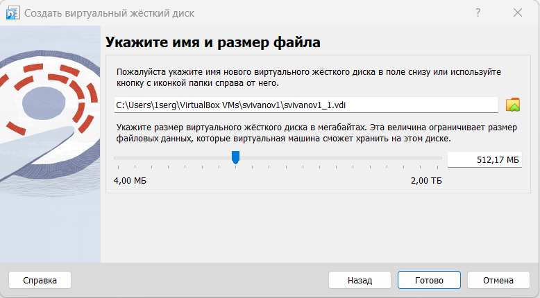{#fig:004 width=70%}

В окне выбора жёсткого диска встанем на обозначение созданного диска и нажмём «Выбрать» (рис. 5). 

{#fig:005 width=70%}

**Создание разделов MBR с помощью fdisk**

Запустим нашу виртуальную машину с добавленными дополнительными дисками disk1 и disk2. В командной строке с полномочиями администратора с помощью fdisk посмотрим перечень разделов на всех имеющихся в системе устройствах жёстких дисков: 
su – 	
fdisk --list 
В списке отразилась информация о добавленных дисках размером 512 MiB, в частности название разделов: /dev/sdb и /dev/sdc (рис. 6). 

{#fig:006 width=70%}

Предположим, что необходимо сделать разметку диска /dev/sdb с помощью утилиты fdisk: fdisk /dev/sdb. Изменения останутся в памяти только до тех пор, пока мы не решим их записать.  
Введём m, чтобы получить справку по командам  (рис. 7)

{#fig:007 width=70%}

Нажмём p, чтобы просмотреть текущее распределение пространства диска. Обратим внимание на общее количество секторов и последний сектор, который в настоящее время 
используется. Введём n, чтобы добавить новый раздел. Выберем p, чтобы создать основной раздел. Примем номер раздела, который предлагается и укажем первый сектор на диске, с которого начнётся новый раздел. 
По умолчанию предлагается первый доступный сектор, нажмём Enter для подтверждения выбора. Укажем последний сектор, которым будет завершён раздел. 
Ведём +100M, чтобы создать раздел на 100 MiB. Нажмем Enter, чтобы принять тип раздела по умолчанию 83. Нажмем w, чтобы записать изменения на диск и выйти из fdisk  (рис. 8).

{#fig:008 width=70%}

Таблица разделов находится только в памяти ядра. Сравним вывод команды fdisk -l /dev/sdb с выводом команды cat /proc/partitions. 
Запишем изменения в таблицу разделов ядра: partprobe /dev/sdb  (рис. 9).

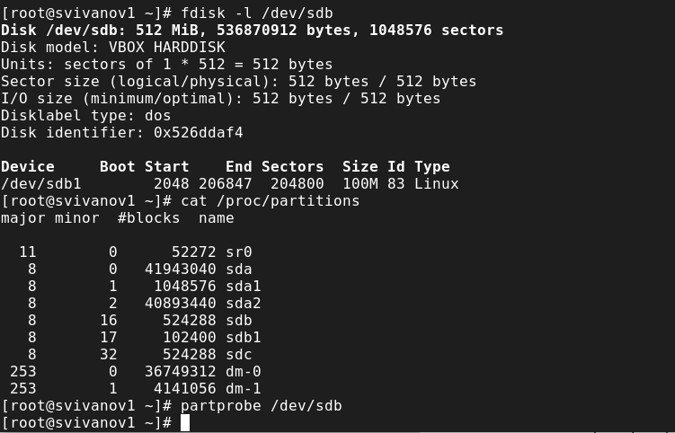{#fig:009 width=70%}

**Создание логических разделов:**

В терминале с полномочиями администратора запустим fdisk /dev/sdb. Теперь введём n, чтобы добавить новый раздел и e, 
чтобы создать расширенный раздел. Нажмём «Enter», чтобы принять первый сектор по умолчанию и снова нажмём «Enter», когда fdisk запросит последний сектор (рис. 10).

{#fig:010 width=70%}

Теперь, когда расширенный раздел создан, мы можем создать в нём логический раздел. Из интерфейса fdisk снова нажмём n  
Нажмём Enter, чтобы принять выбор первого сектора в качестве сектора по умолчанию. На вопрос о последнем секторе введём +101M. 
После создания логического раздела введём w, чтобы записать изменения на диск и выйти из fdisk  (рис. 11). 

{#fig:011 width=70%}

Чтобы завершить процедуру и обновить таблицу разделов, введём partprobe /dev/sdb. Новый раздел теперь готов к использованию. Просмотрим информацию о добавленных разделах: 
cat /proc/partitions 
fdisk --list /dev/sdb  (рис. 12).

{#fig:012 width=70%}

**Создание раздела подкачки:**

Запустим fdisk: fdisk /dev/sdb. Нажмём n, чтобы добавить новый раздел. 
Нажмём «Enter», чтобы принять первый сектор по умолчанию. На вопрос о последнем секторе введём +100M. Далее изменим тип раздела.
Для этого нажмём «t», затем укажем номер партиции, для которой хотим изменить тип (в данном случае номер 6). 
Затем введём код типа раздела (в данном случае 82 — раздел подкачки). После создания логического раздела введём «w», 
чтобы записать изменения на диск и выйти из fdisk (рис. 13)

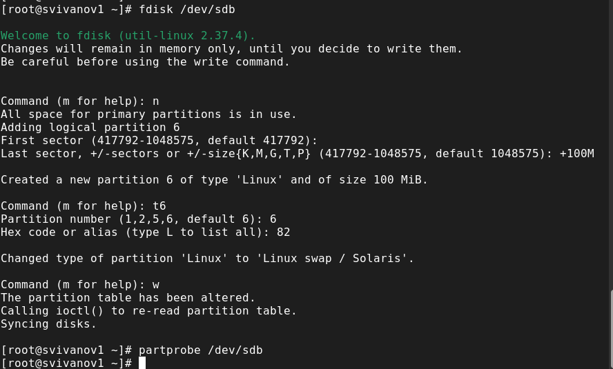{#fig:013 width=70%}

Чтобы завершить процедуру и обновить таблицу разделов ядра, введём partprobe /dev/sdb. Новый раздел теперь готов 
к использованию. Просмотрим информацию о добавленных разделах:
cat /proc/partitions (рис. 14)

{#fig:014 width=70%}

Продолжим просмотр информации о добавленных разделах: 
fdisk --list /dev/sdb 
Отформатируем раздел подкачки, используя команду mkswap /dev/sdb6. Для включения вновь 
выделенного пространства подкачки используем swapon /dev/sdb6. Для просмотра размера пространства подкачки, которое 
в настоящее время выделено, введём free -m (рис. 15)

{#fig:015 width=70%}

В терминале с полномочиями администратора с помощью gdisk посмотрим таблицы разделов и разделы на втором добавленном нами ранее диске /dev/sdc: 
gdisk -l /dev/sdc (рис. 16)

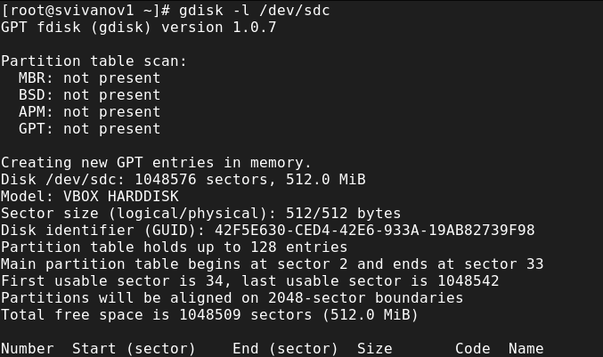{#fig:016 width=70%}

Создадим раздел с помощью gdisk: gdisk /dev/sdc. Введём «n», чтобы добавить новый раздел. Теперь нас просят задать первый сектор. 
Нажмем «Enter», чтобы принять предлагаемый по умолчанию первый сектор. Чтобы создать раздел диска размером 100 MiB, используем +100M. 
Нажмём «Enter», чтобы принять тип раздела 8300 по умолчанию (рис. 17)

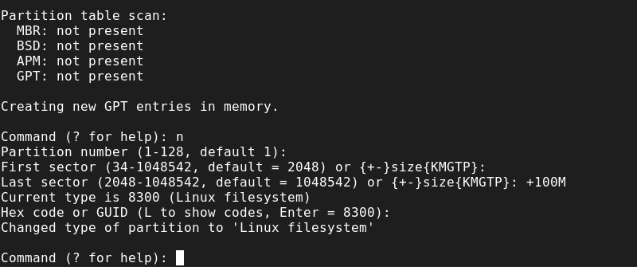{#fig:017 width=70%}

Теперь раздел создан (но ещё не записан на диск). Нажмём «p», чтобы отобразить разбиение диска и нажмём «w», чтобы записать изменения на диск (рис. 18)

{#fig:018 width=70%}

Обновим таблицу разделов: 
partprobe /dev/sdc 
Просмотрим информацию о добавленных разделах: 
cat /proc/partitions 
gdisk -l /dev/sdc (рис. 19)

{#fig:019 width=70%}

**Форматирование файловой системы XFS**

В терминале с полномочиями администратора для диска dev/sdb1 создадим файловую систему XFS: mkfs.xfs /dev/sdb1. 
Для установки метки файловой системы в xfsdisk используем команду xfs_admin -L xfsdisk /dev/sdb1 (рис. 20)

{#fig:020 width=70%}

**Форматирование файловой системы EXT4:**

В терминале с полномочиями администратора для диска dev/sdb5 создадим файловую систему EXT4: mkfs.ext4 /dev/sdb5. 
Для установки метки файловой системы в ext4disk используем команду tune2fs -L ext4disk /dev/sdb5. Для установки параметров 
монтирования по умолчанию для файловой системы используем команду tune2fs -o acl,user_xattr /dev/sdb5. В данном случае 
включены списки контроля доступа и расширенные атрибуты пользователя (рис. 21)

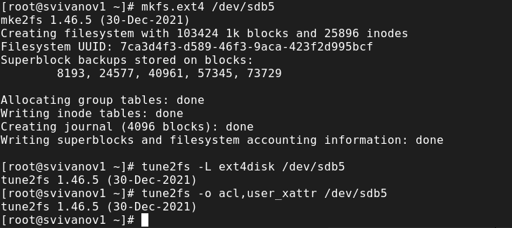{#fig:021 width=70%}

**Ручное монтирование файловых систем:**

Для создания точки монтирования для раздела введём mkdir -p /mnt/tmp. Чтобы смонтировать файловую систему, 
используем следующую команду mount /dev/sdb5 /mnt/tmp. Для проверки корректности монтирования раздела введём: 
mount (рис. 22)

{#fig:022 width=70%}

Чтобы отмонтировать раздел введём: umount /dev/sdb5. Проверим, что раздел отмонтирован: mount (рис. 23)

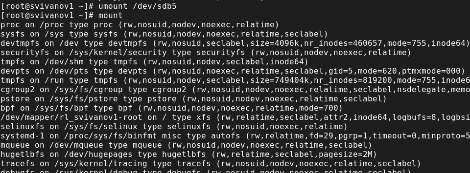{#fig:023 width=70%}

**Монтирование разделов с помощью /etc/fstab:**

Создадим точку монтирования для раздела XFS /dev/sdb1: mkdir -p /mnt/data. Просмотрим информацию
об идентификаторах блочных устройств (UUID): blkid. Введём blkid /dev/sdb1 и затем используем мышь, чтобы 
скопировать значение идентификатора UUID для устройства /dev/sdb1. Откроем файл /etc/fstab на редактирование в текстовом редакторе mcedit (рис. 24)

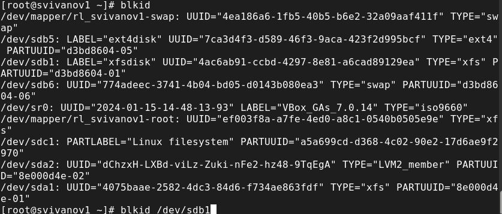{#fig:024 width=70%}

Добавим следующую строку в открытый файл:
UUID=значение_идентификатора /mnt/data xfs defaults 1 2 (рис. 25)

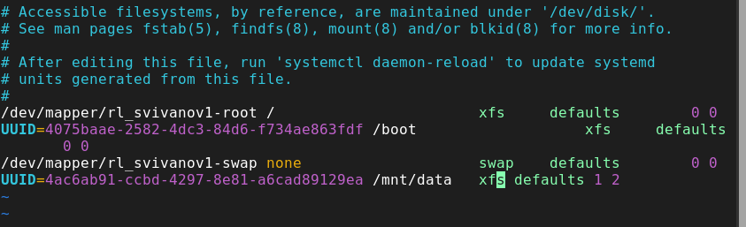{#fig:025 width=70%}

Введём команду, которая монтирует всё, что указано в /etc/fstab: mount -a. Проверим, что раздел примонтирован правильно: df -h (рис. 26)

{#fig:026 width=70%}

# Самостоятельная работа

Добавим две партиции на диск с разбиением GPT. Создадим оба раздела размером 100 MiB. Один из этих разделов будет настроен как пространство подкачки, другой раздел будет отформатирован файловой системой ext4. 
Создадим первый раздел (рис. 27)

{#fig:027 width=70%}

Отформатируем первый раздел (рис. 28)

{#fig:028 width=70%}

Создадим второй раздел (рис. 29)

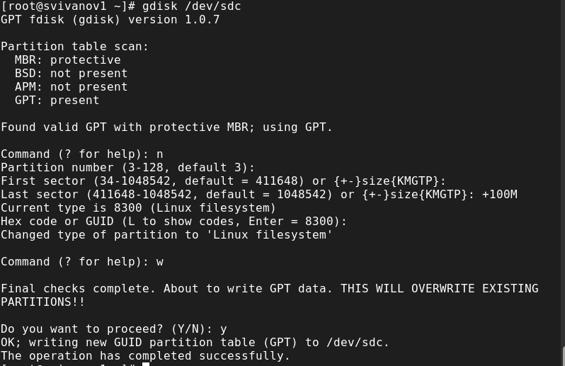{#fig:029 width=70%}

Настроим второй раздел как swap-пространство (рис. 30)

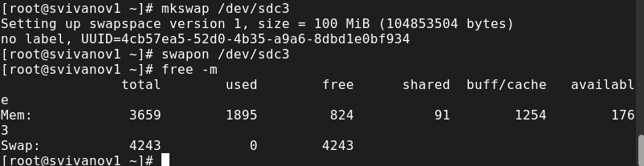{#fig:030 width=70%}

Настроем сервер для автоматического монтирования этих разделов. Установим раздел ext4 на /mnt/data-ext 
и установим пространство подкачки в качестве области подкачки (рис. 31) (рис. 32) (рис. 33)

{#fig:031 width=70%}

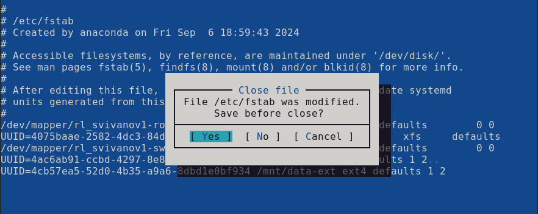{#fig:032 width=70%}

{#fig:033 width=70%}

Перезагрузим систему и убедимся, что всё установлено правильно (рис. 34)

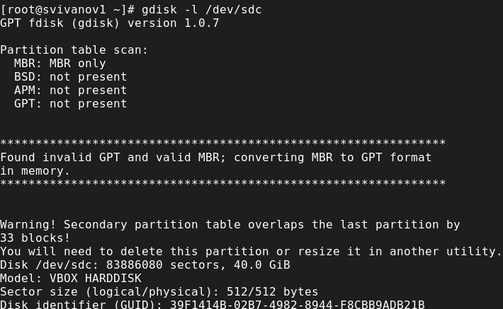{#fig:034 width=70%}

# Контрольные вопросы

**1. Какой инструмент используется для создания разделов GUID?**

gdisk

**2. Какой инструмент применяется для создания разделов MBR?**

fdisk

**3. Какой файл используется для автоматического монтирования разделов во время загрузки?**

/ets/fstab

**4. Какой вариант монтирования целесообразно выбрать, если необходимо, чтобы файловая система не была автоматически примонтирована во время загрузки?**

mount /dev/sdb5/mnt/tmp

**5. Какая команда позволяет форматировать раздел с типом 82 с соответствующей файловой системой?**

t

**6. Вы только что добавили несколько разделов для автоматического монтирования при загрузке. Как можно безопасно проверить, будет ли это работать без реальной перезагрузки?**

df -h

**7. Какая файловая система создаётся, если вы используете команду mkfs без какой-либо спецификации файловой системы?**

swap

**8. Как форматировать раздел EXT4?**

mkfs.ext4 /dev/sdb<number>
tune2fs -L ext4disk /dev/sdb<number>
tune2fs -o acl,user_xattar /dev/sdb<number>

**9. Как найти UUID для всех устройств на компьютере?**

blkid

# Выводы

В ходе выполнения лабораторной работы были получены навыки создания разделов на диске и файловых систем, а также навыки монтирования файловых систем.
