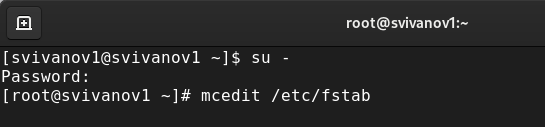
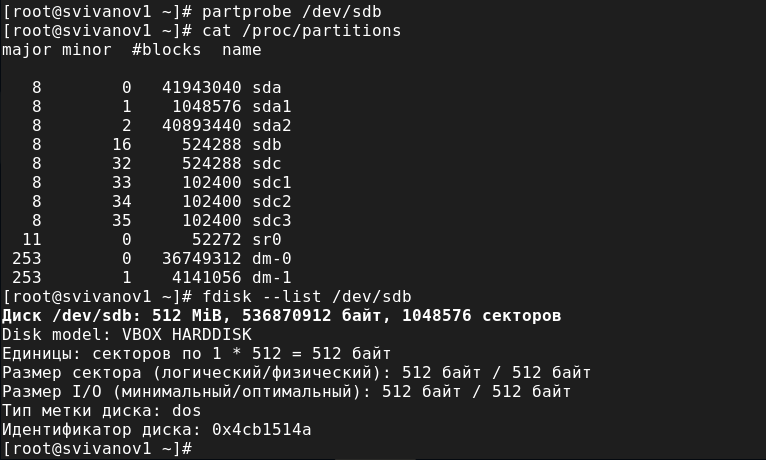
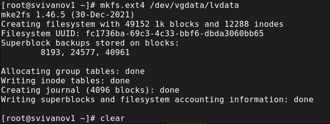
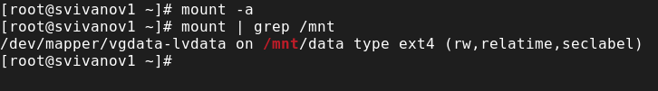
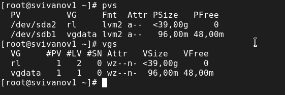
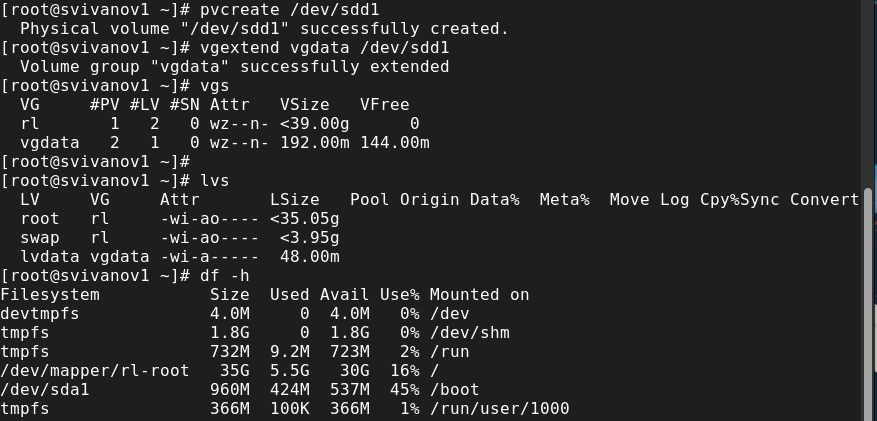
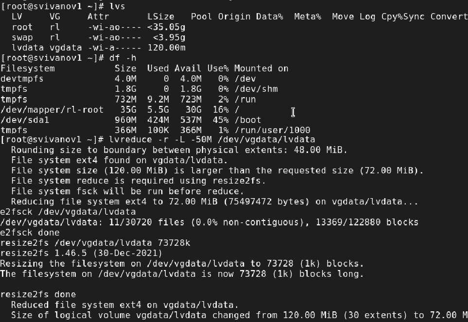
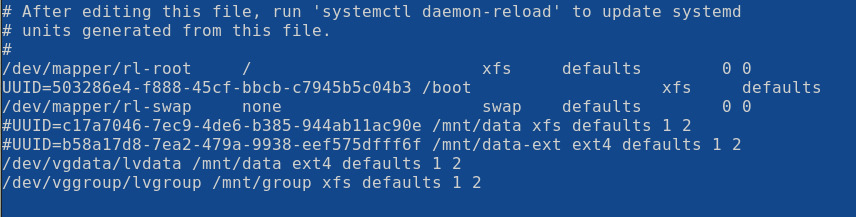
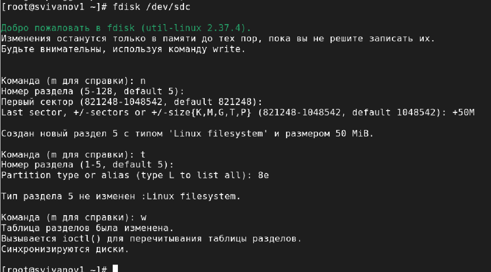
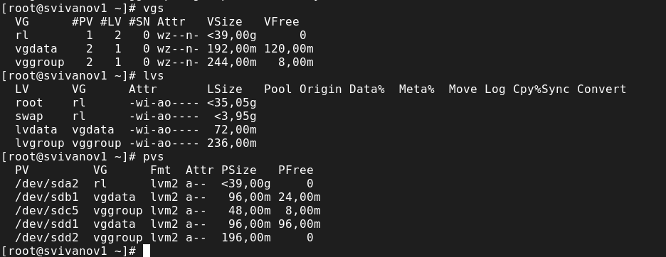

---
## Front matter
lang: ru-RU
title: Лабораторная работа № 15
subtitle: Основы администрирования операционных систем
author:
  - Иванов Сергей Владимирович, НПИбд-01-23
institute:
  - Российский университет дружбы народов, Москва, Россия
date: 13 декабря 2024

## i18n babel
babel-lang: russian
babel-otherlangs: english

## Formatting pdf
toc: false
slide_level: 2
aspectratio: 169
section-titles: true
theme: metropolis
header-includes:
 - \metroset{progressbar=frametitle,sectionpage=progressbar,numbering=fraction}
 - '\makeatletter'
 - '\beamer@ignorenonframefalse'
 - '\makeatother'

  ## Fonts
mainfont: PT Serif
romanfont: PT Serif
sansfont: PT Sans
monofont: PT Mono
mainfontoptions: Ligatures=TeX
romanfontoptions: Ligatures=TeX
sansfontoptions: Ligatures=TeX,Scale=MatchLowercase
monofontoptions: Scale=MatchLowercase,Scale=0.9
---

## Цель работы

Целью данной работы является получение навыков управления логическими томами.

# Выполнение работы

## Открытие файла

{#fig:001 width=70%}

## Отключение строк автомонтирования

{#fig:002 width=70%}

## Отмонтирование

{#fig:003 width=70%}

## DOS

{#fig:004 width=70%}

## Проверка удаления

{#fig:005 width=70%}

## Запись изменений

{#fig:006 width=70%}

## Создание нового раздела

{#fig:007 width=70%}

## Изменение типа раздела 

{#fig:008 width=70%}

## Обновление таблицы

{#fig:009 width=70%}

## LVM

{#fig:010 width=70%}

## Создание файловой системы

{#fig:011 width=70%}

## Создание папки

{#fig:012 width=70%}

## Добавление строки

{#fig:013 width=70%}

## Проверка

{#fig:014 width=70%}

## Отображение текущей конфигурации

{#fig:015 width=70%}

## Добавление раздела

{#fig:016 width=70%}

## Создание физического тома

{#fig:017 width=70%}

## Увеличение lvdata на 50%

{#fig:018 width=70%}

## Уменьшение lvdata на 50 МБ

{#fig:019 width=70%}

## Проверка успешного изменения

{#fig:020 width=70%}

## Самостоятельная работа. Выполнение пункта №1

{#fig:021 width=70%}

## Выполнение пункта №1

{#fig:022 width=70%}

## Выполнение пункта №1

{#fig:023 width=70%}

## Выполнение пункта №1

{#fig:024 width=70%}

## Выполнение пункта №2

{#fig:025 width=70%}

## Выполнение пункта №2

{#fig:026 width=70%}

## Выполнение пункта №2

{#fig:027 width=70%}

## Выполнение пункта №3

{#fig:028 width=70%}

# Вывод

## Вывод 

В ходе выполнения лабораторной работы были получены навыки управления логическими томами

## Список литературы

:::{#refs}

https://esystem.rudn.ru/mod/page/view.php?id=1098933

:::

