---
## Front matter
title: "Отчет по лабораторной работе №15"
subtitle: "Дисциплина: Основы администрирования операционных систем"
author: "Иванов Сергей Владимирович"

## Generic otions
lang: ru-RU
toc-title: "Содержание"

## Bibliography
bibliography: bib/cite.bib
csl: pandoc/csl/gost-r-7-0-5-2008-numeric.csl

## Pdf output format
toc: true # Table of contents
toc-depth: 2
lof: true # List of figures
fontsize: 12pt
linestretch: 1.5
papersize: a4
documentclass: scrreprt
## I18n polyglossia
polyglossia-lang:
  name: russian
  options:
	- spelling=modern
	- babelshorthands=true
polyglossia-otherlangs:
  name: english
## I18n babel
babel-lang: russian
babel-otherlangs: english
## Fonts
mainfont: PT Serif
romanfont: PT Serif
sansfont: PT Sans
monofont: PT Mono
mainfontoptions: Ligatures=TeX
romanfontoptions: Ligatures=TeX
sansfontoptions: Ligatures=TeX,Scale=MatchLowercase
monofontoptions: Scale=MatchLowercase,Scale=0.9
## Biblatex
biblatex: true
biblio-style: "gost-numeric"
biblatexoptions:
  - parentracker=true
  - backend=biber
  - hyperref=auto
  - language=auto
  - autolang=other*
  - citestyle=gost-numeric
## Pandoc-crossref LaTeX customization
figureTitle: "Рис."
listingTitle: "Листинг"
lofTitle: "Список иллюстраций"
lolTitle: "Листинги"
## Misc options
indent: true
header-includes:
  - \usepackage{indentfirst}
  - \usepackage{float} # keep figures where there are in the text
  - \floatplacement{figure}{H} # keep figures where there are in the text
---

# Цель работы

Целью данной работы является получение навыков управления логическими томами.

# Задание

1. Продемонстрировать навыки создания физических томов на LVM (см. раздел 15.4.1).
2. Продемонстрировать навыки создания группы томов и логических томов на LVM (см.
раздел 15.4.2).
3. Продемонстрировать навыки изменения размера логических томов на LVM (см. раздел 15.4.3).
4. Выполнить задание для самостоятельной работы (см. раздел 15.5).

# Выполнение лабораторной работы

**Создание физического тома:**

В терминале с полномочиями администратора в файле /etc/fstab закомментируем строки автомантирования /mnt/data и /mnt/data-ext (рис. 1), (рис. 2).

{#fig:001 width=70%}

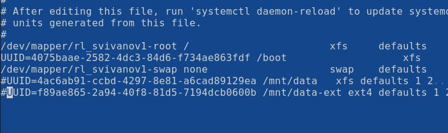{#fig:002 width=70%}

Отмонтируем /mnt/data и /mnt/data-ext:
umount /mnt/data
umount /mnt/data-ext
С помощью команды mount без параметров убедимся, что диски /dev/sdb и /dev/sdc не подмонтированы  (рис. 3).

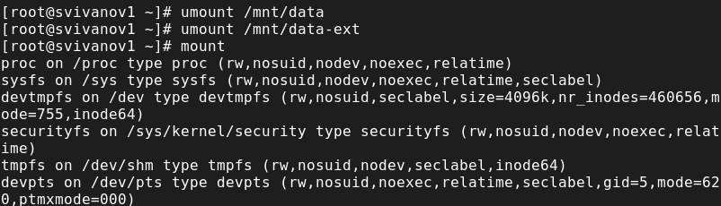{#fig:003 width=70%}

С помощью fdisk сделаем новую разметку для /dev/sdb и /dev/sdc, удалив ранее созданные партиции:
В терминале с полномочиями администратора введём fdisk /dev/sdb. Введём p для просмотра текущей разметки дискового пространства. Затем
для удаления всех имеющихся партиций на диске достаточно создать новую пустую таблицу DOS-партиции, используя команду o. Убедимся, что партиции
удалены, введя p. Сохраним изменения, введя w (рис. 4), (рис. 5). 

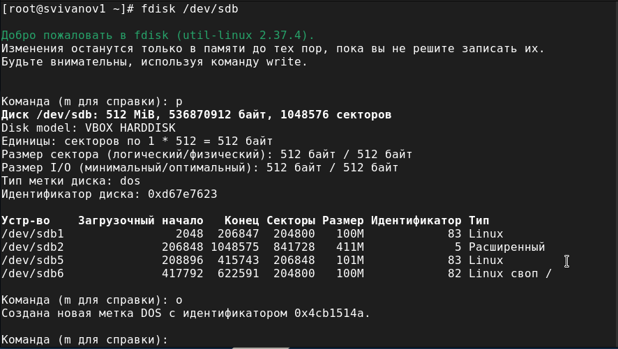{#fig:004 width=70%}

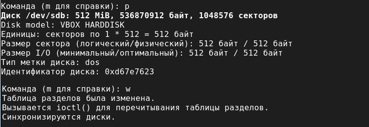{#fig:005 width=70%}

Запишем изменения в таблицу разделов ядра:
partprobe /dev/sdb.
Просмотрим информацию о разделах:
cat /proc/partitions
fdisk --list /dev/sdb (рис. 6). 

{#fig:006 width=70%}

В терминале с полномочиями администратора с помощью fdisk создадим основной раздел с типом LVM:
Введём fdisk /dev/sdb.
Введём n, чтобы создать новый раздел. Выберем p, чтобы сделать его основным разделом, и используем номер раздела, который предлагается по
умолчанию. Нажмём Enter при запросе для первого сектора и введём +100M, чтобы выбрать последний сектор.
Вернувшись в приглашение fdisk, введём t, чтобы изменить тип раздела (поскольку существует только один раздел, fdisk не спрашивает, какой раздел
использовать). Программа запрашивает тип раздела, который мы хотим использовать. Выберем 8е. Затем нажмём w, чтобы записать изменения на диск и выйти из
fdisk (рис. 7), (рис. 8).

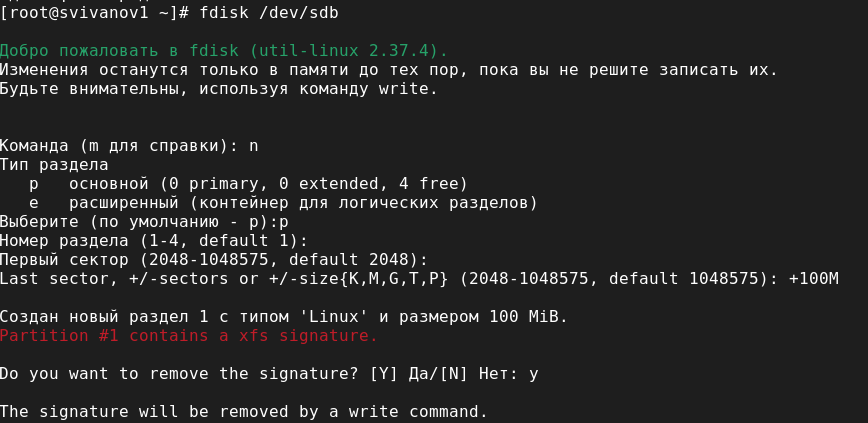{#fig:007 width=70%}  

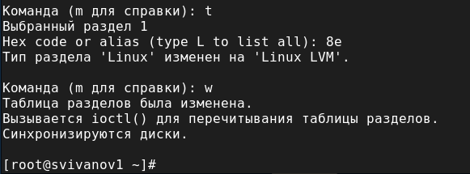{#fig:008 width=70%}

Чтобы обновить таблицу разделов, введём partprobe /dev/sdb. Теперь, когда раздел был создан, мы должны указать его как физический том LVM. Для
этого введём:
pvcreate /dev/sdb1 
Теперь введём pvs, чтобы убедиться, что физический том создан успешно (рис. 9).

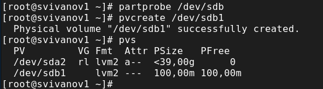{#fig:009 width=70%}

**Создание группы томов и логических томов:**

В терминале с полномочиями администратора проверим доступность физических томов в нашей системе: pvs (мы видим созданный нами
физический том /dev/sdb1). Создадим группу томов с присвоенным ей физическим томом: vgcreate vgdata /dev/sdb1. Убедимся, что группа томов
была создана успешно: vgs. Затем введём pvs. Введём lvcreate -n lvdata -l 50%FREE vgdata (это создаст логический том LVM с именем lvdata, который будет использовать 50%
доступного дискового пространства в группе томов vgdata). Для проверки успешного добавления тома введём lvs (рис. 10).

{#fig:010 width=70%}

На этом этапе мы создадим файловую систему поверх логического тома.
Для этого введём:
mkfs.ext4 /dev/vgdata/lvdata (рис. 11). 

{#fig:011 width=70%}

Чтобы создать папку, на которую можно смонтировать том, введём:
mkdir -p /mnt/data
Добавим следующую строку в /etc/fstab: /dev/vgdata/lvdata /mnt/data ext4 defaults 1 2 (рис. 12), (рис. 13).

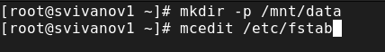{#fig:012 width=70%}

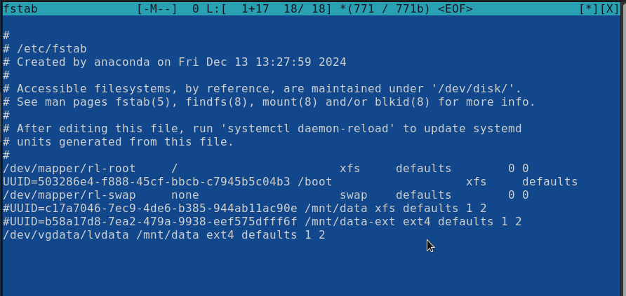{#fig:013 width=70%}

Проверим, монтируется ли файловая система:
mount -a
mount | grep /mnt (рис. 14)

{#fig:014 width=70%}

**Изменение размера логических томов:**

В терминале с полномочиями администратора введём pvs и vgs, чтобы отобразить текущую конфигурацию физических томов и группы томов (рис. 15)

{#fig:015 width=70%}

С помощью fdisk добавим раздел /dev/sdd1 размером 100М. Зададим тип раздела 8e (рис. 16)

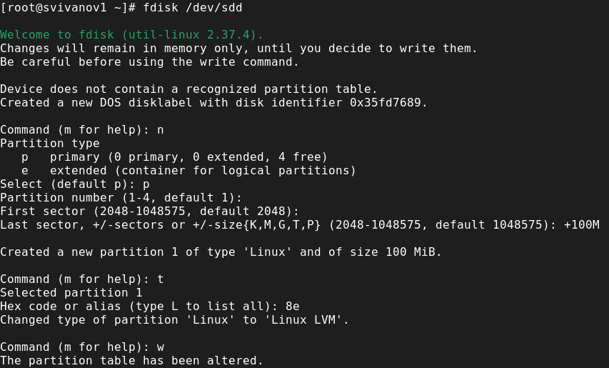{#fig:016 width=70%}

Создадим физический том: pvcreate /dev/sdd1. Расширим vgdata: vgextend vgdata /dev/sdd1. Проверим, что размер доступной группы томов увеличен: vgs. 
Проверим текущий размер логического тома lvdata: lvs и текущий размер файловой системы на lvdata: df -h (рис. 17)

{#fig:017 width=70%}

Увеличим lvdata на 50% оставшегося доступного дискового пространства в группе томов: lvextend -r -l +50%FREE /dev/vgdata/lvdata (рис. 18)

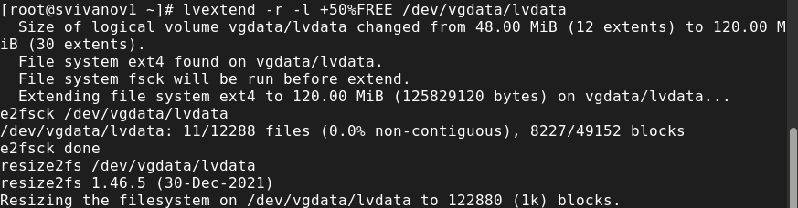{#fig:018 width=70%}

Убедимся, что добавленное дисковое пространство стало доступным:
lvs
df -h
Уменьшим размер lvdata на 50 МБ: lvreduce -r -L -50M /dev/vgdata/lvdata
(обратим внимание, что при этом том временно размонтируется) (рис. 19)

{#fig:019 width=70%}

Убедимся в успешном изменении дискового пространства:
lvs
df -h (рис. 20)

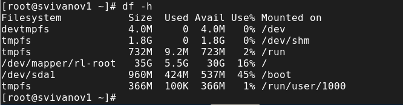{#fig:020 width=70%}

# Самостоятельная работа:

1. Создайте логический том lvgroup размером 200 МБ. Отформатируйте его
в файловой системе XFS и cмонтируйте его постоянно на /mnt/groups.
Перезагрузите виртуальную машину, чтобы убедиться, что устройство
подключается.

2. После перезагрузки добавьте ещё 150 МБ к тому lvgroup. Убедитесь, что
размер файловой системы также изменится при изменении размера тома.

3. Убедитесь, что расширение тома выполнено успешно.

Выполним первый пункта самостоятельного задания (рис. 21), (рис. 22), (рис. 23), (рис. 24)

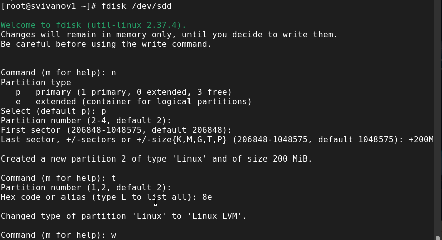{#fig:021 width=70%}

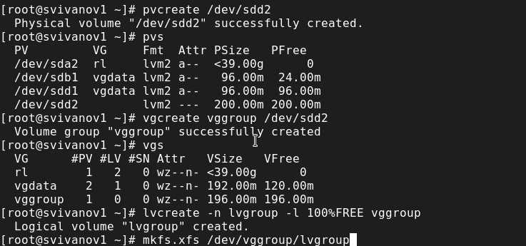{#fig:022 width=70%}

{#fig:023 width=70%}

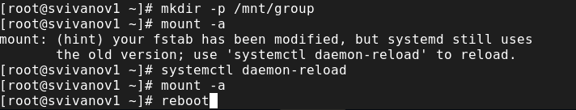{#fig:024 width=70%}

Выполним второй пункта самостоятельного задания (рис. 25), (рис. 26), (рис. 27)

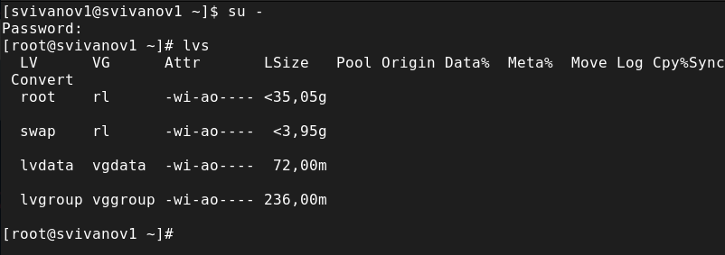{#fig:025 width=70%}

{#fig:026 width=70%}

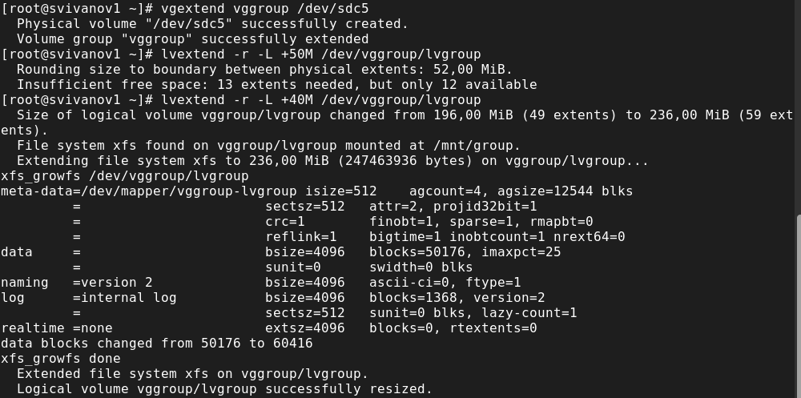{#fig:027 width=70%}

Выполним третий пункта самостоятельного задания (рис. 28)

{#fig:028 width=70%}

# Контрольные вопросы

**1. Какой тип раздела используется в разделе GUID для работы с LVM?**

GPT

**2. Какой командой можно создать группу томов с именем vggroup, которая содержит физическое устройство /dev/sdb3 и использует физический экстент 4 MiB?**

vgcreate vggroup /dev/sdb3

**3. Какая команда показывает краткую сводку физических томов в вашей системе, а также группу томов, к которой они принадлежат?**

pvs

**4. Что вам нужно сделать, чтобы добавить весь жёсткий диск /dev/sdd в группу томов группы?**

vgextend vggroup /dev/sdd

**5. Какая команда позволяет вам создать логический том lvvol1 с размером 6 MiB?**

vcreate -n lvvol1 -l vggroup

**6. Какая команда позволяет вам добавить 100 МБ в логический том lvvol1, если предположить, что дисковое пространство доступно в группе томов?**

lvextend -r -l +100M lvvol1

**7. Каков первый шаг, чтобы добавить ещё 200 МБ дискового пространства в логический том, если требуемое дисковое пространство недоступно в группе томов?**

Создать раздел на 200Мб с помощью fdisk

**8. Какую опцию нужно использовать с командой lvextend, чтобы также изменить размер файловой системы?**

-r

**9. Как посмотреть, какие логические тома доступны?**

lvs

**10. Какую команду нужно использовать для проверки целостности файловой системы на /dev/vgdata/lvdata?**

fsck /dev/vgdata/lvdata

# Выводы

В ходе выполнения лабораторной работы были управления логическими томами.
