---
## Front matter
title: "Отчет по лабораторной работе №16"
subtitle: "Дисциплина: Основы администрирования операционных систем"
author: "Иванов Сергей Владимирович"

## Generic otions
lang: ru-RU
toc-title: "Содержание"

## Bibliography
bibliography: bib/cite.bib
csl: pandoc/csl/gost-r-7-0-5-2008-numeric.csl

## Pdf output format
toc: true # Table of contents
toc-depth: 2
lof: true # List of figures
fontsize: 12pt
linestretch: 1.5
papersize: a4
documentclass: scrreprt
## I18n polyglossia
polyglossia-lang:
  name: russian
  options:
	- spelling=modern
	- babelshorthands=true
polyglossia-otherlangs:
  name: english
## I18n babel
babel-lang: russian
babel-otherlangs: english
## Fonts
mainfont: PT Serif
romanfont: PT Serif
sansfont: PT Sans
monofont: PT Mono
mainfontoptions: Ligatures=TeX
romanfontoptions: Ligatures=TeX
sansfontoptions: Ligatures=TeX,Scale=MatchLowercase
monofontoptions: Scale=MatchLowercase,Scale=0.9
## Biblatex
biblatex: true
biblio-style: "gost-numeric"
biblatexoptions:
  - parentracker=true
  - backend=biber
  - hyperref=auto
  - language=auto
  - autolang=other*
  - citestyle=gost-numeric
## Pandoc-crossref LaTeX customization
figureTitle: "Рис."
listingTitle: "Листинг"
lofTitle: "Список иллюстраций"
lolTitle: "Листинги"
## Misc options
indent: true
header-includes:
  - \usepackage{indentfirst}
  - \usepackage{float} # keep figures where there are in the text
  - \floatplacement{figure}{H} # keep figures where there are in the text
---

# Цель работы

Цель данной работы заключается в освоении работы с RAID-массивами при помощи утилиты mdadm.

# Задание

1. Прочитайте руководство по работе с утилитами fdisk, sfdisk и mdadm.
2. Добавить три диска на виртуальную машину (объёмом от 512 MiB каждый). При помощи sfdisk создать на каждом из дисков по одной партиции, задав тип раздела для
RAID (см. разделы 16.4.1, 16.4.2).
3. Создать массив RAID 1 из двух дисков, смонтировать его. Эмитировать сбой одного из
дисков массива, удалить искусственно выведенный из строя диск, добавить в массив
работающий диск (см. раздел 16.4.2).
4. Создать массив RAID 1 из двух дисков, смонтировать его. Добавить к массиву третий диск. Эмитировать сбой одного из дисков массива. Проанализировать состояние
массива, указать различия по сравнению с предыдущим случаем (см. раздел 16.4.3).
5. Создать массив RAID 1 из двух дисков, смонтировать его. Добавить к массиву третий
диск. Изменить тип массива с RAID1 на RAID5, изменить число дисков в массиве с 2 на 3.
Проанализировать состояние массива, указать различия по сравнению с предыдущим
случаем (см. раздел 16.4.4).

# Выполнение лабораторной работы

**Создание физического тома:**

Добавим к нашей виртуальной машине к контроллеру SATA три диска размером 512 MiB (рис. 1)

{#fig:001 width=70%}

Запустим виртуальную машину. Получим полномочия администратора: su -
и проверим наличие созданных нами на предыдущем этапе дисков: fdisk -l | grep /dev/sd (т.к. наша предыдущая работа по LVM выполнена успешно, 
в системе добавленные диски отображаются как /dev/sdd, /dev/sde, /dev/sdf) (рис. 2)

{#fig:002 width=70%}

Создадим на каждом из дисков раздел:
sfdisk /dev/sde <<EOF
;
EOF (рис. 3):
sfdisk /dev/sdf <<EOF
;
EOF (рис. 4):
sfdisk /dev/sdg <<EOF
;
EOF (рис. 5):

{#fig:003 width=70%}

{#fig:004 width=70%}

{#fig:005 width=70%}

Проверим текущий тип созданных разделов:
sfdisk --print-id /dev/sde 1
sfdisk --print-id /dev/sdf 1
sfdisk --print-id /dev/sdg 1 (рис. 6). 

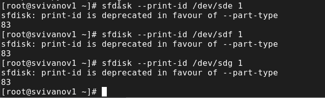{#fig:006 width=70%}

Просмотрим, какие типы партиций, относящиеся к RAID, можно задать:
sfdisk -T | grep -i raid 
Далее установим тип разделов в Linux raid autodetect:
sfdisk --change-id /dev/sde 1 fd
sfdisk --change-id /dev/sdf 1 fd
sfdisk --change-id /dev/sdg 1 fd (рис. 7).

{#fig:007 width=70%}  

Просмотрим состояние дисков:
sfdisk -l /dev/sde
sfdisk -l /dev/sdf
sfdisk -l /dev/sdg (рис. 8)

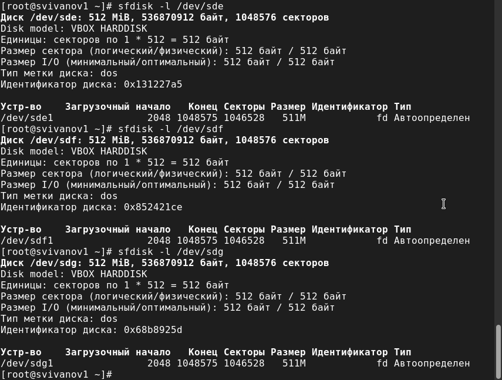{#fig:008 width=70%}

При помощи утилиты mdadm создадим массив RAID 1 из двух дисков:
mdadm --create --verbose /dev/md0 --level=1 --raid-devices=2 /dev/sdd1
/dev/sde1 (рис. 9)

{#fig:009 width=70%}

Проверим состояние массива RAID, используя команды:
cat /proc/mdstat
mdadm --query /dev/md0
mdadm --detail /dev/md0 (рис. 10).

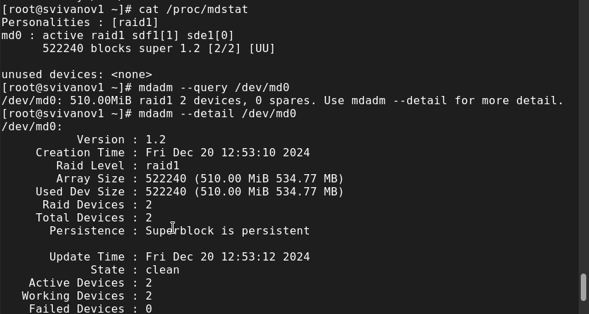{#fig:010 width=70%}

Создадим файловую систему на RAID
mkfs.ext4 /dev/md0 (рис. 11). 

{#fig:011 width=70%}

Подмонтируем RAID:
mkdir /data
mount /dev/md0 /data
После чего, в текстовом редакторе mcedit выполним открытие файла /etc/fstab (рис. 12)

{#fig:012 width=70%}

Для автомонтирования в открывшийся файл добавим запись:
/dev/md0 /data ext4 defaults 1 2 (рис. 13)

{#fig:013 width=70%}

Сымитируем сбой одного из дисков:
mdadm /dev/md0 --fail /dev/sde1
Удалим сбойный диск:
mdadm /dev/md0 --remove /dev/sde1
Заменим диск в массиве:
mdadm /dev/md0 --add /dev/sdf1 (рис. 14)

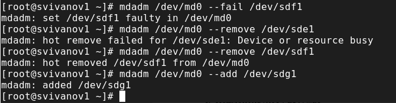{#fig:014 width=70%}

Просмотрим состояние массива (рис. 15)

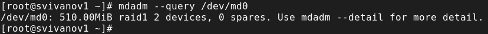{#fig:015 width=70%}

Удалим массив и очистим метаданные:
umount /dev/md0
mdadm --stop /dev/md0
mdadm --zero-superblock /dev/sdd1
mdadm --zero-superblock /dev/sde1
mdadm --zero-superblock /dev/sdf1 (рис. 16)

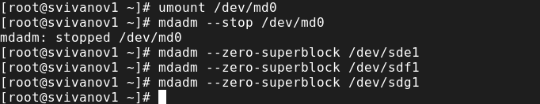{#fig:016 width=70%}

**RAID-массив с горячим резервом (hotspare):**

Создадим массив RAID 1 из двух дисков:
mdadm --create --verbose /dev/md0 --level=1 --raid-devices=2 /dev/sdd1
/dev/sde1
Добавим третий диск: mdadm --add /dev/md0 /dev/sdf1 и подмонтируем
/dev/md0:
mount /dev/md0 (рис. 17)

{#fig:017 width=70%}

Проверим состояние массива:
cat /proc/mdstat
mdadm --query /dev/md0
mdadm --detail /dev/md0 (рис. 18)

{#fig:018 width=70%}

Сымитируем сбой одного из дисков:
mdadm /dev/md0 --fail /dev/sde1 (рис. 19)

{#fig:019 width=70%}

Проверим состояние массива:
mdadm --detail /dev/md0
И убедимся, что массив автоматически пересобирается (рис. 20)

{#fig:020 width=70%}

Удалим массив и очистим метаданные:
umount /dev/md0
mdadm --stop /dev/md0
mdadm --zero-superblock /dev/sde1
mdadm --zero-superblock /dev/sdf1
mdadm --zero-superblock /dev/sdg1 (рис. 21)

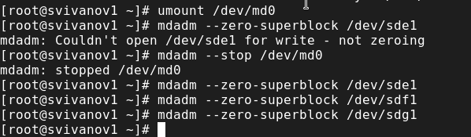{#fig:021 width=70%}

**Преобразование массива RAID 1 в RAID 5:**

Создадим массив RAID 1 из двух дисков:
mdadm --create --verbose /dev/md0 --level=1 --raid-devices=2 /dev/sdd1 /dev/sde1
Добавим третий диск: mdadm --add /dev/md0 /dev/sdf1 и подмонтируем
/dev/md0: mount /dev/md0: (рис. 22)

{#fig:022 width=70%}

Проверим состояние массива: 
cat /proc/mdstat 
mdadm --query /dev/md0
mdadm --detail /dev/md0 (рис. 23)

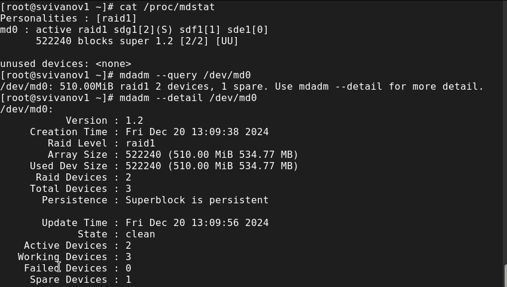{#fig:023 width=70%}

Изменим тип массива RAID:
mdadm --grow /dev/md0 --level=5 (рис. 24)

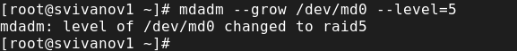{#fig:024 width=70%}

Проверим состояние массива:
mdadm --detail /dev/md0 (рис. 25)

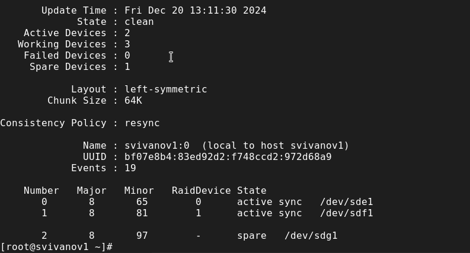{#fig:025 width=70%}

Изменим количество дисков в массиве RAID 5:
mdadm --grow /dev/md0 --raid-devices 3 (рис. 26)

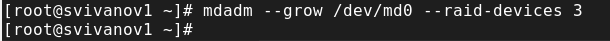{#fig:026 width=70%}

Проверим состояние массива:
mdadm --detail /dev/md0 (рис. 27)

{#fig:027 width=70%}

Удалим массив и очистим метаданные:
umount /dev/md0
mdadm --stop /dev/md0
mdadm --zero-superblock /dev/sdd1
mdadm --zero-superblock /dev/sde1
mdadm --zero-superblock /dev/sdf1а (рис. 28)

{#fig:028 width=70%}

Закомментируем запись в /etc/fstab: /dev/md0 /data ext4 defaults 1 2 и
выполним сохранение (рис. 29):

{#fig:029 width=70%}

# Контрольные вопросы

**1. Приведите определение RAID.**

Аббревиатура RAID расшифровывается как Redundant Array of Inexpensive Disks (избыточный массив недорогих дисков) или Redundant
Array of Independent Disks (избыточный массив независимых дисков). Это способ хранения данных на нескольких установленных накопителях.

**2. Какие типы RAID-массивов существуют на сегодняшний день?**

Есть программные и аппаратные RAID-массивы. Программные массивы создаются уже после установки ОС средствами программных
продуктов и утилит, что и является главным недостатком таких дисковых массивов. Аппаратные RAID создают дисковый массив до установки ОС и
от неё не зависят. Существуют следующие уровни спецификации RAID: 0,1, 2, 3, 4, 5, 6 Кроме того, существуют комбинированные уровни: 01/10,
50/05, 15/51, 60/ 6

**3. Охарактеризуйте RAID 0, RAID 1, RAID 5, RAID 6, опишите алгоритм работы, назначение, приведите примеры применения.**

RAID 0 – дисковой массив из двух или более жестких дисков без резервирования. Запись происходит следующим образом: информация
разбивается на блоки данных фиксированной длинны и записывается поочередно, то есть первый блок данных записывается на один диск, второй блок данных на второй диск и так далее
Каждый диск записывает/читает свою порцию данных, что позволяет значительно увеличить скорость работы.
Для записи используется весь объем, но это снижает надежность хранения данных, поскольку при отказе одного диска – массив
разрушается, и восстановить данные практически невозможно. Сам RAID 0 редко используется из-за низкой надежности, чаще используется как оболочка для комбинированных уровней. Однако
высокая скорость записи/чтения и большой объем отлично подходит для видеомонтажа и видеозахвата. Хороший выбор для
домашнего использования на SATA HDD накопителях. RAID 1 – дисковой массив из двух или более жестких дисков. Этот уровень
является обычным зеркалированием данных. На два жестких диска пишутся две одинаковые копи данных. Используется при четном
количестве дисков, но существуют модификации, позволяющие использовать RAID 1 на нечетном количестве дисков.
Выигрыша в скорости нет, но зеркалирование позволяет надежно защитить данные и обеспечить работу системы даже при выходе из строя
одного из дисков. В основном используется как оболочка для комбинированных уровней.
RAID 5- дисковой массив из трех или более жестких дисков. Для записи используется чередование и четность. Контрольные суммы не хранятся на
одном диске, а распределяются по всем, что положительно сказывается на скорости записи. Стоит отметить, что современные RAID контролеры
обычно оснащены кеш-памятью, что позволяет избегать чтения контрольных сумм, тем самым скорость чтения не уменьшается.
Используется около 80% объема. Главный принцип распределения блоков контрольных сумм – они не
должны располагаться на том же диске, с которого была получена контрольная сумма. При использовании четырех дисков из строя могут
выйти два диска. Это обеспечивает хорошую надежность, а высокая скорость записи позволяет использовать RAID 5 на веб-серверах с
активным чтением данных. При использовании RAID 5 подключают дополнительный диск, который не используется до тех пор, пока один из дисков не выйдет из строя, в
таком случае RAID-контролер автоматически восстановит все данные на новый диск.
RAID 6 - дисковой массив из четырех или более жестких дисков. Используется два блока четности, что увеличивает надежность, но снижает
скорость записи данных. На скорость чтения никак не влияет, так как блоки четности не считываются. Так же как и в RAID 5 контрольные
суммы не записываются на диски, с которых была получена контрольная сумма. При использовании четырех дисков, два из них могут выйти из
строя. Благодаря хорошей надежности используется в качестве резервного хранилища, но для домашнего использования такая надежность – избыточна.

# Выводы

В ходе выполнения лабораторной работы мы усвоили работу с RAID-массивами при помощи утилиты mdadm.
